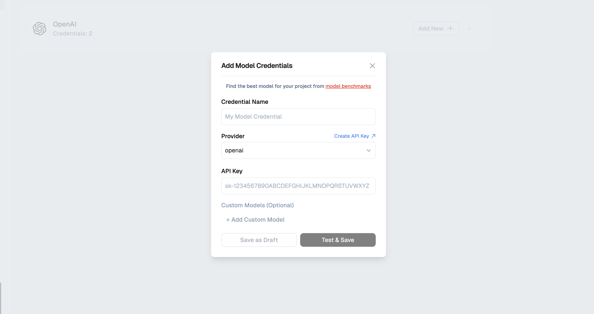

# Models in Generative AI Projects

Models are the fundamental building blocks of any Generative AI project. They serve as the cognitive engines that power agentic flows, enabling sophisticated decision-making and content generation. These models are the cornerstone of AI-driven applications, providing the intelligence and capabilities that make advanced functionalities possible. [Lamatic.ai](http://Lamatic.ai) offers seamless integration with a diverse array of models through built-in connections and efficient proxies, streamlining the development process for AI practitioners.

## Prerequisites

- A Lamatic Project in Studio
- Basic understanding of [Flows](/docs/flows) and [Nodes](/docs/nodes)
- API keys from model providers (OpenAI, Anthropic, etc.) if you want to use external models

## Understanding Models

**Models** are AI systems trained on vast amounts of data that can understand and generate content. In Lamatic, you configure models once in your Project, then use them across multiple Flows and Nodes.

<Callout type="info">
Think of models as "AI engines" - you set them up once, then your Flows can use them to generate text, analyze images, or process other types of content.
</Callout>

---

## Model Types

| **Model Type**     | **Description**                                                                                                                                       | **Availability** |
|--------------------|-------------------------------------------------------------------------------------------------------------------------------------------------------|------------------|
| **Text**           | Sophisticated text generation based on input prompts, capable of producing coherent and contextually relevant content                                  | ✅                |
| **Chat**           | Interactive text generation that considers both the initial prompt and the ongoing conversation history, enabling dynamic and context-aware responses | ✅                |
| **Multimodal**     | Advanced text generation with comprehensive understanding capabilities, including the ability to process and interpret images, documents, and more     | ✅                |
| **Image Generation** | Creation of visual content based on textual descriptions, allowing for the production of unique and customized images                                | ✅                |
| **Audio Transcript** | Accurate conversion of spoken language into written text, facilitating the transcription of audio content                                           | 🚧               |
| **Audio Generation**  | Transformation of written text into natural-sounding speech, enabling voice synthesis for various applications                                     | 🚧               |
| **Video**             | Production of video content from textual prompts, allowing for the creation of dynamic visual narratives                                           | ❌                |

---

## Providers

Models are typically offered by providers, which are companies or organizations responsible for the development, training, and hosting of these AI models. These providers invest significant resources in creating and maintaining state-of-the-art models that can be leveraged by developers and businesses. For open-source models, the provider may be the organization or company that hosts and maintains the model infrastructure, even if they didn't originally develop the model.
### Available Providers

    <iframe
        className="absolute top-0 left-0 w-full h-full overflow-x-hidden"
        src="https://airtable.com/embed/app3p6bgbAipAiEOX/shrpj5NrkMJARowJU"
        allowFullScreen
    ></iframe>

> 💡 **Note**: You can explore a variety of providers to find the models that best suit your specific project requirements using [Benchmarks](/ ).

---

## Adding a New Provider → Model

To use a model in your flow, you first add API credentials for that provider. Lamatic stores these keys securely and only uses them when making requests. You can delete or rotate credentials at any time, and you can maintain separate credentials per provider—or separate sets for Development and Production for better usage tracking.

> 💡 **Tip**: Set up separate API credentials for Development and Production in Lamatic for clearer monitoring and management of usage across stages.

**High-level steps:** Get API keys from the provider → add and configure the model in Studio (see below) → test and save.

---

## Setting Up a Model in Studio

Configure your model credentials in Studio so they’re available to your flows.

**Navigate to the Models page:**

1. Go to **Studio**
2. Open **Connections**
3. Click on **Models**
4. Click **Add Model** (or select an existing model to edit)

**Configure the model:**

1. **Credential Name**: A human‑readable name for this model credential (e.g. "Prod OpenAI GPT‑4").
2. **Provider**: Select the model provider (e.g. `openai`, `anthropic`, etc.).
3. **API Key / Auth**: Paste the API key or other authentication secret required by the provider.
4. **Custom Models (Optional)**: Add a custom model ID or configuration if you're using a non‑default model from that provider.

You can **Save as Draft** (keep the configuration without using it in flows yet) or **Test & Save** to validate the credentials and make the model available to your flows.

---

## Using Models in a Flow

Lamatic's flexible architecture allows you to incorporate multiple models, either of the same type or different types, within a single flow. To integrate a model into your flow, begin by dragging a compatible node (such as a Text LLM node) into the flow builder interface. Once placed, you can select the desired model from the list of available options, which are populated based on the credentials you've added for various providers.

---

## Model Defaults

Lamatic offers a convenient feature that allows you to establish default models for your entire project. When you drag a compatible node into the flow, these default models are automatically selected, streamlining your flow. If you decide to modify the default model settings, the changes will be reflected across all instances where the default option is selected. This functionality provides a quick and efficient method to switch between models on a project-wide scale, eliminating the need to manually update individual model selections throughout your flow.

> ⚡ **Quick Tip**: Setting up default models allows you to quickly switch models project-wide without having to change them individually in each flow node.

## Troubleshooting

- **Model not appearing in node**: Make sure you've added credentials for that model provider in Studio > Models
- **API key errors**: Verify your API key is correct and has sufficient credits/quota
- **Model not responding**: Check your internet connection and the model provider's status page
- **Default model not applying**: Ensure you've saved the default model settings in Project Settings

## Next steps

- **Learn about specific model types**: Explore [Model Integrations](/integrations) for detailed setup guides
- **Use models in Flows**: Read about [AI Nodes](/docs/nodes) to see how to use models in your workflows
- **Optimize model usage**: Check [Best Practices](/docs/models/model-logic#best-practices) for tips on choosing the right model for your use caseUsing Models in a Flow
