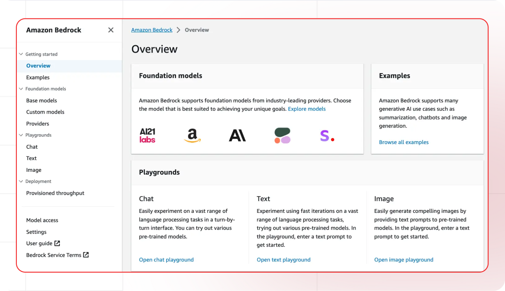

[AWS console]: https://aws.amazon.com/bedrock
[AWS Bedrock]: https://console.aws.amazon.com/bedrock
[AWS credentials]: https://console.aws.amazon.com/iam/home#/security_credentials
[AWS docs]: https://docs.aws.amazon.com/bedrock/
[AWS pricing]: https://aws.amazon.com/bedrock/pricing/

[Lamatic.ai studio]: https://studio.lamatic.ai
[Lamatic support]: https://support.lamatic.ai

# Amazon Bedrock
Amazon Bedrock is a fully managed service by Amazon Web Services (AWS) that simplifies the creation and scaling of generative AI applications. It provides access to a variety of high-performing foundation models (FMs) from leading AI companies such as AI21 Labs, Anthropic, Cohere, Meta, Mistral AI, Stability AI, and Amazon's own models, all through a single API.

1. Log into [AWS console]
2. Navigate to [Bedrock service](https://console.aws.amazon.com/bedrock)
3. Visit [Security credentials][AWS credentials]
4. In [Lamatic.ai studio]: Models → Amazon Bedrock → Paste key

*AWS Bedrock Security Credentials Screen*

Follow these general steps in Lamatic.ai:
1. Open your [Lamatic.ai studio]
2. Navigate to Models section
3. Select your desired provider
4. Paste the API key in the designated field
5. Save your changes

## Important Notes
- Keep your API keys secure and never share them
- Some providers may require additional setup steps
- Check provider's pricing before generating API keys:
  - [AWS pricing]
- Regularly rotate your API keys for security
- Test your integration after adding each key

Need help? Contact [Lamatic support]