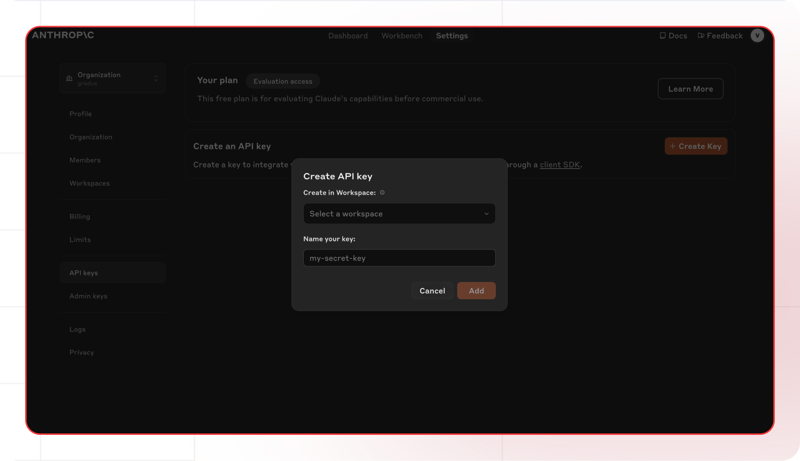

[Anthropic console]: https://console.anthropic.com
[Anthropic keys]: https://console.anthropic.com/settings/keys
[Anthropic docs]: https://docs.anthropic.com
[Anthropic pricing]: https://www.anthropic.com/pricing

[Lamatic.ai Studio]: https://studio.lamatic.ai
[Lamatic support]: https://support.lamatic.ai

# Anthropic
Anthropic is an AI research company that offers a range of AI products and services centered around their Claude AI assistant technology. Their flagship offering is the Claude family of AI models, which includes Claude 3.5 Sonnet for general intelligence and complex tasks, Claude 3 Opus for writing and complex work, and Claude 3 Haiku for faster, everyday tasks. 

 

1. Visit [Anthropic console]
2. Access [API Keys section][Anthropic keys]
3. Create new API key
4. In [Lamatic.ai Studio]: Models → Anthropic → Paste key

*Anthropic Console API Key Screen*

### Follow these general steps in Lamatic.ai:
1. Open your [Lamatic.ai Studio]
2. Navigate to Models section
3. Select Anthropic Model
4. Paste the API key in the designated field
5. Save your changes

## Important Notes
- Keep your API keys secure and never share them
- Some providers may require additional setup steps
- Check provider's pricing before generating API keys:
  - [Anthropic pricing]
- Regularly rotate your API keys for security
- Test your integration after adding each key

Need help? Contact [Lamatic support]