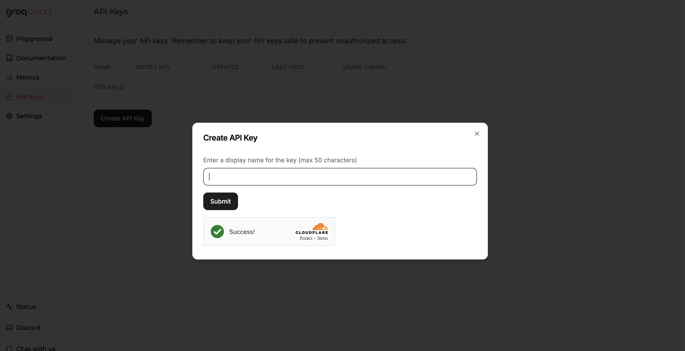

[Groq Dev Console]: https://console.groq.com/playground
[Groq pricing]: https://groq.com/pricing/

[Lamatic.ai Studio]: https://studio.lamatic.ai
[Lamatic support]: https://support.lamatic.ai

### Groq
1. Visit [Groq Dev Console][Groq Dev Console]
2. Access API keys section
3. Generate new key
4. In [Lamatic.ai Studio]: Models → Groq → Paste key

Follow these general steps in Lamatic.ai:
1. Open your [Lamatic.ai Studio]
2. Navigate to Models section
3. Select your desired provider
4. Paste the API key in the designated field
5. Save your changes

## Important Notes
- Keep your API keys secure and never share them
- Some providers may require additional setup steps
- Check provider's pricing before generating API keys:
  - [Groq pricing]
- Regularly rotate your API keys for security
- Test your integration after adding each key

Need help? Contact [Lamatic support]