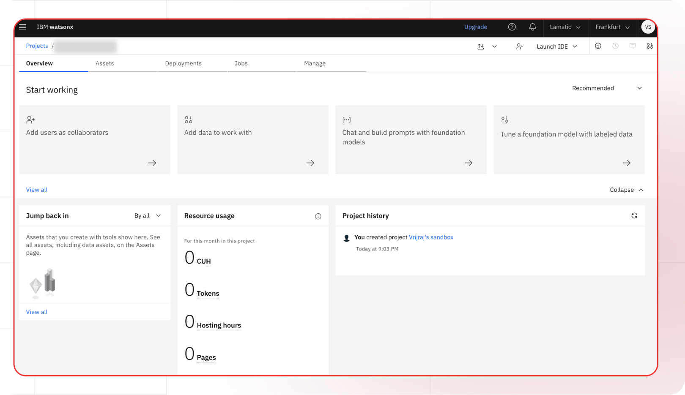

[Lamatic.ai Studio]: https://studio.lamatic.ai
[Lamatic support]: https://support.lamatic.ai

# IBM Watsonx AI
IBM Watsonx is a comprehensive AI and data platform from IBM designed to empower businesses with AI capabilities. It offers a suite of tools and technologies to develop, deploy, and scale AI applications efficiently. Watsonx is particularly tailored for enterprises looking to integrate AI into their workflows, ensuring scalability, security, and reliability.

### 1. Create an IBM watsonx.ai Account
1. Go to [watsonx.ai](https://www.watsonx.ai).
2. Click **Start your free trial**.
3. Create an account and log in.

---

### 2. Create a Project
1. From the IBM watsonx dashboard, open the navigation panel and go to **Projects > View all projects**.
2. Click **New project**.
3. Enter a name and description for the project.
4. Select a data storage option.
5. Click **Create**.
6. Copy the **Project ID**:
   - Go to the new project.
   - Click the **Manage** tab.
   - Click **General** and copy the **Project ID**.

---

### 3. Create a New Service ID
1. From the IBM watsonx dashboard, click **Access (IAM)**.
2. You will be directed to the IBM Cloud site.
3. Click **Service IDs** and then click **Create**.

---

### 4. Create a Deployment Space
1. From the IBM watsonx dashboard, click **Deployments**.
2. Click **New deployment space**.
3. Select **Create a new machine learning service** for the **Select machine learning service** value.
4. Select the **Lite** pricing plan for testing.
5. After testing, you can upgrade to the **Essentials** or **Standard** plan.
6. Click **Create**.

---

### 5. Link the Service ID to the Deployment Space
1. From the IBM watsonx dashboard, click **Deployments**.
2. From the new deployment, click the **Manage** tab.
3. Click **Access control** and then click **Add collaborators**.
4. Select **Add service IDs** and choose the Service ID you created.

---

### 6. Link the Service ID to the Project
1. From the IBM watsonx dashboard, click **Projects**.
2. From the new project, click the **Manage** tab.
3. Click **Access control** and then click **Add collaborators**.
4. Select **Add service IDs** and choose the Service ID you created.

---

### 7. Link the Machine Learning Service to the Project
1. From the IBM watsonx dashboard, click **Projects**.
2. From the new project, click the **Manage** tab.
3. Go to **Services & integrations** and click **Associate services**.
4. Locate and select the machine learning service you created.

---

### 8. Set Up the API Key
1. From the IBM watsonx dashboard, click **Access (IAM)**.
2. You will be directed to the IBM Cloud site.
3. Click **Service IDs** and select the Service ID you created.
4. Go to the **API Keys** tab and click **Create**.
5. Provide a name and description for the API key.
6. Click **Create**.
7. Copy or download the API key for future reference.

---

### 9. You are now ready to access the model using the API key.
Follow these general steps in Lamatic.ai:
1. Open your [Lamatic.ai Studio]
2. Navigate to Models section
3. Select IBM Watsonx
4. Paste the API key, Project ID and URL in the designated field
5. Save your changes

## Important Notes
- Keep your API keys secure and never share them
- Regularly rotate your API keys for security
- Test your integration after adding each key

Need help? Contact [Lamatic support]