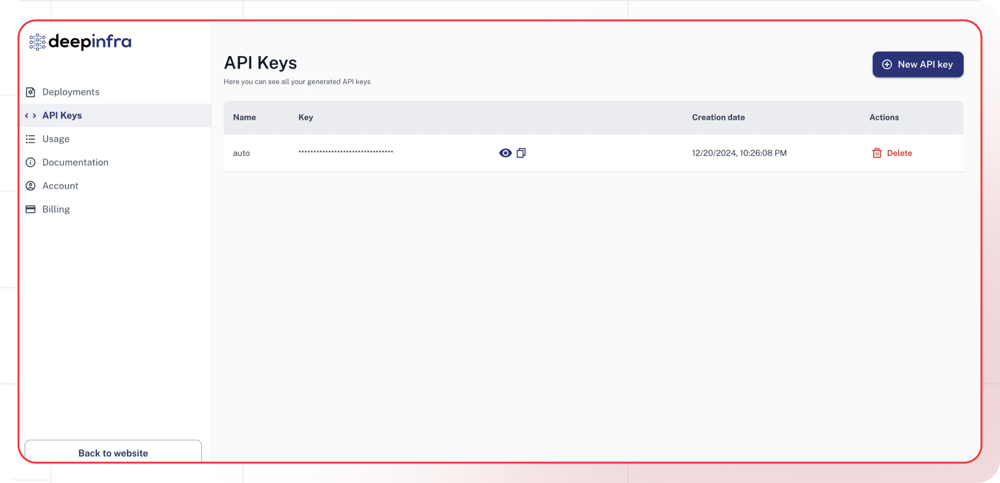

[deepinfra Dashboard]: https://perplexity.ai/settings/api

[Lamatic.ai Studio]: https://studio.lamatic.ai
[Lamatic support]: https://support.lamatic.ai

### Deepinfra 
1. Visit [deepinfra Dashboard][deepinfra Dashboard]
2. Access API keys section
3. Generate new key
4. In [Lamatic.ai dashboard]: Models → deepinfra → Paste key

Follow these general steps in Lamatic.ai:
1. Open your [Lamatic.ai Studio]
2. Navigate to Models section
3. Select your desired provider
4. Paste the API key in the designated field
5. Save your changes

## Important Notes
- Keep your API keys secure and never share them
- Some providers may require additional setup steps
- Regularly rotate your API keys for security
- Test your integration after adding each key

Need help? Contact [Lamatic support]