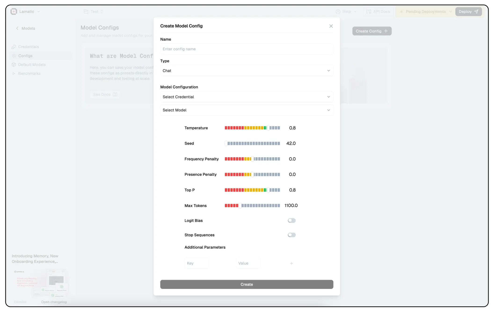

# Model Config

Model Config play a crucial role in fine-tuning the behavior of Large Language Models (LLMs). They help control aspects such as creativity, coherence, repetition, and response length, ensuring that the model generates outputs tailored to specific use cases. Properly configuring these parameters can significantly impact the quality and relevance of the generated text.

## **1. Temperature**

- Controls the randomness of responses.
- **Higher values (e.g., 1.0-1.5)** → More creative and diverse responses.
- **Lower values (e.g., 0.2-0.5)** → More focused and deterministic outputs.

## **2. Seed**

- Sets a fixed starting point for randomization, ensuring repeatability.
- If a specific seed is used, the model will generate the same output for the same prompt.

## **3. Frequency Penalty**

- Discourages frequent word repetition.
- **Higher values (e.g., 1.0-2.0)** → Less repetition.
- **Lower values (e.g., 0-0.5)** → More repetition.

## **4. Presence Penalty**

- Encourages or discourages introducing new words.
- **Higher values** → More variety in topics covered.
- **Lower values** → Tends to stick to common words.

## **5. Top P (Nucleus Sampling)**

- Limits token selection to a subset of the most likely words.
- **Lower values (e.g., 0.1-0.5)** → More focused and deterministic.
- **Higher values (e.g., 0.8-1.0)** → More diverse and creative.

## **6. Logit Bias**

- Adjusts the likelihood of specific words appearing.
- Can be used to make the model prefer or avoid specific words.

## **7. Stop Sequences**

- Defines words/phrases where the response should stop.
- Useful for structured outputs like chatbots.

## **8. Max Tokens**

- The maximum length of the generated response.
- Affects the response length.

## **Additional Parameters**

- Custom key-value pairs can be added for model-specific tuning.

