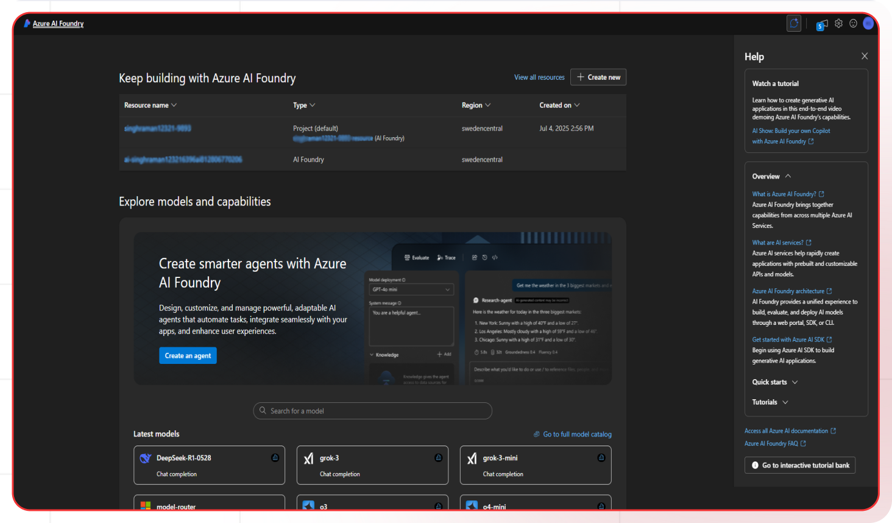
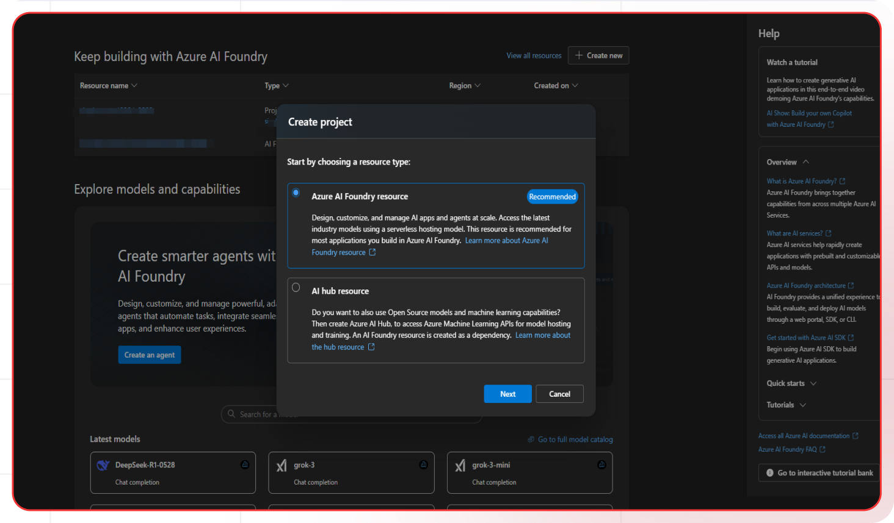
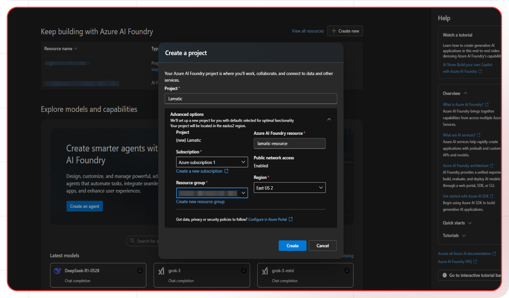
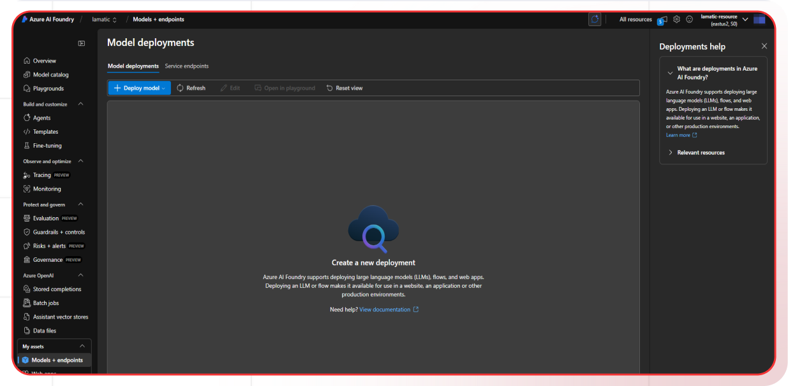
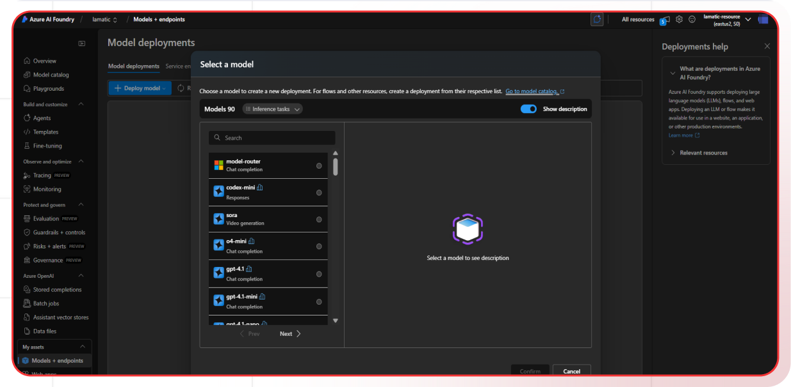
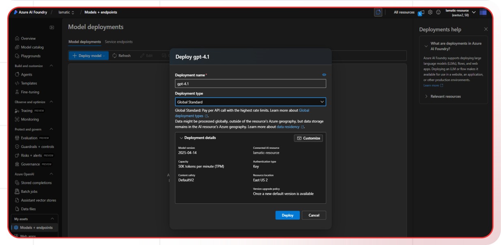
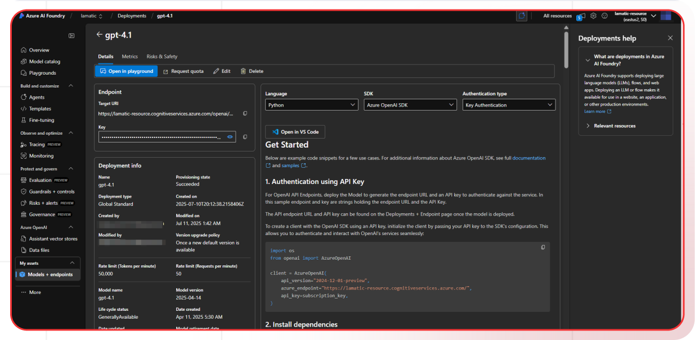

[Azure AI Foundry Portal]: https://ai.azure.com/
[Azure Portal]: https://portal.azure.com/
[Azure AI Foundry Guide]: https://learn.microsoft.com/en-us/azure/ai-foundry/
[Azure AI Foundry Pricing]: https://azure.microsoft.com/en-us/pricing/details/machine-learning/
[Azure AI Foundry Models]: https://learn.microsoft.com/en-us/azure/ai-foundry/concepts/models

[Lamatic.ai Studio]: https://studio.lamatic.ai
[Lamatic support]: https://lamatic.ai/docs/slack

# Azure AI Foundry

Azure AI Foundry provides a unified platform for enterprise AI operations, model building, and application development. With Lamatic, you can seamlessly integrate with various models available on Azure AI Foundry and take advantage of features like observability, prompt management, fallbacks, and more.

<Callout type="info">Provider Slug: `azure-ai-foundry`</Callout>

## Get Started

### Step 1: Access Azure AI Foundry Portal
Go to [ai.azure.com](https://ai.azure.com) (Azure AI Foundry portal) and sign in with your Azure account.

### Step 2: Choose Project Type
Azure AI Foundry supports two types of projects: a **hub-based project** and a **Foundry project**. In most cases, you'll want to use a **Foundry project**.

### Step 3: Create a Foundry Project
1. Click **"Create new"** in the top right

2. Select **"Azure AI Foundry resource"**

3. Enter a **project name**
4. Select your **subscription** and **resource group**
5. Choose a **location/region**

6. Click **"Create"**

### Step 4: Deploy a Model
1. Navigate to **"Model catalog"** or **"Models + endpoints"**

2. Click on **"Deploy model"**
3. Browse available models (GPT-4, GPT-3.5-turbo, etc.)

4. Select a model and click **"Confirm"**
5. Provide a **Deployment Name** (e.g., "gpt-4-deployment")
6. Configure deployment settings

7. Click **"Deploy"**

### Step 5: Get API Credentials
1. Navigate to **"Model catalog"** or **"Models + endpoints"**
2. Select your deployment

3. You can get the required credentials from there

### Step 6: Configure in Lamatic
1. Open your [Lamatic.ai Studio]
2. Navigate to **Models** section
3. Select **Azure AI Foundry** from the provider list
4. Provide the following credentials:
   - Azure API Key
   - Azure API Version
   - Resource Name
   - Deployment Name
5. Save your changes

## Key Features

- **Unified Platform**: Comprehensive platform for AI operations and development
- **Flexible Deployment**: Three deployment types - AI Services, Managed, and Serverless
- **Enterprise Security**: Advanced security and compliance features
- **Scalable Infrastructure**: Enterprise-grade scalability and performance
- **Cost Effective**: Pay-per-use pricing with flexible deployment options
- **Developer Friendly**: Comprehensive API and documentation
- **Model Variety**: Access to a wide range of AI models
- **Compliance Ready**: Meets enterprise compliance and security requirements

## Available Models

Azure AI Foundry provides access to various models through different deployment types:

- **AI Services Models**: Azure-managed models accessed through Azure AI Services endpoints
- **Managed Models**: User-managed deployments running on dedicated Azure compute resources
- **Serverless Models**: Seamless, scalable deployment without managing infrastructure
- **Custom Models**: Your own fine-tuned or custom models
- **Open Source Models**: Various open-source models available in the catalog

Check the [Azure AI Foundry Models][Azure AI Foundry Models] documentation for the complete list of available models and their specifications.

## Configuration Options

- **Azure API Key**: Your Azure AI Foundry API key for authentication
- **Azure API Version**: The API version to use (e.g., 2024-06-01)
- **Resource Name**: The name of your Azure AI Foundry resource
- **Deployment Name**: The name of your model deployment
- **Model Selection**: Choose from available Azure AI Foundry models
- **Custom Parameters**: Configure model-specific parameters
- **Deployment Type**: Choose between AI Services, Managed, or Serverless


## Required Information

### Resource Name
Found in the **project overview** section.

### Deployment Name
Listed in the **"Models + endpoints"** section.

### Azure API Version
Check the latest versions in Azure AI Foundry documentation. Common versions:
- `2024-06-01`
- `2024-02-15-preview`

### Endpoint URL Format
```
https://[ResourceName].openai.azure.com/
```

## Example Configuration
```bash
Azure API Key: your-api-key-here
Azure API Version: 2024-06-01
Resource Name: my-ai-foundry-project
Deployment Name: gpt-4-deployment
Endpoint: https://my-ai-foundry-project.openai.azure.com/
```

## Best Practices

- **API Key Security**: Keep your Azure API keys secure and never share them publicly
- **Deployment Selection**: Choose the appropriate deployment type based on your needs:
  - Use AI Services for managed models
  - Use Managed for dedicated compute resources
  - Use Serverless for scalable, on-demand deployment
- **Resource Management**: Monitor resource usage and optimize for cost
- **Rate Limiting**: Be aware of Azure AI Foundry's rate limits and implement appropriate throttling
- **Error Handling**: Implement proper error handling for API failures and rate limits
- **Cost Optimization**: Monitor your usage and optimize resource allocation
- **Security Configuration**: Configure appropriate security settings for your deployment

## Troubleshooting

**Access Denied:**
- Verify your Azure account has access to Azure AI Foundry
- Check if your API key is correct and hasn't expired
- Ensure your project is properly configured

**Project Creation Issues:**
- Verify your Azure subscription has sufficient permissions
- Check if the project name is unique and follows naming conventions
- Ensure the selected region supports Azure AI Foundry

**Model Deployment Issues:**
- Verify the model is available in your region
- Check if deployment settings are correct
- Ensure sufficient compute resources are available for managed deployments

**Authentication Errors:**
- Ensure your API key is properly formatted
- Check if your Azure account is active and verified
- Verify you're using the correct endpoint URL

**Deployment Type Issues:**
- Verify the deployment type is appropriate for your use case
- Check if the deployment is in "Succeeded" state
- Ensure proper permissions for the deployment type

## Important Notes

- Keep your API keys secure and never share them
- Choose the appropriate deployment type based on your requirements
- Monitor resource usage and costs for managed deployments
- Test your integration after adding each key
- Consider using managed identities for enhanced security
- Review [Azure AI Foundry pricing][Azure AI Foundry Pricing] before deployment
- Different deployment types have different pricing models

## Additional Resources

- [Azure AI Foundry Documentation][Azure AI Foundry Guide]
- [Model Documentation][Azure AI Foundry Models]
- [Pricing Information][Azure AI Foundry Pricing]
- [Azure Support](https://azure.microsoft.com/en-us/support/)

Need help? Contact [Lamatic support]
