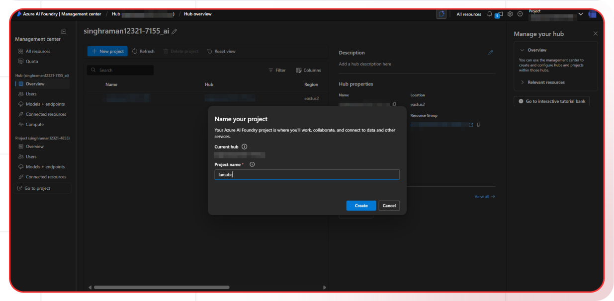
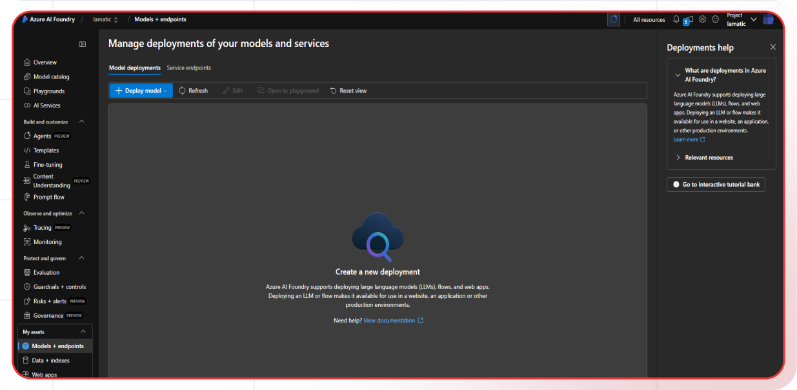
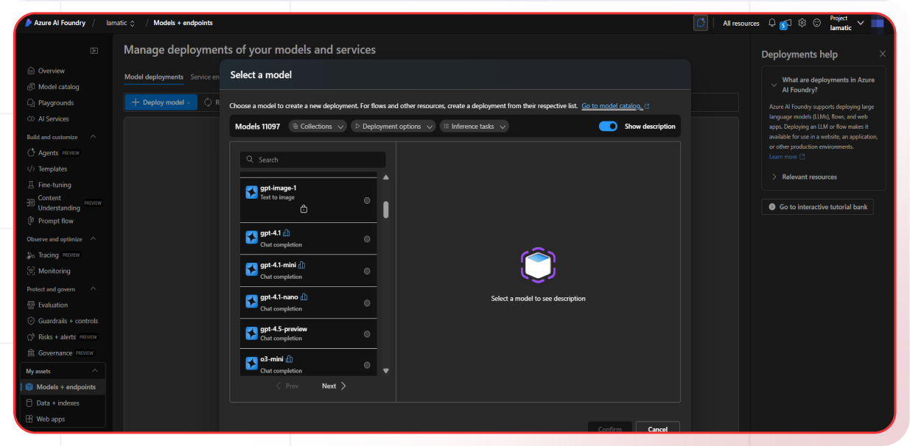
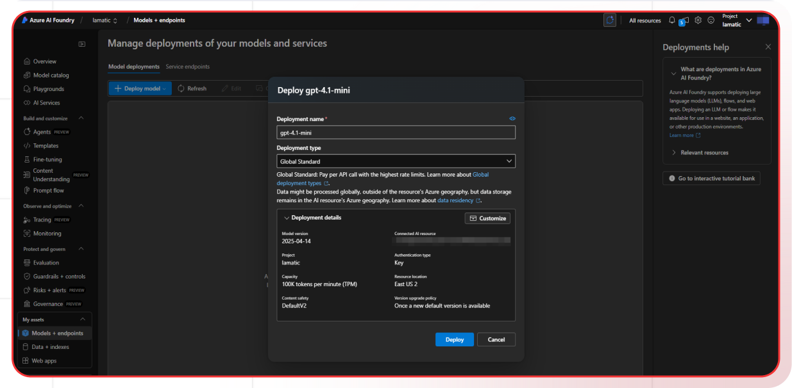
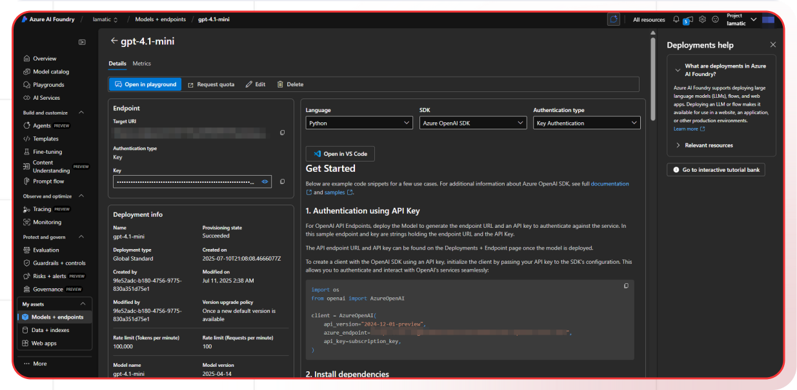

[Azure AI Foundry Portal]: https://ai.azure.com/
[Azure Portal]: https://portal.azure.com/
[Azure Machine Learning Guide]: https://learn.microsoft.com/en-us/azure/machine-learning/
[Azure AI Hub Guide]: https://learn.microsoft.com/en-us/azure/ai-foundry/concepts/ai-resources
[Azure AI Hub Pricing]: https://azure.microsoft.com/en-us/pricing/details/machine-learning/
[Azure AI Hub Models]: https://learn.microsoft.com/en-us/azure/ai-foundry/concepts/models

[Lamatic.ai Studio]: https://studio.lamatic.ai
[Lamatic support]: https://lamatic.ai/docs/slack

# Azure AI Hub

Azure AI Hub provides enterprise-grade resource management for collaborative AI development teams. It offers shared configurations, centralized security settings, and advanced networking capabilities. With Lamatic, you can seamlessly integrate with models deployed through Azure AI Hub and take advantage of features like observability, prompt management, fallbacks, and more.

<Callout type="info">Provider Slug: `azure-ai-foundry`</Callout>

## Get Started

### Step 1: Access Azure AI Foundry Portal
Go to [ai.azure.com](https://ai.azure.com) (Azure AI Foundry portal) and sign in with your Azure account.

### Step 2: Create an Azure AI Hub
1. Click **"Create new"** in the top right
2. Select **"AI hub resource"**

3. Enter **Project name** and select **Hub** (This will create a hub based project while creating the hub)
4. Click **"Create"**

### Step 3: Create a Hub-Based Project
1. Navigate to your created hub
2. Click **"Create project"**
3. Enter a **project name**

4. Click **"Create"**

### Step 4: Deploy a Model
1. Navigate to **"Model catalog"** or **"Models + endpoints"**

2. Click on **"Deploy model"**
3. Browse available models (GPT-4, GPT-3.5-turbo, etc.)

4. Select a model and click **"Deploy"**

5. Provide a **Deployment Name** (e.g., "gpt-4-enterprise-deployment")
6. Configure deployment settings and compute resources
7. Click **"Deploy"**

### Step 5: Get API Credentials
1. Navigate to **"Model catalog"** or **"Models + endpoints"**
2. Select your deployment

3. You can get the required credentials from there

### Step 6: Configure in Lamatic
1. Open your [Lamatic.ai Studio]
2. Navigate to **Models** section
3. Select `azure-ai-foundry` from the provider list
4. Provide the following credentials:
   - Azure API Key: Your Azure AI Foundry API key
   - Azure Foundry URL: The base endpoint URL for your deployment, formatted according to your deployment type:
      - For AI Services: `https://your-resource-name.services.ai.azure.com/models`
      - For Managed: `https://your-model-name.region.inference.ml.azure.com/score`
      - For Serverless: `https://your-model-name.region.models.ai.azure.com`
   - Azure API Version: The API version to use (e.g., “2024-05-01-preview”). This is required if you have api version in your deployment url. For example:
      If your URL is `https://mycompany-ai.westus2.services.ai.azure.com/models?api-version=2024-05-01-preview`, the API version is `2024-05-01-preview`
   - Deployment Name
5. Add Custom Model   
6. Save your changes

## Key Features

- **Hub Resources**: Centralized management of compute, storage, and networking
- **Shared Projects**: Multiple projects sharing hub configurations and resources
- **Enterprise Security**: Advanced networking, private endpoints, and compliance features
- **Collaborative Development**: Team-based AI development with shared resources
- **Scalable Infrastructure**: Enterprise-grade scalability and performance
- **Cost Effective**: Shared resource utilization for cost optimization
- **Developer Friendly**: Comprehensive API and documentation
- **Compliance Ready**: Meets enterprise compliance and security requirements

## Available Models

Azure AI Hub provides access to various models through hub-based deployments:

- **GPT Models**: GPT-4, GPT-3.5-turbo, and other OpenAI models
- **Custom Models**: Your own fine-tuned or custom models
- **Open Source Models**: Various open-source models available in the catalog
- **Enterprise Models**: Models optimized for enterprise use cases
- **Specialized Models**: Models for specific domains and industries

Check the [Azure AI Hub Models][Azure AI Hub Models] documentation for the complete list of available models and their specifications.

## Configuration Options

- **Azure API Key**: Your Azure AI Hub API key for authentication
- **Azure API Version**: The API version to use (e.g., 2024-06-01)
- **Hub Name**: The name of your Azure AI Hub resource
- **Project Name**: The name of your hub-based project
- **Deployment Name**: The name of your model deployment
- **Model Selection**: Choose from available Azure AI Hub models
- **Custom Parameters**: Configure model-specific parameters
- **Security Settings**: Configure networking and access controls

## Required Information

### Hub Name
Found in the **hub overview** section and serves as your resource identifier.

### Project Name
Listed in the **projects** section within your hub.

### Deployment Name
Listed in the **"Models + endpoints"** section of your project.

### Azure API Version
Check the latest versions in Azure AI Hub documentation. Common versions:
- `2024-06-01`
- `2024-02-15-preview`

### Endpoint URL Format
```
https://[HubName]-[ProjectName].openai.azure.com/
```

## Example Configuration
```bash
Azure API Key: your-hub-api-key-here
Azure API Version: 2024-06-01
Hub Name: my-enterprise-ai-hub
Project Name: production-chatbot-project
Deployment Name: gpt-4-enterprise-deployment
Endpoint: https://my-enterprise-ai-hub-production-chatbot-project.openai.azure.com/
```

## Best Practices

- **API Key Security**: Keep your Azure API keys secure and never share them publicly
- **Hub Management**: Configure networking and security settings at the hub level for all projects
- **Resource Optimization**: Monitor resource usage across all projects in your hub
- **Access Control**: Regularly review access permissions for team members
- **Rate Limiting**: Be aware of Azure AI Hub's rate limits and implement appropriate throttling
- **Error Handling**: Implement proper error handling for API failures and rate limits
- **Cost Optimization**: Monitor your usage and optimize resource allocation
- **Security Configuration**: Use private endpoints and network security groups

## Troubleshooting

**Access Denied:**
- Verify your Azure account has access to Azure AI Hub
- Check if your API key is correct and hasn't expired
- Ensure your hub and project are properly configured

**Hub Creation Issues:**
- Verify your Azure subscription has sufficient permissions
- Check if the hub name is unique and follows naming conventions
- Ensure the selected region supports Azure AI Hub

**Project Configuration:**
- Verify the project is created within the correct hub
- Check if project settings are properly configured
- Ensure proper permissions for the project

**Model Deployment Issues:**
- Verify the model is available in your region
- Check if deployment settings are correct
- Ensure sufficient compute resources are available

**Authentication Errors:**
- Ensure your API key is properly formatted
- Check if your Azure account is active and verified
- Verify you're using the correct endpoint URL

## Important Notes

- Keep your API keys secure and never share them
- Hub-based projects are ideal for enterprise environments requiring shared resources
- Configure networking and security settings at the hub level for all projects
- Monitor resource usage across all projects in your hub
- Regularly review access permissions for team members
- Test your integration after adding each key
- Consider using managed identities for enhanced security
- Review [Azure AI Hub pricing][Azure AI Hub Pricing] before deployment

## Additional Resources

- [Azure AI Hub Documentation][Azure AI Hub Guide]
- [Model Documentation][Azure AI Hub Models]
- [Pricing Information][Azure AI Hub Pricing]
- [Azure Support](https://azure.microsoft.com/en-us/support/)

Need help? Contact [Lamatic support]