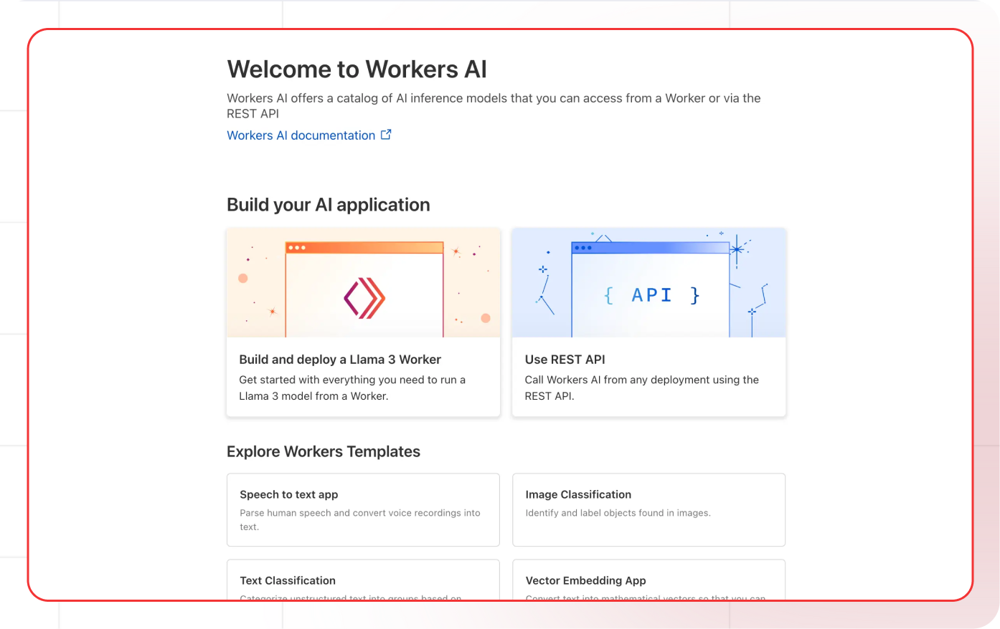

[Cloudflare Dashboard]: https://dash.cloudflare.com
[Cloudflare AI Docs]: https://developers.cloudflare.com/ai/
[Cloudflare AI Models]: https://developers.cloudflare.com/ai/models/

[Lamatic.ai Studio]: https://studio.lamatic.ai
[Lamatic support]: https://lamatic.ai/docs/slack

# Cloudflare

Cloudflare AI is a platform that integrates artificial intelligence capabilities into Cloudflare's global network infrastructure. It leverages Cloudflare's extensive global network to provide fast, reliable, and secure AI services.

<Callout type="info">Provider Slug: `cloudflare`</Callout>

## Get Started

### Step 1: Create Cloudflare Account
1. Visit the [Cloudflare Dashboard][Cloudflare Dashboard]
2. Sign up for a new account or log in to your existing account
3. Complete the account verification process

### Step 2: Get Account ID and API Token
1. Navigate to **Overview** to find your Account ID
2. Navigate to **Profile** to access API keys section
3. Generate a new API token with appropriate permissions
4. Copy both the Account ID and API token

### Step 3: Configure in Lamatic
1. Open your [Lamatic.ai Studio]
2. Navigate to **Models** section
3. Select **Cloudflare** from the provider list
4. Paste your Account ID and API token in the designated fields
5. Save your changes

## Key Features

- **Global Network**: Leverages Cloudflare's worldwide infrastructure for low-latency AI services
- **Edge Computing**: AI processing at the edge for faster response times
- **Security First**: Built on Cloudflare's security infrastructure
- **Scalable**: Automatic scaling based on demand
- **Cost Effective**: Pay-per-use pricing model
- **Multiple Models**: Access to various AI models through a single API

## Available Models

Cloudflare AI offers several model categories:

- **Text Generation**: Models for text completion and generation
- **Text Embeddings**: Models for creating text embeddings
- **Image Generation**: Models for creating images from text descriptions
- **Translation**: Models for text translation between languages
- **Classification**: Models for text and image classification

Check the [Cloudflare AI Models][Cloudflare AI Models] documentation for the latest model offerings and specifications.

## Configuration Options

- **Account ID**: Your Cloudflare account identifier
- **API Token**: Your Cloudflare API token for authentication
- **Model Selection**: Choose from available Cloudflare AI models
- **Custom Parameters**: Configure temperature, max_tokens, and other generation parameters
- **Region Selection**: Choose the optimal region for your use case

## Best Practices

- **API Token Security**: Keep your API tokens secure and never share them publicly
- **Account ID Management**: Store your Account ID securely for configuration
- **Rate Limiting**: Be aware of Cloudflare's rate limits and implement appropriate throttling
- **Model Selection**: Choose the appropriate model based on your specific use case
- **Error Handling**: Implement proper error handling for API failures and rate limits
- **Cost Optimization**: Monitor your usage and optimize requests to reduce costs

## Troubleshooting

**Invalid API Token:**
- Verify your API token is correct and hasn't expired
- Check if your account has sufficient credits
- Ensure the API token has the necessary permissions

**Account ID Issues:**
- Verify your Account ID is correct
- Check if your account is active and verified
- Ensure you're using the correct Account ID format

**Rate Limit Exceeded:**
- Implement exponential backoff in your requests
- Consider upgrading your Cloudflare plan for higher limits
- Monitor your usage in the Cloudflare dashboard

**Model Not Available:**
- Check if the model is available in your region
- Verify your account has access to the specific model
- Contact Cloudflare support for model availability issues

**Authentication Errors:**
- Ensure your API token is properly formatted
- Check if your account is active and verified
- Verify you're using the correct API endpoint

## Important Notes

- Keep your API tokens and Account ID secure and never share them
- Regularly rotate your API tokens for enhanced security
- Monitor your usage and costs in the Cloudflare dashboard
- Test your integration after adding each token
- Some models may require additional setup or approval
- Be aware of Cloudflare's terms of service and usage policies

## Additional Resources

- [Cloudflare AI Documentation][Cloudflare AI Docs]
- [Model Documentation][Cloudflare AI Models]
- [Cloudflare Community](https://community.cloudflare.com/)

Need help? Contact [Lamatic support]