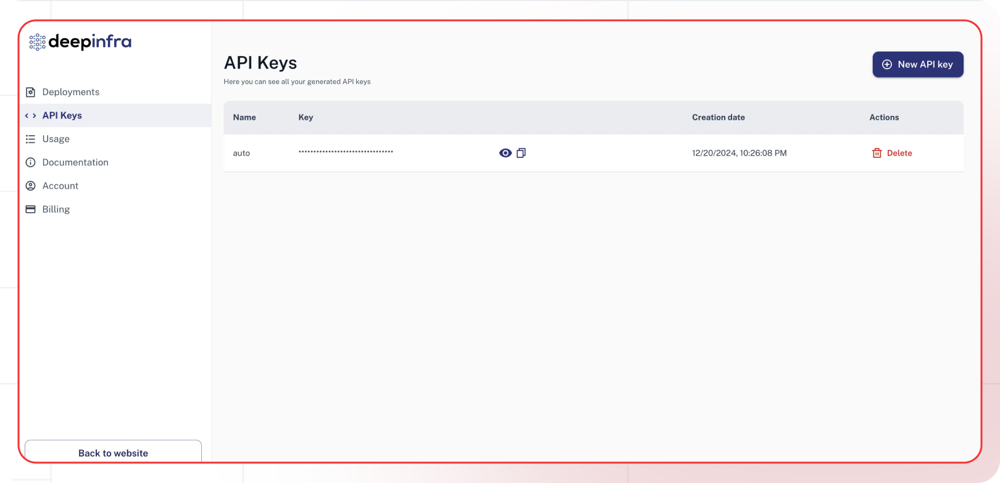

[deepinfra Dashboard]: https://deepinfra.com/
[Deepinfra API Docs]: https://deepinfra.com/docs
[Deepinfra Models]: https://deepinfra.com/models

[Lamatic.ai Studio]: https://studio.lamatic.ai
[Lamatic support]: https://lamatic.ai/docs/slack

# Deepinfra 

DeepInfra is a cloud infrastructure platform focused on making AI model deployment and serving more accessible and cost-effective. It provides developers and businesses with easy access to a wide range of AI models through a unified API.

<Callout type="info">Provider Slug: `deepinfra`</Callout>

## Get Started

### Step 1: Create Deepinfra Account
1. Visit the [deepinfra Dashboard][deepinfra Dashboard]
2. Sign up for a new account or log in to your existing account
3. Complete the account verification process

### Step 2: Generate API Key
1. Navigate to the **API Keys** section in your Deepinfra dashboard
2. Click **Generate New Key**
3. Give your API key a descriptive name
4. Copy the generated API key (you won't be able to see it again)

### Step 3: Configure in Lamatic
1. Open your [Lamatic.ai Studio]
2. Navigate to **Models** section
3. Select **Deepinfra** from the provider list
4. Paste your API key in the designated field
5. Save your changes

## Key Features

- **Wide Model Selection**: Access to hundreds of open-source and proprietary models
- **Cost Effective**: Competitive pricing for model inference
- **High Performance**: Optimized infrastructure for fast model serving
- **Easy Integration**: Simple API for model deployment and inference
- **Scalable**: Automatic scaling based on demand
- **Developer Friendly**: Comprehensive documentation and SDKs

## Available Models

Deepinfra supports a wide variety of models including:

- **Open Source Models**: Llama, Mistral, CodeLlama, and many others
- **Proprietary Models**: Access to various commercial models
- **Specialized Models**: Models for specific tasks like coding, reasoning, and creative writing
- **Multimodal Models**: Models that can process both text and images

Check the [Deepinfra Models][Deepinfra Models] page for the complete list of available models and their specifications.

## Configuration Options

- **API Key**: Your Deepinfra API key for authentication
- **Model Selection**: Choose from available Deepinfra models
- **Custom Parameters**: Configure temperature, max_tokens, top_p, and other generation parameters
- **Streaming**: Enable real-time text generation streaming
- **Model Deployment**: Deploy custom models if needed

## Best Practices

- **API Key Security**: Keep your API keys secure and never share them publicly
- **Rate Limiting**: Be aware of Deepinfra's rate limits and implement appropriate throttling
- **Model Selection**: Choose the appropriate model based on your use case and budget
- **Error Handling**: Implement proper error handling for API failures and rate limits
- **Cost Optimization**: Monitor your usage and optimize prompts to reduce token consumption
- **Performance Monitoring**: Track model performance and latency for your specific use cases

## Troubleshooting

**Invalid API Key:**
- Verify your API key is correct and hasn't expired
- Check if your account has sufficient credits
- Ensure the API key has the necessary permissions

**Rate Limit Exceeded:**
- Implement exponential backoff in your requests
- Consider upgrading your Deepinfra plan for higher limits
- Monitor your usage in the Deepinfra dashboard

**Model Not Available:**
- Check if the model is available in your region
- Verify your account has access to the specific model
- Contact Deepinfra support for model availability issues

**Authentication Errors:**
- Ensure your API key is properly formatted
- Check if your account is active and verified
- Verify you're using the correct API endpoint

**High Latency:**
- Check if the model is currently under high load
- Consider using a different model or region
- Monitor Deepinfra's status page for any service issues

## Important Notes

- Keep your API keys secure and never share them
- Regularly rotate your API keys for enhanced security
- Monitor your usage and costs in the Deepinfra dashboard
- Test your integration after adding each key
- Some models may require additional setup or approval
- Be aware of Deepinfra's terms of service and usage policies

## Additional Resources

- [Deepinfra API Documentation][Deepinfra API Docs]
- [Model Documentation][Deepinfra Models]
- [Deepinfra Community](https://discord.gg/deepinfra)

Need help? Contact [Lamatic support]