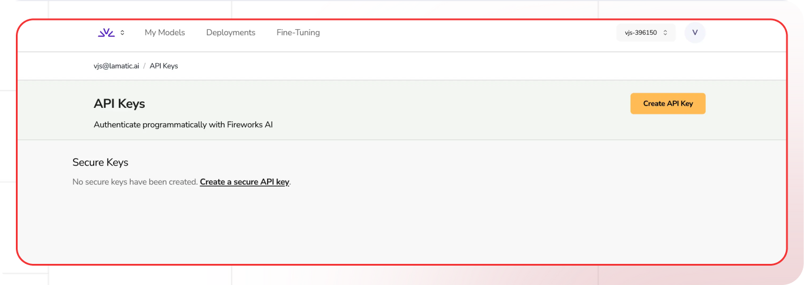

[Fireworks AI Account Setting]: https://fireworks.ai/account/api-keys
[Fireworks AI Docs]: https://readme.fireworks.ai/
[Fireworks AI Models]: https://fireworks.ai/models

[Lamatic.ai Studio]: https://studio.lamatic.ai
[Lamatic support]: https://lamatic.ai/docs/slack

# Fireworks AI

Fireworks AI specializes in providing access to large language models (LLMs) and AI development infrastructure. They offer a comprehensive platform that enables developers and businesses to deploy, serve, and scale AI models efficiently.

<Callout type="info">Provider Slug: `fireworks-ai`</Callout>

## Get Started

### Step 1: Create Fireworks AI Account
1. Visit the [Fireworks AI Account Setting][Fireworks AI Account Setting]
2. Sign up for a new account or log in to your existing account
3. Complete the account verification process

### Step 2: Generate API Key
1. Navigate to the **API Keys** section in your Fireworks AI dashboard
2. Click **Generate New Key**
3. Give your API key a descriptive name
4. Copy the generated API key (you won't be able to see it again)

### Step 3: Configure in Lamatic
1. Open your [Lamatic.ai Studio]
2. Navigate to **Models** section
3. Select **Fireworks AI** from the provider list
4. Paste your API key in the designated field
5. Save your changes

## Key Features

- **High Performance**: Optimized infrastructure for fast model inference
- **Wide Model Support**: Access to various open-source and proprietary models
- **Custom Model Deployment**: Deploy and serve your own fine-tuned models
- **Cost Effective**: Competitive pricing with flexible usage plans
- **Developer Friendly**: Comprehensive API and SDK support
- **Scalable**: Automatic scaling based on demand
- **Enterprise Ready**: Production-grade infrastructure with high reliability

## Available Models

Fireworks AI provides access to various model categories:

- **Open Source Models**: Llama, Mistral, CodeLlama, and other popular models
- **Proprietary Models**: Access to commercial models from various providers
- **Custom Models**: Deploy and serve your own fine-tuned models
- **Specialized Models**: Models optimized for specific tasks like coding, reasoning, and creative writing

Check the [Fireworks AI Models][Fireworks AI Models] page for the complete list of available models and their specifications.

## Configuration Options

- **API Key**: Your Fireworks AI API key for authentication
- **Model Selection**: Choose from available Fireworks AI models
- **Custom Parameters**: Configure temperature, max_tokens, top_p, and other generation parameters
- **Streaming**: Enable real-time text generation streaming
- **Custom Model Endpoints**: Use your own deployed models if available

## Best Practices

- **API Key Security**: Keep your API keys secure and never share them publicly
- **Rate Limiting**: Be aware of Fireworks AI's rate limits and implement appropriate throttling
- **Model Selection**: Choose the appropriate model based on your use case and performance requirements
- **Error Handling**: Implement proper error handling for API failures and rate limits
- **Cost Optimization**: Monitor your usage and optimize prompts to reduce token consumption
- **Performance Monitoring**: Track model performance and latency for your specific use cases
- **Custom Model Optimization**: If using custom models, ensure they're properly optimized for production

## Troubleshooting

**Invalid API Key:**
- Verify your API key is correct and hasn't expired
- Check if your account has sufficient credits
- Ensure the API key has the necessary permissions

**Rate Limit Exceeded:**
- Implement exponential backoff in your requests
- Consider upgrading your Fireworks AI plan for higher limits
- Monitor your usage in the Fireworks AI dashboard

**Model Not Available:**
- Check if the model is available in your region
- Verify your account has access to the specific model
- Contact Fireworks AI support for model availability issues

**Authentication Errors:**
- Ensure your API key is properly formatted
- Check if your account is active and verified
- Verify you're using the correct API endpoint

**Custom Model Issues:**
- Verify your custom model is properly deployed and running
- Check model endpoint configuration
- Ensure proper permissions for custom model access

## Important Notes

- Keep your API keys secure and never share them
- Regularly rotate your API keys for enhanced security
- Monitor your usage and costs in the Fireworks AI dashboard
- Test your integration after adding each key
- Some models may require additional setup or approval
- Be aware of Fireworks AI's terms of service and usage policies
- Custom models may have different pricing and availability

## Additional Resources

- [Fireworks AI Documentation][Fireworks AI Docs]
- [Model Documentation][Fireworks AI Models]
- [Fireworks AI Community](https://discord.gg/fireworks-ai)

Need help? Contact [Lamatic support]
