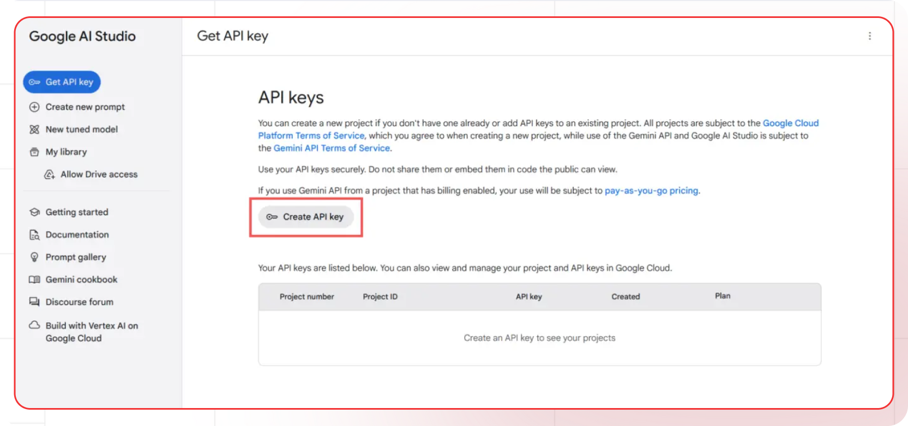

[Gemini studio]: https://makersuite.google.com/app/apikey
[Gemini docs]: https://ai.google.dev/docs
[Gemini pricing]: https://ai.google.dev/pricing
[Gemini models]: https://ai.google.dev/models

[Lamatic.ai Studio]: https://studio.lamatic.ai
[Lamatic support]: https://lamatic.ai/docs/slack

# Gemini 

Gemini is Google's most advanced AI model family, launched in December 2023. It's designed to be multimodal, meaning it can understand and work with different types of input including text, images, audio, and video.

<Callout type="info">Provider Slug: `gemini`</Callout>

## Get Started

### Step 1: Create Google AI Studio Account
1. Visit the [Google AI Studio][Gemini studio]
2. Sign up for a new account or log in to your existing Google account
3. Complete the account verification process

### Step 2: Generate API Key
1. Navigate to the **API Keys** section in your Google AI Studio
2. Click **Create API Key**
3. Give your API key a descriptive name
4. Copy the generated API key (you won't be able to see it again)

*Google AI Studio API Key Generation Screen*

### Step 3: Configure in Lamatic
1. Open your [Lamatic.ai Studio]
2. Navigate to **Models** section
3. Select **Gemini** from the provider list
4. Paste your API key in the designated field
5. Save your changes

## Key Features

- **Multimodal Capabilities**: Process text, images, audio, and video inputs
- **Advanced Reasoning**: Sophisticated reasoning and problem-solving abilities
- **Google Integration**: Seamless integration with Google's ecosystem
- **High Performance**: State-of-the-art model performance across multiple modalities
- **Cost Effective**: Competitive pricing with flexible usage plans
- **Developer Friendly**: Comprehensive API and documentation
- **Enterprise Ready**: Production-grade infrastructure with high reliability
- **Safety Focused**: Built with safety and responsible AI principles

## Available Models

Gemini offers several model variants:

- **Gemini Pro**: Advanced text model for complex reasoning and creative tasks
- **Gemini Pro Vision**: Multimodal model for text and image understanding
- **Gemini Flash**: Fast and efficient model for real-time applications
- **Gemini Ultra**: Most capable model for complex multimodal tasks
- **Embedding Models**: Text embedding models for semantic search and RAG

Check the [Gemini Models][Gemini models] documentation for the latest model specifications and capabilities.

## Configuration Options

- **API Key**: Your Gemini API key for authentication
- **Model Selection**: Choose from available Gemini models
- **Custom Parameters**: Configure temperature, max_tokens, top_p, and other generation parameters
- **Streaming**: Enable real-time text generation streaming
- **Multimodal Input**: Configure image, audio, and video processing
- **Safety Settings**: Configure content safety and filtering options

## Best Practices

- **API Key Security**: Keep your API keys secure and never share them publicly
- **Rate Limiting**: Be aware of Gemini's rate limits and implement appropriate throttling
- **Model Selection**: Choose the appropriate model based on your use case:
  - Use Pro for general text tasks
  - Use Pro Vision for image and text tasks
  - Use Flash for speed-critical applications
  - Use Ultra for complex multimodal tasks
- **Error Handling**: Implement proper error handling for API failures and rate limits
- **Cost Optimization**: Monitor your usage and optimize prompts to reduce token consumption
- **Multimodal Optimization**: Optimize image and media inputs for better results
- **Safety Configuration**: Configure appropriate safety settings for your use case

## Troubleshooting

**Invalid API Key:**
- Verify your API key is correct and hasn't expired
- Check if your account has sufficient credits
- Ensure the API key has the necessary permissions

**Rate Limit Exceeded:**
- Implement exponential backoff in your requests
- Consider upgrading your Gemini plan for higher limits
- Monitor your usage in the Google AI Studio

**Model Not Available:**
- Check if the model is available in your region
- Verify your account has access to the specific model
- Contact Google support for model availability issues

**Authentication Errors:**
- Ensure your API key is properly formatted
- Check if your account is active and verified
- Verify you're using the correct API endpoint

**Multimodal Issues:**
- Check if your media files are in supported formats
- Verify file size limits for images and media
- Ensure proper encoding for audio and video inputs

**Content Safety Violations:**
- Review Gemini's content safety guidelines
- Modify inputs to comply with safety standards
- Configure safety settings appropriately

## Important Notes

- Keep your API keys secure and never share them
- Check provider's pricing before generating API keys: [Gemini pricing][Gemini pricing]
- Regularly rotate your API keys for enhanced security
- Monitor your usage and costs in the Google AI Studio
- Test your integration after adding each key
- Some models may require additional setup or approval
- Be aware of Gemini's content safety and usage policies
- Consider multimodal capabilities for enhanced applications
- Respect Google's responsible AI principles

## Additional Resources

- [Gemini API Documentation][Gemini docs]
- [Model Documentation][Gemini models]
- [Pricing Information][Gemini pricing]
- [Google AI Community](https://ai.google.dev/community)

Need help? Contact [Lamatic support]