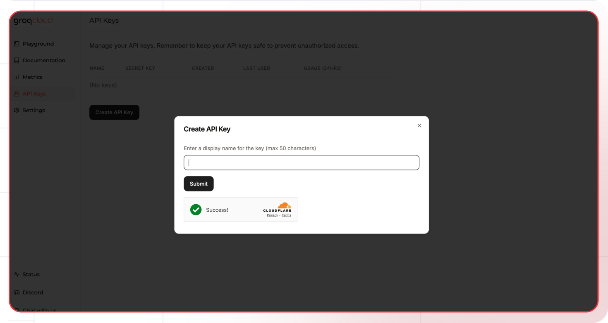

[Groq Dev Console]: https://console.groq.com/playground
[Groq pricing]: https://groq.com/pricing/
[Groq API Docs]: https://console.groq.com/docs
[Groq Models]: https://console.groq.com/docs/models

[Lamatic.ai Studio]: https://studio.lamatic.ai
[Lamatic support]: https://lamatic.ai/docs/slack

# Groq

Groq is a platform that allows developers to run various large language models, including Mixtral and Llama 2, with reportedly very low latency compared to other providers. Many users have noted response times significantly faster than other platforms.

<Callout type="info">Provider Slug: `groq`</Callout>

## Get Started

### Step 1: Create Groq Account
1. Visit the [Groq Dev Console][Groq Dev Console]
2. Sign up for a new account or log in to your existing account
3. Complete the account verification process

### Step 2: Generate API Key
1. Navigate to the **API Keys** section in your Groq console
2. Click **Generate New Key**
3. Give your API key a descriptive name
4. Copy the generated API key (you won't be able to see it again)

### Step 3: Configure in Lamatic
1. Open your [Lamatic.ai Studio]
2. Navigate to **Models** section
3. Select **Groq** from the provider list
4. Paste your API key in the designated field
5. Save your changes

## Key Features

- **Ultra-Low Latency**: Significantly faster response times compared to other providers
- **High Performance**: Optimized infrastructure for rapid model inference
- **Wide Model Support**: Access to various models including Mixtral, Llama 2, and others
- **Cost Effective**: Competitive pricing with pay-per-use model
- **Developer Friendly**: Simple API integration and comprehensive documentation
- **Scalable**: Automatic scaling based on demand
- **Enterprise Ready**: Production-grade infrastructure with high reliability

## Available Models

Groq provides access to various high-performance models:

- **Mixtral Models**: High-quality models for general tasks and reasoning
- **Llama 2 Models**: Popular open-source models for various applications
- **Code Models**: Specialized models for coding and development tasks
- **Custom Models**: Support for custom model deployments

Check the [Groq Models][Groq Models] documentation for the complete list of available models and their specifications.

## Configuration Options

- **API Key**: Your Groq API key for authentication
- **Model Selection**: Choose from available Groq models
- **Custom Parameters**: Configure temperature, max_tokens, top_p, and other generation parameters
- **Streaming**: Enable real-time text generation streaming
- **Performance Tuning**: Optimize for speed vs. quality based on your needs

## Best Practices

- **API Key Security**: Keep your API keys secure and never share them publicly
- **Rate Limiting**: Be aware of Groq's rate limits and implement appropriate throttling
- **Model Selection**: Choose the appropriate model based on your use case and performance requirements
- **Error Handling**: Implement proper error handling for API failures and rate limits
- **Cost Optimization**: Monitor your usage and optimize prompts to reduce token consumption
- **Performance Monitoring**: Track response times and optimize for your specific use cases
- **Latency Optimization**: Leverage Groq's low-latency advantage for real-time applications

## Troubleshooting

**Invalid API Key:**
- Verify your API key is correct and hasn't expired
- Check if your account has sufficient credits
- Ensure the API key has the necessary permissions

**Rate Limit Exceeded:**
- Implement exponential backoff in your requests
- Consider upgrading your Groq plan for higher limits
- Monitor your usage in the Groq console

**Model Not Available:**
- Check if the model is available in your region
- Verify your account has access to the specific model
- Contact Groq support for model availability issues

**Authentication Errors:**
- Ensure your API key is properly formatted
- Check if your account is active and verified
- Verify you're using the correct API endpoint

**Performance Issues:**
- Check if the model is currently under high load
- Consider using a different model or region
- Monitor Groq's status page for any service issues

## Important Notes

- Keep your API keys secure and never share them
- Check provider's pricing before generating API keys: [Groq pricing][Groq pricing]
- Regularly rotate your API keys for enhanced security
- Monitor your usage and costs in the Groq console
- Test your integration after adding each key
- Some models may require additional setup or approval
- Be aware of Groq's terms of service and usage policies
- Take advantage of Groq's low-latency for real-time applications

## Additional Resources

- [Groq API Documentation][Groq API Docs]
- [Model Documentation][Groq Models]
- [Pricing Information][Groq pricing]
- [Groq Community](https://discord.gg/groq)

Need help? Contact [Lamatic support]