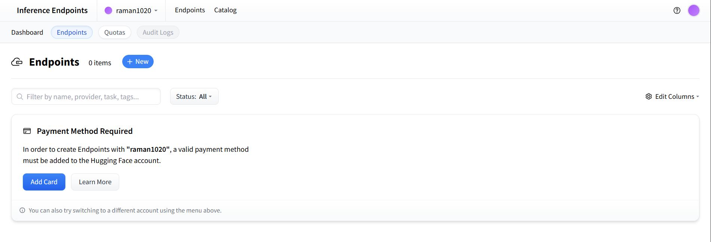
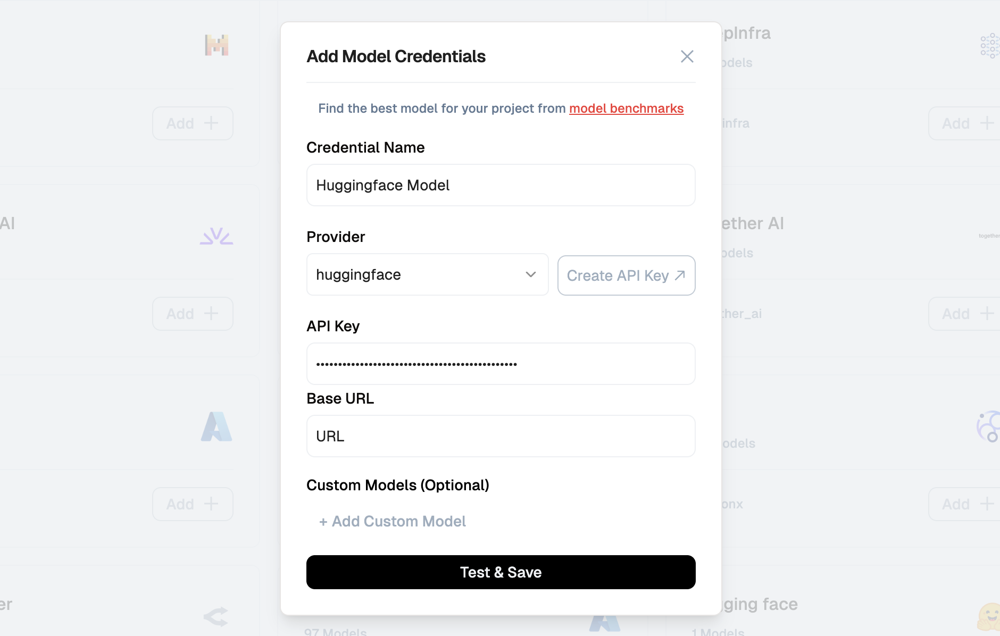

[Hugging Face Hub]: https://huggingface.co/
[Hugging Face Access Tokens]: https://huggingface.co/settings/tokens
[Lamatic.ai Studio]: https://studio.lamatic.ai
[Lamatic Support]: https://support.lamatic.ai

# HuggingFace Integration

**Hugging Face** is a leading platform for building, hosting, and deploying state-of-the-art machine learning models. With its powerful `Transformers` library and public model hub, Hugging Face makes it easy to access and run pre-trained models across tasks like text classification, generation, summarization, and more. You can now bring **custom or fine-tuned HuggingFace models** directly into Lamatic Studio. This allows full control over AI workflows, logic, and model performance — tailored to your specific use case.

 
You can now integrate HuggingFace models directly into **[Lamatic.ai Studio]**, whether they’re publicly available or hosted privately using dedicated inference endpoints.

## Setup Instructions

### Using HuggingFace Dedicated Inference Endpoints

> Use this method for private or fine-tuned models with higher performance and security.

1. Go to the [Hugging Face Hub] and log in.
2. Navigate to your Inference Endpoints: `https://endpoints.huggingface.co/your-username/endpoints/dedicated`
3. Copy your **Base URL**.
4. Visit [Hugging Face Access Tokens] and generate a new token.
5. Open [Lamatic.ai Studio].
6. Go to `Models → Huggingface`.
7. Paste your **Base URL** and **Access Token**.
8. Save the configuration.

---

### Using HuggingFace Public Models
> Best for quick testing or integrating popular open-source models.

1. Go to [Hugging Face Hub] and find your desired public model.
2. Use the public inference URL format: `https://api-inference.huggingface.co/models/your-model-name`
3. Generate a [Hugging Face Access Token] if required.
4. In [Lamatic.ai Studio]:
- Navigate to `Models → Huggingface`
- Paste the model URL and token
- Save your settings

---

### Key Benefits

- **Customizability**  
Use internal or domain-specific fine-tuned models to match your needs.

- **Model Flexibility**  
Access public models or host private ones using HuggingFace endpoints.

- **Seamless Integration**  
Easily connect HuggingFace to Lamatic workflows with no additional infrastructure setup.

- **Credential Support**  
Authenticate using custom tokens and manage access securely.

- **Provider-Level Customization**  
Override default behavior on a per-provider basis.

Check out the full [Custom Model Integration Docs](https://lamatic.ai/docs/models/custom-model-integration) for more advanced configuration options.

## Best Practices

- Keep your API keys and tokens private.
- Rotate your credentials periodically.
- Test model responses after integration.
- Use dedicated endpoints for production-grade use cases.
- Monitor rate limits and billing on Hugging Face if using large models.