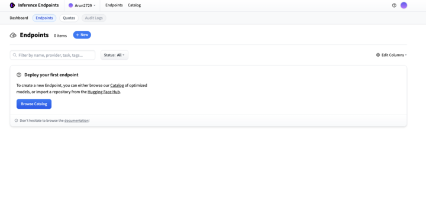

[Huggingface hub]: https://huggingface.co/
[Huggingface access tokens]: https://huggingface.co/settings/tokens
[Lamatic.ai Studio]: https://studio.lamatic.ai
[Lamatic support]: https://support.lamatic.ai

# Huggingface
Hugging Face is an AI platform that provides powerful tools and libraries for building, sharing, and deploying machine learning models, especially in natural language processing (NLP). Best known for its open-source library Transformers, Hugging Face makes state-of-the-art models easily accessible to developers and researchers. It also offers Hugging Face Hub, a central repository for models, datasets, and demos, and supports seamless integration with tools like PyTorch, TensorFlow, and ONNX.These services enable developers to leverage pre-trained models or fine-tune their own, all without requiring deep expertise in training large-scale AI systems.
 
1. Go to [Huggingface hub]
2. Visit your Hugging Face Inference Endpoint: 
``
https://endpoints.huggingface.co/your-username/endpoints/dedicated
``
3. Find Base URL
4. Visit your [Huggingface access tokens]
5. Get your access token.
6. In [Lamatic.ai Studio]: Models → Huggingface → Paste key

*Huggingface Endpoint Section*
### Follow these general steps in Lamatic.ai:
1. Open your [Lamatic.ai Studio]
2. Navigate to Models section
3. Select Huggingface Provider
4. Paste the Credentials in the designated field
5. To use Hugging Face's hosted inference API for public models, use the following base URL format:
   ``
   https://api-inference.huggingface.co/models/your-model-name
   ``
5. Save your changes

## Important Notes
- Keep your API keys secure and never share them
- Some providers may require additional setup steps

- Regularly rotate your API keys for security
- Test your integration after adding each key

Need help? Contact [Lamatic support]