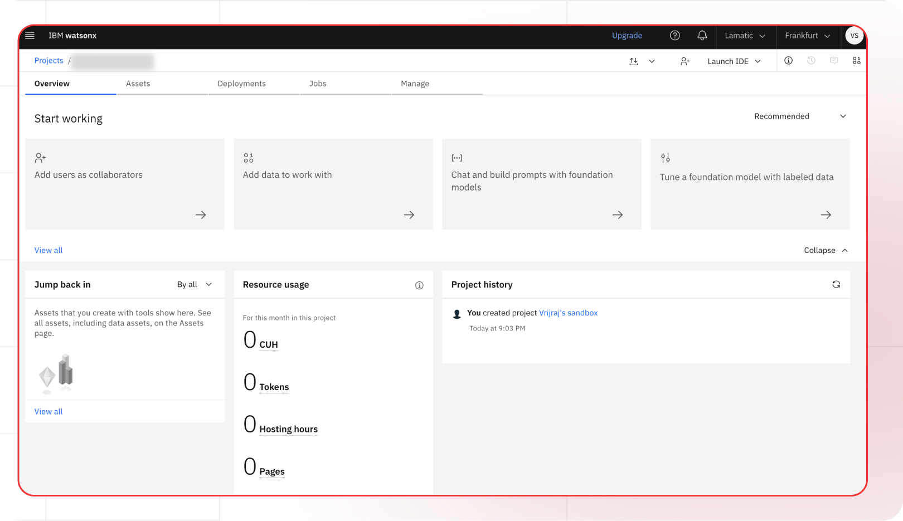

[IBM Watsonx Portal]: https://www.watsonx.ai
[IBM Watsonx Docs]: https://www.ibm.com/docs/en/watsonx
[IBM Watsonx Pricing]: https://www.ibm.com/cloud/watsonx/pricing
[IBM Watsonx Models]: https://www.ibm.com/docs/en/watsonx/models

[Lamatic.ai Studio]: https://studio.lamatic.ai
[Lamatic support]: https://lamatic.ai/docs/slack

# IBM Watsonx AI

IBM Watsonx is a comprehensive AI and data platform from IBM designed to empower businesses with AI capabilities. It offers a suite of tools and technologies to develop, deploy, and scale AI applications efficiently. Watsonx is particularly tailored for enterprises looking to integrate AI into their flow, ensuring scalability, security, and reliability.

<Callout type="info">Provider Slug: `watsonx`</Callout>

## Get Started

### Step 1: Create an IBM watsonx.ai Account
1. Go to [watsonx.ai][IBM Watsonx Portal]
2. Click **Start your free trial**
3. Create an account and log in

### Step 2: Create a Project
1. From the IBM watsonx dashboard, open the navigation panel and go to **Projects > View all projects**
   
2. Click **New project**
3. Enter a name and description for the project
4. Select a data storage option
5. Click **Create**
6. Copy the **Project ID**:
   - Go to the new project
   - Click the **Manage** tab
   - Click **General** and copy the **Project ID**

### Step 3: Create a New Service ID
1. From the IBM watsonx dashboard, click **Access (IAM)**
2. You will be directed to the IBM Cloud site
3. Click **Service IDs** and then click **Create**

### Step 4: Create a Deployment Space
1. From the IBM watsonx dashboard, click **Deployments**
2. Click **New deployment space**
3. Select **Create a new machine learning service** for the **Select machine learning service** value
4. Select the **Lite** pricing plan for testing
5. After testing, you can upgrade to the **Essentials** or **Standard** plan
6. Click **Create**

### Step 5: Link the Service ID to the Deployment Space
1. From the IBM watsonx dashboard, click **Deployments**
2. From the new deployment, click the **Manage** tab
3. Click **Access control** and then click **Add collaborators**
4. Select **Add service IDs** and choose the Service ID you created

### Step 6: Link the Service ID to the Project
1. From the IBM watsonx dashboard, click **Projects**
2. From the new project, click the **Manage** tab
3. Click **Access control** and then click **Add collaborators**
4. Select **Add service IDs** and choose the Service ID you created

### Step 7: Link the Machine Learning Service to the Project
1. From the IBM watsonx dashboard, click **Projects**
2. From the new project, click the **Manage** tab
3. Go to **Services & integrations** and click **Associate services**
4. Locate and select the machine learning service you created

### Step 8: Set Up the API Key
1. From the IBM watsonx dashboard, click **Access (IAM)**
2. You will be directed to the IBM Cloud site
3. Click **Service IDs** and select the Service ID you created
4. Go to the **API Keys** tab and click **Create**
5. Provide a name and description for the API key
6. Click **Create**
7. Copy or download the API key for future reference

### Step 9: Configure in Lamatic
1. Open your [Lamatic.ai Studio]
2. Navigate to **Models** section
3. Select **IBM Watsonx** from the provider list
4. Paste the API key, Project ID, and URL in the designated fields
5. Save your changes

## Key Features

- **Enterprise AI Platform**: Comprehensive AI and data platform designed for enterprise use
- **Scalable Infrastructure**: Built for scalability, security, and reliability
- **Multiple AI Models**: Access to various IBM AI models and capabilities
- **Data Integration**: Seamless integration with enterprise data sources
- **Security Focus**: Enterprise-grade security and compliance features
- **Cost Effective**: Flexible pricing plans from Lite to Standard
- **Developer Friendly**: Comprehensive tools and APIs for AI development
- **IBM Ecosystem**: Integration with IBM Cloud and other IBM services

## Available Models

IBM Watsonx provides access to various AI models and capabilities:

- **Foundation Models**: Large language models for text generation and understanding
- **Specialized Models**: Domain-specific models for various industries
- **Custom Models**: Ability to fine-tune and deploy custom models
- **Multimodal Models**: Models that can process text, images, and other data types
- **Enterprise Models**: Models optimized for enterprise use cases and compliance

Check the [IBM Watsonx Models][IBM Watsonx Models] documentation for the complete list of available models and their specifications.

## Configuration Options

- **API Key**: Your IBM Watsonx API key for authentication
- **Project ID**: The unique identifier for your Watsonx project
- **Service URL**: The endpoint URL for your Watsonx service
- **Model Selection**: Choose from available IBM Watsonx models
- **Custom Parameters**: Configure model-specific parameters
- **Deployment Settings**: Configure deployment space and service settings

## Best Practices

- **API Key Security**: Keep your API keys secure and never share them publicly
- **Project Management**: Organize your AI projects effectively using Watsonx projects
- **Service ID Management**: Use service IDs for secure API access
- **Rate Limiting**: Be aware of IBM Watsonx's rate limits and implement appropriate throttling
- **Error Handling**: Implement proper error handling for API failures and rate limits
- **Cost Optimization**: Monitor your usage and optimize resource allocation
- **Security Configuration**: Configure appropriate access controls and permissions
- **Testing**: Test your integration thoroughly before production deployment

## Troubleshooting

**Access Denied:**
- Verify your IBM account has access to Watsonx
- Check if your API key is correct and hasn't expired
- Ensure your project and deployment space are properly configured

**Project Creation Issues:**
- Verify your IBM account has sufficient permissions
- Check if the project name is unique and follows naming conventions
- Ensure proper data storage configuration

**Service ID Issues:**
- Verify the service ID is properly created and configured
- Check if the service ID has the necessary permissions
- Ensure proper linking between service ID and resources

**Deployment Space Issues:**
- Verify the deployment space is created successfully
- Check if the machine learning service is properly configured
- Ensure proper access control settings

**Authentication Errors:**
- Ensure your API key is properly formatted
- Check if your IBM account is active and verified
- Verify you're using the correct service URL

## Important Notes

- Keep your API keys secure and never share them
- Regularly rotate your API keys for enhanced security
- Monitor your usage and costs in the IBM Watsonx dashboard
- Test your integration after adding each key
- Some models may require additional setup or approval
- Be aware of IBM Watsonx's terms of service and usage policies
- Consider enterprise compliance and security requirements
- Review [IBM Watsonx pricing][IBM Watsonx Pricing] before deployment

## Additional Resources

- [IBM Watsonx Documentation][IBM Watsonx Docs]
- [Model Documentation][IBM Watsonx Models]
- [Pricing Information][IBM Watsonx Pricing]
- [IBM Support](https://www.ibm.com/support/)

Need help? Contact [Lamatic support]