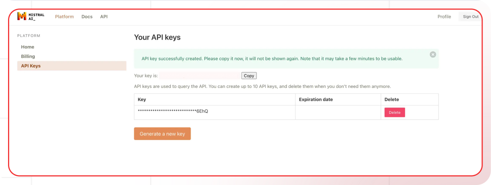

[Mistral platform]: https://console.mistral.ai
[Mistral keys]: https://console.mistral.ai/api-keys/
[Mistral docs]: https://docs.mistral.ai
[Mistral pricing]: https://mistral.ai/pricing

[Lamatic.ai Studio]: https://studio.lamatic.ai
[Lamatic support]: https://support.lamatic.ai

# Mistral AI
Mistral AI provides a comprehensive suite of AI products and services. Their core offerings include several powerful language models in the Mistral series, starting with Mistral 7B, their foundational open-source model that made headlines for its efficient performance.
 
1. Visit [Mistral platform]
2. Go to [API Keys section][Mistral keys]
3. Generate new key
4. In [Lamatic.ai Studio]: Models → Mistral AI → Paste key

*Mistral AI Platform API Key Generation Screen*

### Follow these general steps in Lamatic.ai:
1. Open your [Lamatic.ai Studio]
2. Navigate to Models section
3. Select Mistral provider
4. Paste the API key in the designated field
5. Save your changes

## Important Notes
- Keep your API keys secure and never share them
- Some providers may require additional setup steps
- Check provider's pricing before generating API keys:
  - [Mistral pricing]
- Regularly rotate your API keys for security
- Test your integration after adding each key

Need help? Contact [Lamatic support]