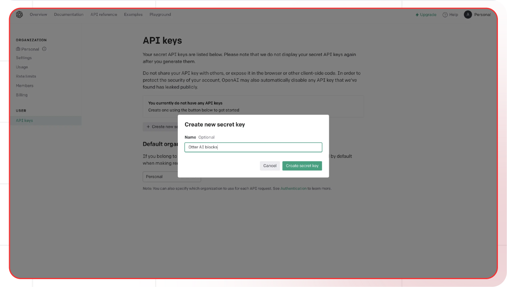

[OpenAI API]: https://platform.openai.com/api-keys
[OpenAI signup]: https://platform.openai.com/signup
[OpenAI docs]: https://platform.openai.com/docs
[OpenAI pricing]: https://openai.com/pricing

[Lamatic.ai Studio]: https://studio.lamatic.ai
[Lamatic support]: https://support.lamatic.ai

# OpenAI
OpenAI provides several key products and services that have become widely used in various industries. 
 
1. Visit [OpenAI API]
2. Sign in or create an [account][OpenAI signup]
3. Go to API section → Generate new key
4. In [Lamatic.ai Studio]: Models → OpenAI → Paste key

*OpenAI API Key Generation Screen*

### Follow these general steps in Lamatic.ai:
1. Open your [Lamatic.ai Studio]
2. Navigate to Models section
3. Select OpenAI provider
4. Paste the API key in the designated field
5. Save your changes

## Important Notes
- Keep your API keys secure and never share them
- Some providers may require additional setup steps
- Check provider's pricing before generating API keys:
  - [OpenAI pricing]
- Regularly rotate your API keys for security
- Test your integration after adding each key

Need help? Contact [Lamatic support]