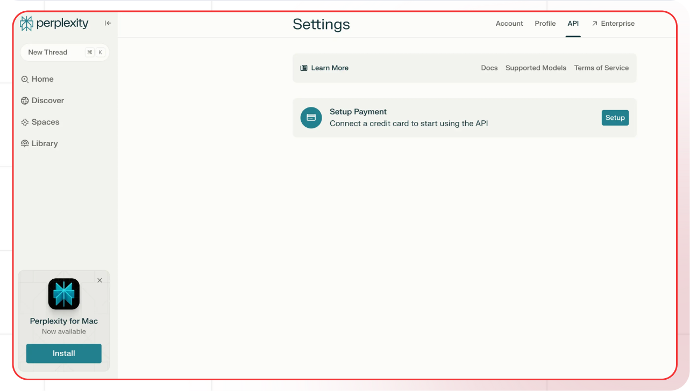

[Perplexity AI Settings]: https://perplexity.ai/settings/api

[Lamatic.ai Studio]: https://studio.lamatic.ai
[Lamatic support]: https://support.lamatic.ai

# Perplexity AI
Perplexity AI is a modern search and information discovery platform that revolutionizes how people find and understand information online. Through their perplexity.ai website and mobile apps, they provide an AI-powered search experience that delivers direct answers rather than just links, combining real-time information gathering with advanced AI processing. 
 
1. Visit [Perplexity AI Settings][Perplexity AI Settings]
2. Access API keys section
3. Generate new key
4. In [Lamatic.ai Studio]: Models → Perplexity AI → Paste key

### Follow these general steps in Lamatic.ai:
1. Open your [Lamatic.ai Studio]
2. Navigate to Models section
3. Select Perplexity AI provider
4. Paste the API key in the designated field
5. Save your changes

## Important Notes
- Keep your API keys secure and never share them
- Some providers may require additional setup steps
- Regularly rotate your API keys for security
- Test your integration after adding each key

Need help? Contact [Lamatic support]