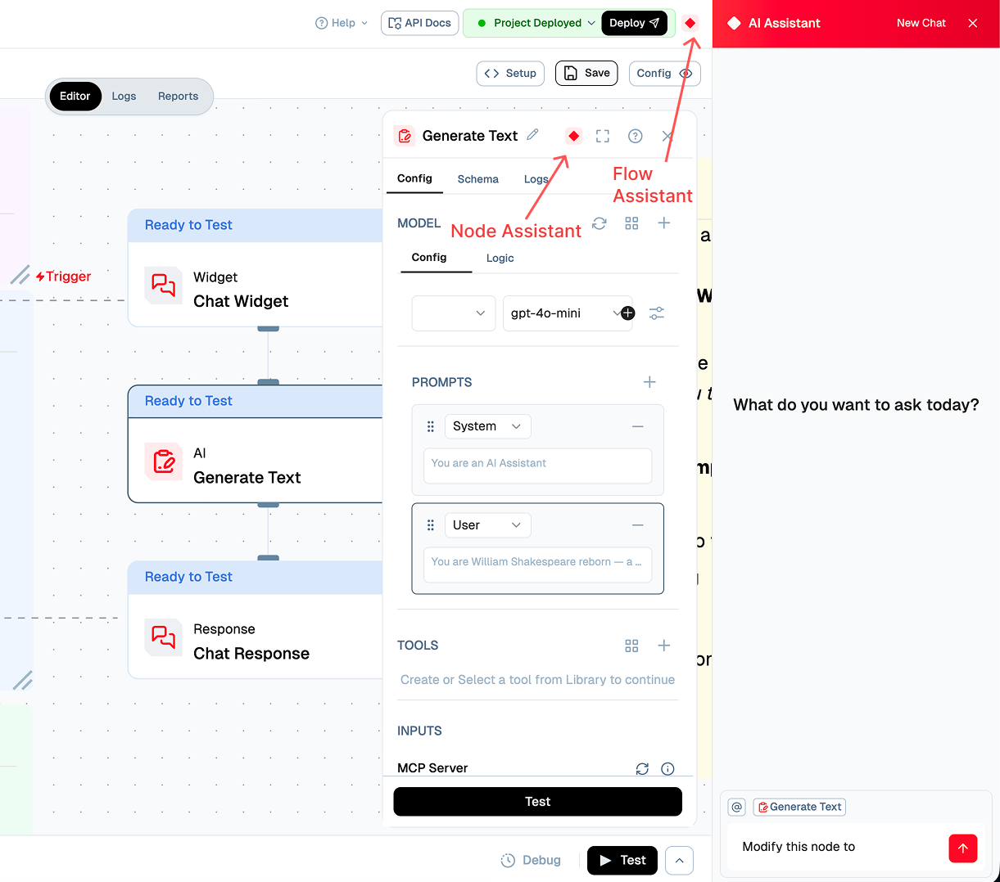

# Node AI Assistant

<Callout type="warning">
**Note**: The Node AI Assistant may occasionally provide improper or inaccurate responses. Please manually verify all instructions and configurations provided by the assistant. Our team is continuously working to improve this feature for better accuracy and reliability.
</Callout>
 
The Node AI Assistant is an intelligent helper that provides contextual AI-powered assistance for configuring individual nodes in your flow. Unlike the Flow AI Assistant which helps with overall workflow guidance, the Node Assistant focuses specifically on helping you configure, optimize, and improve individual nodes with targeted suggestions and improvements.

## What is the Node AI Assistant?

The Node AI Assistant is a specialized AI-powered feature that appears within the node configuration panel. It provides real-time, node-specific guidance to help you configure nodes more effectively. The assistant understands the context of the specific node you're working with and offers relevant suggestions, improvements, and step-by-step instructions tailored to that node's configuration.

## Key Features

### Node-Specific Configuration Help

The Node Assistant provides targeted assistance for the specific node you're configuring:

- **Model Selection**: Get recommendations on which AI models work best for your use case
- **Prompt Optimization**: Receive suggestions for improving your prompts based on best practices
- **Parameter Tuning**: Learn about optimal settings for node-specific parameters
- **Input/Output Mapping**: Get help with correctly mapping inputs and outputs
- **Tool Integration**: Receive guidance on selecting and configuring tools for your node

### Contextual Improvements

The assistant analyzes your node configuration and provides contextual suggestions:

- **Configuration Optimization**: Get recommendations to improve your node's performance
- **Best Practices**: Learn node-specific best practices and patterns
- **Error Prevention**: Receive warnings about potential configuration issues
- **Advanced Features**: Discover advanced configuration options you might not be aware of

### Interactive Assistance

Provide context about what you want to achieve, and the assistant will help you:

- **Custom Instructions**: Share your goals and requirements for the node
- **Iterative Refinement**: Get suggestions for improving your configuration step by step
- **Use Case Examples**: Request examples specific to your node type and use case
- **Troubleshooting**: Get help resolving configuration issues or errors

## How to Use the Node AI Assistant

### Accessing the Node Assistant

**Method:**
1. Open a flow in the Flow Editor
2. Click on the node you want to configure
3. The node configuration panel will open on the right side
4. Look for the assistant icon (diamond icon) next to the node's title in the configuration panel
5. Click on the assistant icon to enable the Node Assistant

### Getting Configuration Help

Once the Node Assistant is enabled, you can:

**Method:**
1. **Provide Context**: Share what you're trying to achieve with this node
2. **Ask Questions**: Ask specific questions about configuration options
3. **Request Improvements**: Ask the assistant to suggest improvements to your current configuration
4. **Get Examples**: Request examples of how to configure the node for your use case

**Example: Configuring an AI Text Generation Node**

1. Click on a "Generate Text" node in your flow
2. Open the node configuration panel
3. Click the assistant icon next to the node title
4. Provide context: "I want to create a chatbot that responds in a friendly, professional tone"
5. The assistant will provide suggestions for:
   - System prompts that match your tone requirements
   - Model selection recommendations
   - Temperature and other parameter settings
   - Best practices for chatbot configurations

### Providing Context for Improvement

The Node Assistant works best when you provide context about your goals:

**What to Share:**
- **Use Case**: What are you trying to accomplish with this node?
- **Requirements**: What are your specific requirements or constraints?
- **Current Issues**: Are you experiencing any problems with the current configuration?
- **Desired Outcome**: What result are you aiming for?

**Example Context:**
- "I need this node to process customer support tickets and extract key information"
- "I want to optimize this node for faster response times"
- "I'm getting errors when this node processes large text inputs"
- "I want to make this node's output more consistent"

### Working with Different Node Types

The Node Assistant adapts its guidance based on the node type:

**AI Nodes:**
- Model selection and configuration
- Prompt engineering and optimization
- Temperature and parameter tuning
- Tool selection and integration

**App Nodes:**
- Credential setup and authentication
- API endpoint configuration
- Data mapping and transformation
- Error handling and retry logic

**Data Nodes:**
- Data transformation strategies
- Chunking and indexing parameters
- Filtering and query optimization
- Performance tuning

**Logic Nodes:**
- Conditional logic setup
- Variable mapping
- Flow control patterns
- Code optimization

## Benefits of Using the Node Assistant

### Faster Configuration

- **Quick Setup**: Get step-by-step guidance for configuring nodes quickly
- **Reduced Errors**: Receive warnings and suggestions that help prevent configuration mistakes
- **Best Practices**: Learn optimal configuration patterns without extensive trial and error

### Improved Node Performance

- **Optimization Suggestions**: Get recommendations to improve node performance
- **Parameter Tuning**: Learn about optimal parameter settings for your use case
- **Resource Efficiency**: Receive guidance on using resources more efficiently

### Better Understanding

- **Node-Specific Learning**: Deep dive into specific node capabilities and features
- **Advanced Features**: Discover configuration options you might not know about
- **Contextual Examples**: See examples relevant to your specific node and use case

### Iterative Improvement

- **Continuous Refinement**: Get suggestions for improving your configuration over time
- **Context-Aware Help**: Receive assistance that understands your current configuration state
- **Goal-Oriented Guidance**: Get help that aligns with your specific objectives

## Best Practices

1. **Be Specific**: Provide clear context about what you want to achieve with the node
2. **Share Requirements**: Mention any specific requirements, constraints, or preferences
3. **Iterate**: Use the assistant's suggestions as a starting point and refine based on your needs
4. **Test Changes**: After applying suggestions, test your node to ensure it works as expected
5. **Combine with Flow Assistant**: Use the Node Assistant for node-specific help and the Flow Assistant for overall workflow guidance

## Node Assistant vs. Flow Assistant

While both assistants provide AI-powered help, they serve different purposes:

| **Feature** | **Node Assistant** | **Flow Assistant** |
|-------------|-------------------|-------------------|
| **Scope** | Individual node configuration | Overall flow structure and workflow |
| **Location** | Node configuration panel | Right side panel in Flow Editor |
| **Focus** | Node-specific settings, prompts, parameters | Flow structure, node connections, overall logic |
| **Use Case** | "How do I configure this specific node?" | "How do I build this workflow?" |
| **Context** | Current node's configuration | Entire flow context |

Use the Node Assistant when you need help with a specific node's configuration, and use the Flow Assistant when you need guidance on building or structuring your overall workflow.

The Node AI Assistant makes node configuration more intuitive and efficient, helping you get the most out of each node in your flow. Whether you're configuring a simple node or optimizing a complex one, the assistant provides valuable, context-aware guidance to help you achieve your goals.