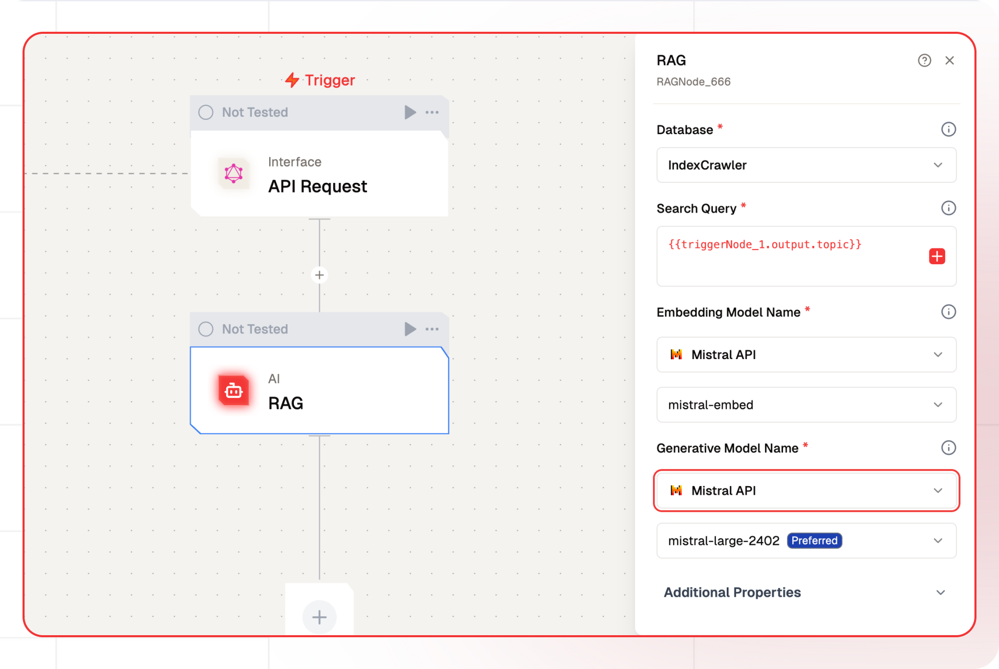

# RAG Node Documentation

The RAG Node generates more relevant responses from a Language Learning Model (LLM) by using Retrieval Augmented Generation (RAG). This approach incorporates additional context retrieved from a vector database to improve the accuracy and relevance of the generated text.

The node allows users to configure parameters such as the embedding model, generative model, and query specifics to tailor the response generation process to their needs. By leveraging RAG, users can efficiently create context-aware, concise, and helpful responses, making it a valuable tool for projects requiring advanced AI-driven text generation.



## Features

<details> 
  <summary>**Key Functionalities**</summary>
  1. **Database Integration**: Allows integration with a specified database (e.g., `IndexCrawler`) to fetch relevant data for downstream processes. 
  
  1. **Dynamic Query Handling**: Supports dynamic query generation using variables (e.g., `{{triggerNode.output.topic}}`) for flexible search and data retrieval. 
  
  1. **Embedding and Generative Models**: Enables the use of embedding models (e.g., `mistral-embed`) and generative models (e.g., `mistral-large-2402`) for advanced AI-powered search and content generation tasks. 
  
  1. **API Modular Configuration**: Offers seamless customization with additional properties for tailored AI and search workflows. 
</details>

<details>
  <summary>**Benefits**</summary>
  
  1. **Flexibility**: Supports a variety of databases and AI models, making it adaptable for diverse use cases.

  1. **Efficiency**: Utilizes embedding and generative models to provide relevant, high-quality outputs.

  1. **Scalability**: Ensures the capability to handle large datasets and complex queries without performance issues.

  1. **User-Friendly Design**: Simplifies workflow creation and configuration through an intuitive interface.
</details>

## What can I build?

1. Develop AI-driven chatbots that provide context-aware responses using RAG for improved user interactions.
1. Create automated customer support systems that deliver precise answers based on user queries and contextual data retrieval.
1. Build educational tools that generate tailored learning content and explanations by leveraging context from a vector database.
1. Design content creation platforms that use RAG to produce more relevant and concise articles or reports based on user input.

## Setup

### Select the RAG Node

1. Fill in the required parameters.
1. Build the desired flow
1. Deploy the Project
1. Click Setup on the workflow editor to get the automatically generated instruction and add it in your application.

## Configuration Reference

| **Parameter**             | **Description**                                                                                                                                                                                                                                                                                          | **Example Value**            |
| ------------------------- | -------------------------------------------------------------------------------------------------------------------------------------------------------------------------------------------------------------------------------------------------------------------------------------------------------- | ---------------------------- |
| **Database**              | Select the vector database to be queried.                                                                                                                                                                                                                                                                | Database                     |
| **Search Query**          | Input the query to search the vector database.                                                                                                                                                                                                                                                           | Tell me something about Bali |
| **Embedding Model Name**  | This field allows the user to select the embedding model used to embed the query into vector space. It loads available embedding models through the listModels method.                                                                                                                                   | Embedding Model Name         |
| **Generative Model Name** | Select the model to generate responses from the query results.                                                                                                                                                                                                                                           | LLM Model                    |
| **System Prompt**         | System prompt to guide the LLM                                                                                                                                                                                                                                                                           | You are Travel Planner       |
| **No. of References**     | Number of results to return                                                                                                                                                                                                                                                                              | 3                            |
| **Certainty**             | Its the distance score into a value between `0 <= certainty <= 1`, where 1 would represent identical vectors and 0 would represent opposite vectors.Its the distance score into a value between `0 <= certainty <= 1`, where 1 would represent identical vectors and 0 would represent opposite vectors. | 0.7                          |
| **Filters**               | Apply JSON-based filters to refine search results.Apply JSON-based filters to refine search results.                                                                                                                                                                                                     |                              |
| **Messages (History)**    | Pass your messages history here                                                                                                                                                                                                                                                                          | []                           |

## Low-Code Example

```yaml
nodes:
  - nodeId: RAGNode_666
    nodeType: RAGNode
    nodeName: RAG
    values:
      systemPrompt: >-
        You are a helpful AI assistant that answers user queries based on the
        context provided to you.
      vectorDB: IndexCrawler
      queryField: "{{triggerNode.output.topic}}"
      limit: "3"
      certainty: "0.7"
      filters: |-
        {
          "operator": "And",
          "operands": [
            {
              "path": [
                "title"
              ],
              "operator": "Equal",
              "valueText": "Test"
            }
          ]
        }
      messages: "[]"
      embeddingModelName:
        provider_name: mistral
        type: embedder/text
        credential_name: Mistral API
        credentialId: 32bf5e3b-a8fc-4697-b95a-b1af3dcf7498
        model_name: mistral/mistral-embed
      generativeModelName:
        provider_name: mistral
        type: generator/text
        credential_name: Mistral API
        credentialId: 32bf5e3b-a8fc-4697-b95a-b1af3dcf7498
        model_name: mistral/mistral-large-2402
    needs:
      - triggerNode
```

## Output

- `modelResponse`: A string containing the text response generated by the model, incorporating retrieved information and reasoning.

- `references`: An array of objects representing the source documents or data points used to generate the response.

- `_additional`: A nested object within `references` containing supplementary metadata about the reference.

- `certainty`: A float value indicating the confidence or relevance score of the reference, as provided in the additional metadata.

- `data`: A string or null value representing the content extracted from the reference source.

- `rr`: A string or null value denoting an additional attribute or identifier related to the reference.

- `certainty`: A float value representing the confidence or relevance score of the reference, mirrored at the top level.

- `_meta`: A nested object containing metadata about the processing of the request.

- `prompt_tokens`: An integer indicating the number of tokens in the input prompt provided to the model.

- `completion_tokens`: An integer representing the number of tokens in the generated output.

- `total_tokens`: An integer reflecting the sum of `prompt_tokens` and `completion_tokens`.

- `prompt_tokens_details`: A nested object providing a breakdown of token usage in the prompt.

- `cached_tokens`: An integer indicating the number of tokens reused from a cache.

- `audio_tokens`: An integer representing the number of tokens associated with audio input, if applicable.

- `completion_tokens_details`: A nested object detailing token usage in the generated output.

- `reasoning_tokens`: An integer indicating the number of tokens used for reasoning processes, if applicable.

- `audio_tokens`: An integer representing the number of tokens associated with audio output, if applicable.

- `accepted_prediction_tokens`: An integer indicating the number of tokens from accepted predictions, if applicable.

- `rejected_prediction_tokens`: An integer representing the number of tokens from rejected predictions, if applicable.

- `model_name`: A string specifying the name of the AI model used for generation.

- `model_provider`: A string identifying the provider or organization supplying the model.


### Example Output

```json
{
    "modelResponse": "The information extracted from the reference documents provided indicates:\n\n1. The first document has a certainty score of about 0.873 but does not contain any specific data (it is null).\n2. The second document, with a certainty score of around 0.861, contains some sort of information labeled as \"info,\" but does not provide further details or context about the nature of this information.\n\nBased on these documents, it's not possible to provide detailed content as the first document is empty and the second only indicates the presence of some unspecified information.",
    "references": [
      {
        "_additional": {
          "certainty": 0.8730262517929077
        },
        "data": null,
        "rr": "wr",
        "certainty": 0.8730262517929077
      },
      {
        "_additional": {
          "certainty": 0.8614917993545532
        },
        "data": "info",
        "rr": null,
        "certainty": 0.8614917993545532
      }
    ],
    "_meta": {
      "prompt_tokens": 112,
      "completion_tokens": 111,
      "total_tokens": 223,
      "prompt_tokens_details": {
        "cached_tokens": 0,
        "audio_tokens": 0
      },
      "completion_tokens_details": {
        "reasoning_tokens": 0,
        "audio_tokens": 0,
        "accepted_prediction_tokens": 0,
        "rejected_prediction_tokens": 0
      },
      "model_name": "gpt-4-turbo",
      "model_provider": "openai"
    }
  }
```

## Troubleshooting

### Common Issues

| **Problem**                    | **Solution**                                                 |
| ------------------------------ | ------------------------------------------------------------ |
| **Invalid API Key**            | Ensure the API key is correct and has not expired.           |
| **Dynamic Content Not Loaded** | Increase the `Wait for Page Load` time in the configuration. |

### Debugging

1. Check Lamatic Flow logs for error details.
1. Verify API Key.
