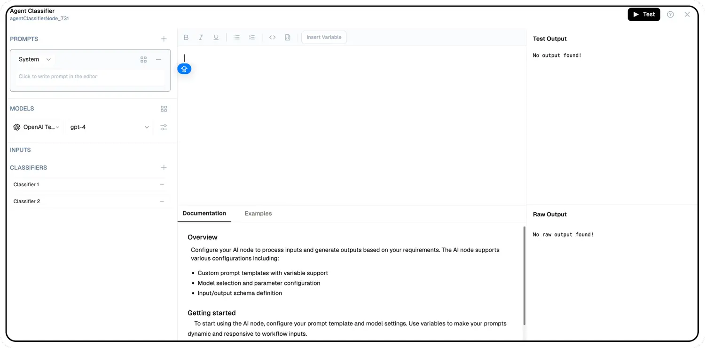

# Agent Classifier Node Documentation

The Agent Classifier Node processes input data and classifies it into predefined categories. This node is essential for applications requiring automated data categorization, intent recognition, or routing tasks based on classification results.


## Features

<details>
  <summary>**Key Functionalities**</summary>
  1. **Multi-Input Classification:** Supports both text and structured data inputs
  for classification. 1. **Customizable Categories:** Allows defining specific categories
  for classification based on application needs. 1. **Intent Recognition:** Identifies
  user intent from textual input and maps it to predefined intents. 1. **Automated
  Routing:** Routes data or user queries to the appropriate workflow based on classification
  results. 1. **LLM Integration:** Uses large language models to enhance classification
  accuracy and contextual understanding.
</details>

<details>
  <summary>**Benefits**</summary>
  1. **Improved Automation:** Reduces manual intervention by automatically categorizing
  input data. 1. **Enhanced User Experience:** Directs queries or data to the appropriate
  processing module efficiently. 1. **Scalability:** Supports multiple classification
  tasks across different domains. 1. **Efficiency:** Streamlines workflows by integrating
  classification and routing into a single node. 1. **AI-Powered Accuracy:** Leverages
  advanced AI models for context-aware classification.
</details>

## What can I build?

1. Automate customer support by categorizing and routing user queries to the correct department.

1. Enhance chatbot interactions with intent-based responses.

1. Implement dynamic content recommendations based on user input classification.

1. Build intelligent document categorization systems for large-scale data management.

## Setup

### Select the Agent Classifier Node

1. Fill in the required parameters.
1. Build the desired flow
1. Select Agent Classifier Node.
1. Deploy the Project

## Configuration Reference



| **Parameter**             | **Description**                                                                                                | **Example Value**            |
| ------------------------- | -------------------------------------------------------------------------------------------------------------- | ---------------------------- |
| **Generative Model Name** | Select the model to generate text based on the prompt.                                                         | Gemini Model                 |
| **Prompt Template**       | Define the instructions for generating the text output.Define the instructions for generating the text output. | Tell me something about Bali |
| **Classifier**            | Add Classifier                                                                                                 | `Classifier 1`               |
| **System Prompt**         | System prompt to guide the LLM                                                                                 | You are Travel Planner       |

## Low-Code Example

```yaml
nodes:
  - nodeId: agentClassifierNode_885
    nodeType: agentClassifierNode
    nodeName: Agent Classifier
    values:
      promptTemplate: ""
      systemPrompt: ""
      classifier:
        - label: Classifier 1
          value: agentClassifierNode_885-addNode_248
        - label: Classifier 2
          value: agentClassifierNode_885-addNode_671
    needs:
      - triggerNode_1
    classifier:
      - label: Classifier 1
        value: plus-node-addNode_248884
      - label: Classifier 2
        value: plus-node-addNode_671526
  - nodeId: plus-node-addNode_248884
    nodeType: addNode
    nodeName: ""
    values: {}
    needs:
      - agentClassifierNode_885
  - nodeId: plus-node-addNode_671526
    nodeType: addNode
    nodeName: ""
    values: {}
    needs:
      - agentClassifierNode_885
  - nodeId: plus-node-addNode_605143
```

## Output 

#### `_meta`
- A nested object containing metadata about the request processing.

  - **`prompt_tokens`**: The number of tokens in the input prompt provided to the model.
  - **`completion_tokens`**: The number of tokens generated in the model’s output.
  - **`total_tokens`**: The total sum of `prompt_tokens` and `completion_tokens`.
  - **`model_name`**: The identifier of the AI model utilized for processing the request.
  - **`model_provider`**: The organization or entity supplying the AI model.

#### `class`
- The classification label or result determined by the classifier.

#### `condition`
- A secondary attribute indicating the condition or context of the classification.

### Example Output

```json
    {
      "_meta": {
      "prompt_tokens": 56,
      "completion_tokens": 4,
      "total_tokens": 60,
      "model_name": "gemini-1.5-pro-latest",
      "model_provider": "google"
    },
    "class": "Classifier 1",
    "condition": "Classifier 1"
    }
```

## Troubleshooting

### Common Issues

| **Problem**                     | **Solution**                                                    |
| ------------------------------- | --------------------------------------------------------------- |
| **Invalid API Key**             | Adjust the confidence threshold or refine system prompts.       |
| **Low Classification Accuracy** | Increase the `Wait for Page Load` time in the configuration.    |
| **Incorrect Routing**           | Review and update routing rules based on classification output. |

### Debugging

1. Check Lamatic Flow logs for error details.
1. Verify API Key.
1. Verify classification model settings.
1. Test different system prompts for improved accuracy.
