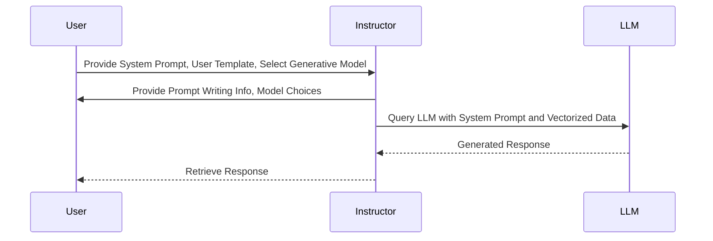

# RAG

Query a chosen LLM with a structured prompt and vectorized data and retrieve its response

<Callout emoji="💡">
    **Learn More about Retrieval Augmented Generation (RAG) on [Weaviate](https://weaviate.io/developers/weaviate/starter-guides/generative)**
</Callout>

### Input Parameters

- Input Field for Query:
- Vector DB: Choose vector database to use for RAG process
- Limit: Upper limit of how many documents to be fed to the model
- Certainty: Decimal value between 0 to 1 for how loose or strict to be on what data is given to the model
- Filters (JSON): Custom JSON to filter which documents are accessed by key attributes
- System Prompt: A prompt to give the model context as to what its purpose is in relation to the process
- User Template: A prompt for the model combining the data provided and the specific query for the workflow
- Embedding Model Name: Choose model to embed data as vectors
- Generative Model Name: Choose LLM from your activated models to use for the query

### Expected Output

Generated text designed by the prompt template imformed by vectorized data from database

**Example Use Case**

In this example, a vector database of recipes is embedded using OpenAI's ADA-002 model and combined with a prompt and 
GPT 3.5 is queried and its response is the output

