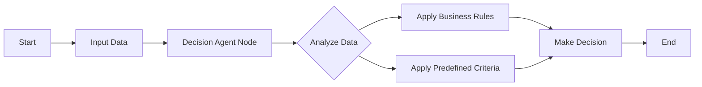

# Decision Branch

The Decision Agent Node brings the power of 
AI-driven decision-making to your GenAI applications. 
By analyzing complex data, this Agent Node can assist 
in making informed decisions based on predefined criteria 
and business rules, streamlining decision-making processes 
and improving overall efficiency.

As developers, the Decision Agent Node offers a powerful tool for integrating AI-driven decision-making into your applications. By leveraging this node, you can automate complex decision-making processes, reducing manual intervention and potential for human error.
Remember, the Decision Agent Node is not a silver bullet. It's important to understand the data you're working with, the business rules and criteria you're applying, and the decisions you're automating. Always validate the decisions made by the Decision Agent Node to ensure they align with your expectations and business objectives.
For more information on how to integrate the Decision Agent Node into your applications, refer to the GenAI Developer Documentation.

