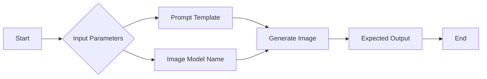

# Generate Image

Use image generation model to create an image given a text prompt

### Input Parameters

- Prompt Template: An effective prompt using text and variables from the workflow to achieve the best AI-generated image for its use
    - Learn more about writing good image generation prompts on [Zapier](https://zapier.com/blog/ai-art-prompts/)
- Image Model Name: Which model from your added models to use for image generation

### Expected Output

 A high-quality image generated by the selected model based on the prompt template.

**Example Use Case**

In this recipe generation workflow, after generating the recipe metadata, this 
information is fed into the image generation node which prompts DALL-E 3 and outputs 
an image of what the cooked dish might look like.

