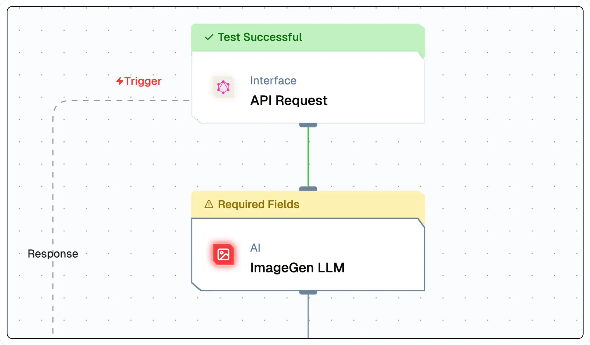

import { NodeOverview } from "@/components/NodeOverview";

# Image Gen Node

<NodeOverview slug="generate-image-node" type="ai" />

## Overview

The Generate Image node creates image outputs programmatically that can be integrated into flow. Images are generated based on specified parameters and prompts. This node leverages models like OpenAI's DALL-E. It is useful for applications requiring automated image generation.



## Features

<details>
  <summary>**Key Functionalities**</summary>
1. **Generative Images**: Allows users to select credentials for their preferred generative model, ensuring flexibility and compatibility with various LLMs.

1. **Customizable Prompts**: Features a field for creating prompt templates, enabling tailored input for specific use cases.
</details>

<details>
  <summary>**Benefits**</summary>

1. **Flexibility**: Supports integration with multiple LLMs, allowing users to utilize different models based on their specific needs and use cases.

1. **User-Centric Design**: Provides intuitive interfaces for prompt customization and system prompt definition, making it accessible to both beginners and advanced users.
</details>

## What can I build?

1. Automated generation of visual content for marketing campaigns.
1. Integration of custom image generation into e-commerce platforms for product visualization.
1. Creation of personalized artwork or graphics for social media posts.
1. Development of dynamic website features that adapt visuals based on user input.

## Setup

### Select the Image Generate Node

1. Fill in the required parameters.
1. Build the desired flow
1. Deploy the Project
1. Click Setup on the workflow editor to get the automatically generated instruction and add it in your application.

## Configuration Reference

| **Parameter**             | **Description**                                                                                                | **Example Value**             |
| ------------------------- | -------------------------------------------------------------------------------------------------------------- | ----------------------------- |
| **Generative Model Name** | Select the model to generate text based on the prompt.                                                         | Open AI Model                 |
| **User Prompt**           | Define the instructions for generating the text output.Define the instructions for generating the text output. | Create a Image of Car in Bali |

## Low-Code Example

```yaml
nodes:
  - nodeId: ImageGenNode_135
    nodeType: ImageGenNode
    nodeName: ImageGen
    values:
      promptTemplate: make image on ${{triggerNode_1.output.topic}}
      imageGenModelName:
        provider_name: openai
        type: generator/image
        credential_name: Test
        credentialId: b552a29b-69b6-4951-84c3-a6555bb132d1
        model_name: hd/1024-x-1024/dall-e-3
    needs:
      - triggerNode_1
  - nodeId: plus-node-addNode_401321
    nodeType: addNode
    nodeName: ""
    values: {}
    needs:
      - ImageGenNode_135
```

## Troubleshooting

### Common Issues

| **Problem**                    | **Solution**                                                 |
| ------------------------------ | ------------------------------------------------------------ |
| **Invalid API Key**            | Ensure the API key is correct and has not expired.           |
| **Dynamic Content Not Loaded** | Increase the `Wait for Page Load` time in the configuration. |

### Debugging

1. Check Lamatic Flow logs for error details.
1. Verify API Key.
