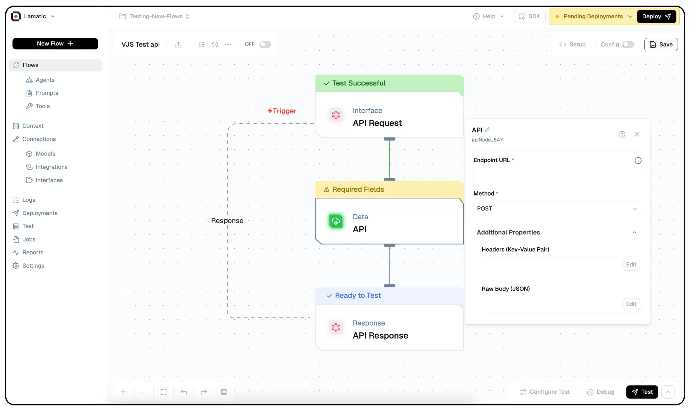

import { NodeOverview } from "@/components/NodeOverview"

# API Node

<NodeOverview slug="api-node"/>

## Overview

The Lamatic.ai API Node enables users to integrate external REST APIs effortlessly into their flow.


## Features

<details>
  <summary>**Key Functionalities**</summary>

1. **Custom Logic Integration:** Seamlessly incorporate JavaScript code to create tailored flow.

2. **Data Manipulation:** Process and transform large datasets dynamically within your flows.

3. **Third-Party API Support:** Extend your flow by connecting to external APIs and services.

4. **Dynamic Report Generation:** Automate the creation of insightful reports based on real-time data.

5. **Testing and Deployment Tools:** Easily test and deploy JavaScript logic directly in the Lamatic platform.

</details>

<details>
  <summary>**Benefits**</summary>

1. **Enhanced Flow Customization:** Tailor flows to meet specific business or operational needs.

2. **Streamlined Automation:** Minimize manual intervention with robust, automated processes.

3. **Improved Efficiency:** Optimize flow by integrating complex operations directly into your flows.

4. **Reduced Development Overhead:** Empower developers to build and deploy custom logic without external systems.

5. **Scalable Design:** Create reusable logic components that adapt to various use cases and scale with your needs.

</details>

## What Can You Build?

1. **Automated Data Processing Flow:** Handle large datasets within the Lamatic platform effortlessly by automating repetitive tasks and calculations.
1. **Custom Notification Systems:** Send alerts based on specific criteria or data changes, ensuring timely communication.
1. **Third-Party API Integration:** Extend the functionality of existing Lamatic flows by incorporating external APIs.
1. **Dynamic Report Generation:** Compile and present data insights automatically for real-time analysis and decision-making.

## Setup

### Select the API Node

1. Fill in the required parameters.
1. Build the desired flow
1. Deploy the Project
1. Click Setup on the workflow editor to get the automatically generated instruction and add it in your application.

## Configuration Reference

| **Parameter**                 | **Description**                                                                                   | **Required** | **Example Value**            |
| ----------------------------- | ------------------------------------------------------------------------------------------------- | ------------ | ---------------------------- |
| **Endpoint URL**              | Specify the URL of the API endpoint that this node will connect to for sending or receiving data. | Yes          | https://api.github.com/users |
| **Method**                    | API Request Method (Get/Post)                                                                     | Yes          | Get                          |
| **Body**                      | Body Parameters                                                                                   | Yes          | {}                           |
| **Headers**                   | API Headers                                                                                       | No           | []                           |
| **Number of Retries**         | Set the number of retry attempts if the API request fails.                                        | No           | 0                            |
| **Delay between retry (sec)** | Specify the wait time in seconds between each retry.                                              | No           | 0                            |

## Low-Code Example

```yaml
nodes:
nodes:
  - nodeId: apiNode_601
    nodeType: apiNode
    nodeName: API
    values:
      url: https://api.github.com/users
      method: GET
      headers: ''
      body: '{}'
      retries: '0'
      retry_deplay: '0'
    needs:
      - triggerNode_1
  - nodeId: plus-node-addNode_259786
    nodeType: addNode
    nodeName: ''
    values: {}
    needs:
      - apiNode_601
```
## Output

The data retrieved from the API request.

### Example Output

```json
  { "key": "value" }
```

## Troubleshooting

### Common Issues

| **Problem**                    | **Solution**                                                 |
| ------------------------------ | ------------------------------------------------------------ |
| **Invalid API**                | Ensure the API is correct.                                   |
| **Dynamic Content Not Loaded** | Increase the `Wait for Page Load` time in the configuration. |

### Debugging

1. Check Lamatic Flow logs for error details.
1. Verify API Key.
