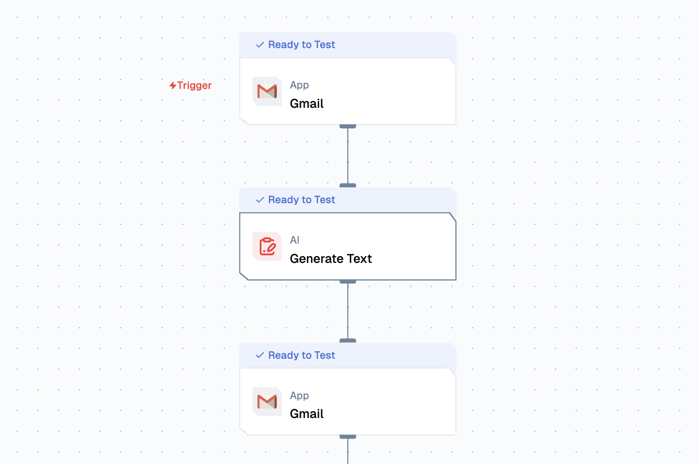

import { NodeOverview } from "@/components/NodeOverview";
import { NodeTypeInfo } from "@/components/NodeTypeInfo";

# Gmail Node

<NodeOverview slug="gmail-node" type="apps" />

## Overview

The Gmail Node is an email automation component that provides both event triggering and action capabilities for Gmail integration. This node enables automated email monitoring, sending, and management within flows, supporting real-time email processing and automated email operations.



<NodeTypeInfo
  batchTrigger={false}
  eventTrigger={true}
  action={true}
  description="This node is both an Event Trigger and Action node that provides email automation capabilities for monitoring, sending, and managing emails."
/>

This node combines **Event Trigger** and **Action** capabilities to provide comprehensive email automation within your workflows.

## Features

<details>
  <summary>**Key Functionalities**</summary>

1. **Event Trigger - On New Email**: Automatically triggers workflows when new emails are received, enabling real-time email processing and automation.
2. **Action - Send Email**: Composes and sends emails with customizable content, recipients, and attachments.
3. **Action - Create Event Draft**: Generates calendar event drafts from email content for scheduling automation.
4. **Action - Fetch Email**: Retrieves specific emails or email threads based on search criteria and filters.

</details>

<details>
  <summary>**Benefits**</summary>

1. **Real-time Email Monitoring**: Automatically responds to incoming emails without manual intervention.
2. **Automated Email Communication**: Streamlines email sending processes with customizable templates and dynamic content.
3. **Calendar Integration**: Seamlessly converts email content into calendar events for better scheduling.
4. **Email Data Extraction**: Efficiently retrieves and processes email data for analysis and workflow integration.

</details>

## Prerequisites

Before using Gmail Node, ensure the following:

- **Gmail Account**: A valid Gmail account with proper authentication setup.

## Setup

### Step 1: Set Up Gmail API Access

1. Set Up Google Drive Access
   - Set up Google OAuth credentials for Gmail access |

### Step 2: Set Up Lamatic Flow

1. **Create a Custom Flow** for Gmail automation:
   - Configure the Gmail node based on your use case
   - Set up event triggers for email monitoring
   - Define action parameters for email operations

## Configuration Reference

### Event Trigger Configuration

| **Parameter**    | **Description**                                             | **Required** | **Example**            |
| ---------------- | ----------------------------------------------------------- | ------------ | ---------------------- |
| **Name**         | Display name for the node                                   | ✅           | `Gmail Monitor`        |
| **Credentials**  | Gmail authentication details required to access the account | ✅           | `my-gmail-credentials` |
| **Trigger Type** | Type of email event to monitor                              | ✅           | `On New Email`         |

### Action Configuration

#### Send Email Action

| **Parameter**        | **Description**                                      | **Required** | **Example**                                       |
| -------------------- | ---------------------------------------------------- | ------------ | ------------------------------------------------- |
| **Name**             | Display name for the action                          | ✅           | `Send Email`                                      |
| **Credentials**      | Gmail authentication details required to send emails | ✅           | `my-gmail-credentials`                            |
| **Action**           | Actions for Gmail                                    | ✅           | `Send Email`, `Create Email Draft`, `Fetch Email` |
| **Recipient Email**  | Recipient email addresses (comma-separated)          | ✅           | `recipient@example.com`                           |
| **Subject**          | Email subject line                                   | ✅           | `Automated Response`                              |
| **Body**             | Email body content (supports HTML and plain text)    | ✅           | `Hello, this is an automated email.`              |
| **CC**               | CC recipient email addresses (comma-separated)       | ❌           | `cc@example.com`                                  |
| **BCC**              | BCC recipient email addresses (comma-separated)      | ❌           | `bcc@example.com`                                 |
| **Is Content HTML?** | Set to true if the email body is HTML.               | ❌           | `true`, `false`                                   |

#### Fetch Email Action

| **Parameter**           | **Description**                                                                                                   | **Required** | **Example**                  |
| ----------------------- | ----------------------------------------------------------------------------------------------------------------- | ------------ | ---------------------------- |
| **Name**                | Display name for the action                                                                                       | ✅           | `Fetch Email`                |
| **Credentials**         | Gmail authentication details required to fetch emails                                                             | ✅           | `my-gmail-credentials`       |
| **Max Results**         | Maximum number of emails to retrieve                                                                              | ❌           | `10`                         |
| **From User**           | If provided, only emails from the specified user(s) will be fetched. If not provided, all emails will be fetched. | ❌           | `user1@example.com`          |
| **To User**             | If provided, only emails to the specified user(s) will be fetched. If not provided, all emails will be fetched.   | ❌           | `user2@example.com`          |

## Low-Code Example

### Event Trigger Example

```yaml
triggerNode:
  nodeId: triggerNode_1
  nodeType: gmailNode
  nodeName: Gmail
  values:
    credentials: Gmail OAuth VJS
    action: GMAIL_NEW_GMAIL_MESSAGE
  modes: {}
```

### Action Examples

#### Send Email Action

```yaml
nodes:
  - nodeId: gmailNode_397
    nodeType: gmailNode
    nodeName: Gmail
    values:
      credentials: Gmail OAuth VJS
      action: GMAIL_SEND_EMAIL
      recipient_email: ''
      cc: ''
      bcc: ''
      subject: ''
      body: ''
      is_html: false
      max_results: 10
      from_user: ''
      to_user: ''
    modes: {}
    needs:
      - triggerNode_1
```

#### Create Event Draft Action

```yaml
nodes:
  - nodeId: gmailNode_397
    nodeType: gmailNode
    nodeName: Gmail
    values:
      credentials: Gmail OAuth VJS
      action: GMAIL_CREATE_EMAIL_DRAFT
      recipient_email: ''
      cc: ''
      bcc: ''
      subject: ''
      body: ''
      is_html: false
      max_results: 10
      from_user: ''
      to_user: ''
    modes: {}
    needs:
      - triggerNode_1
```

#### Fetch Email Action

```yaml
nodes:
  - nodeId: gmailNode_397
    nodeType: gmailNode
    nodeName: Gmail
    values:
      credentials: Gmail OAuth VJS
      action: GMAIL_FETCH_EMAILS
      recipient_email: ''
      cc: ''
      bcc: ''
      subject: ''
      body: ''
      is_html: false
      max_results: 10
      from_user: ''
      to_user: ''
    modes: {}
    needs:
      - triggerNode_1
```


## Output

### Event Trigger Output

- `emailId`: String identifier for the email
- `from`: String containing the sender's email address
- `to`: String containing the recipient's email address
- `subject`: String containing the email subject
- `body`: String containing the email body content
- `timestamp`: String containing the email timestamp
- `labels`: Array of strings containing Gmail labels
- `attachments`: Array of attachment objects (if any)

### Action Output

#### Send Email Output

- `messageId`: String identifier for the sent email
- `threadId`: String identifier for the email thread
- `success`: Boolean indicating if the email was sent successfully
- `timestamp`: String containing the send timestamp

#### Create Event Draft Output

- `eventId`: String identifier for the created event
- `eventLink`: String containing the link to the event
- `success`: Boolean indicating if the event was created successfully
- `attendees`: Array of attendee objects with their response status

#### Fetch Email Output

- `emails`: Array of email objects containing:
  - `emailId`: String identifier for the email
  - `from`: String containing the sender's email address
  - `to`: String containing the recipient's email address
  - `subject`: String containing the email subject
  - `body`: String containing the email body content
  - `timestamp`: String containing the email timestamp
  - `labels`: Array of strings containing Gmail labels
  - `attachments`: Array of attachment objects (if any)
- `totalCount`: Number indicating the total number of emails found
- `nextPageToken`: String token for pagination (if applicable)

## Troubleshooting

### Common Issues

| **Problem**                | **Solution**                                                                    |
| -------------------------- | ------------------------------------------------------------------------------- |
| **Authentication Errors**  | Verify that the Gmail OAuth credentials are valid and have the correct scopes   |
| **Permission Denied**      | Ensure the Gmail API is enabled and the account has proper permissions          |
| **Email Not Triggering**   | Check the filter criteria and ensure the monitored label exists                 |
| **Send Email Fails**       | Verify recipient email addresses and ensure the account has sending permissions |
| **Calendar Access Issues** | Confirm that Calendar API is enabled and the account has calendar permissions   |
| **Rate Limiting**          | Implement appropriate delays between API calls to avoid hitting rate limits     |

### Debugging

- Check Gmail API logs for detailed error messages
- Verify OAuth token validity and refresh if necessary
- Test email filters using Gmail's search syntax
- Monitor API quota usage to avoid rate limiting
- Validate email addresses and calendar event parameters
- Check network connectivity and firewall settings
- Review Gmail API documentation for specific error codes

