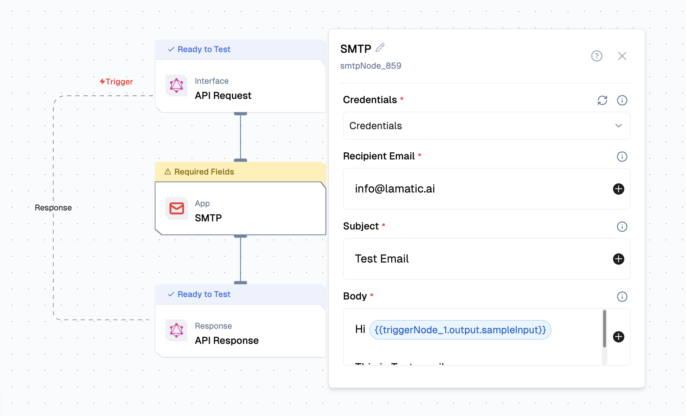

import { NodeOverview } from "@/components/NodeOverview";
import { NodeTypeInfo } from "@/components/NodeTypeInfo";

# SMTP Node

<NodeOverview slug="smtp-node" type="apps" />

## Overview

The SMTP Node is an email automation component that provides action capabilities for SMTP integration. This node enables automated email sending and management within flows, supporting reliable email delivery through standard SMTP protocol.




<NodeTypeInfo
  batchTrigger={false}
  eventTrigger={false}
  action={true}
  description="This node is an Action node that provides email automation capabilities for sending emails through SMTP protocol."
/>

This node provides **Action** capabilities to send emails through SMTP servers within your workflows.

## Features

<details>
  <summary>**Key Functionalities**</summary>

1. **Action - Send Email**: Composes and sends emails with customizable content, recipients, and attachments through SMTP protocol.
2. **SMTP Authentication**: Supports various SMTP authentication methods including username/password authentication.
3. **HTML and Plain Text Support**: Send emails in both HTML and plain text formats.
4. **Multiple Recipients**: Support for CC and BCC recipients in addition to primary recipients.

</details>

<details>
  <summary>**Benefits**</summary>

1. **Reliable Email Delivery**: Uses standard SMTP protocol for reliable email delivery across different email providers.
2. **Flexible SMTP Configuration**: Works with any SMTP server, including custom mail servers and third-party providers.
3. **Automated Email Communication**: Streamlines email sending processes with customizable templates and dynamic content.
4. **Enterprise Integration**: Ideal for enterprise environments with custom SMTP servers and security requirements.

</details>

## Prerequisites

Before using SMTP Node, ensure the following:

- **SMTP Server Access**: Valid SMTP server credentials and connection details.
- **Email Account**: A valid email account configured for SMTP sending.

## Setup

### Step 1: Configure SMTP Credentials

1. **Set Up SMTP Credentials**:
   - Configure SMTP host, port, username, and password
   - Ensure proper authentication settings for your SMTP server
   - Test SMTP connection to verify credentials

### Step 2: Set Up Lamatic Flow

1. **Create a Custom Flow** for SMTP email automation:
   - Configure the SMTP node with your credentials
   - Set up action parameters for email operations
   - Define recipient lists and email content

## Configuration Reference

### Credential Configuration

| **Parameter**    | **Description**                                             | **Required** | **Example**            |
| ---------------- | ----------------------------------------------------------- | ------------ | ---------------------- |
| **Credential Name** | Display name for the SMTP credentials                      | ✅           | `My SMTP Server`       |
| **Sender Email** | Email address to send from                                  | ✅           | `sender@example.com`   |
| **Sender Name**  | Display name for the sender                                 | ✅           | `John Doe`             |
| **SMTP Host**    | SMTP server hostname or IP address                          | ✅           | `smtp.gmail.com`       |
| **SMTP Port**    | SMTP server port number                                     | ✅           | `587`                  |
| **Username**     | SMTP authentication username                                | ✅           | `user@example.com`     |
| **Password**     | SMTP authentication password                                | ✅           | `your-password`        |

### Action Configuration

#### Send Email Action

| **Parameter**        | **Description**                                      | **Required** | **Example**                                       |
| -------------------- | ---------------------------------------------------- | ------------ | ------------------------------------------------- |
| **Name**             | Display name for the action                          | ✅           | `Send Email`                                      |
| **Credentials**      | SMTP authentication details required to send emails | ✅           | `my-smtp-credentials`                             |
| **Recipient Email**  | Recipient email addresses (comma-separated)          | ✅           | `recipient@example.com`                           |
| **Subject**          | Email subject line                                   | ✅           | `Automated Response`                              |
| **Body**             | Email body content (supports HTML and plain text)    | ✅           | `Hello, this is an automated email.`              |
| **CC**               | CC recipient email addresses (comma-separated)       | ❌           | `cc@example.com`                                  |
| **BCC**              | BCC recipient email addresses (comma-separated)      | ❌           | `bcc@example.com`                                 |
| **In HTML**          | Set to true if the email body is HTML                | ❌           | `true`, `false`                                   |

## Low-Code Example

### Action Example

#### Send Email Action

```yaml
nodes:
  nodes:
  - nodeId: smtpNode_859
    nodeType: smtpNode
    nodeName: SMTP
    values:
      credentials: 'smtp_1'
      recipient_email: ''
      cc: ''
      bcc: ''
      subject: ''
      body: ''
      is_html: false
    modes: {}
    needs:
      - triggerNode_1
```

## Output

### Action Output

#### Send Email Output

- `messageId`: String identifier for the sent email
- `success`: Boolean indicating if the email was sent successfully
- `timestamp`: String containing the send timestamp
- `recipients`: Array of recipient objects with delivery status
- `error`: String containing error message if sending failed

## Troubleshooting

### Common Issues

| **Problem**                | **Solution**                                                                    |
| -------------------------- | ------------------------------------------------------------------------------- |
| **Authentication Errors**  | Verify that the SMTP credentials are correct and the server supports the authentication method |
| **Connection Timeout**     | Check SMTP host and port settings, ensure firewall allows SMTP connections      |
| **SSL/TLS Issues**         | Verify SSL/TLS settings match your SMTP server requirements                     |
| **Send Email Fails**       | Verify recipient email addresses and ensure the SMTP server allows sending      |
| **Rate Limiting**          | Implement appropriate delays between email sends to avoid hitting rate limits   |
| **Port Blocking**          | Ensure the SMTP port (usually 587, 465, or 25) is not blocked by firewall     |

### Debugging

- Check SMTP server logs for detailed error messages
- Verify SMTP credentials and server settings
- Test SMTP connection using email client or command line tools
- Monitor SMTP server quota and rate limits
- Validate email addresses and message content
- Check network connectivity and firewall settings
- Review SMTP server documentation for specific error codes
- Ensure proper SSL/TLS configuration for secure connections

### Common SMTP Ports

| **Port** | **Protocol** | **Description**                    |
| -------- | ------------ | ---------------------------------- |
| **25**   | SMTP         | Standard SMTP port (often blocked) |
| **587**  | SMTP/TLS     | Submission port with STARTTLS      |
| **465**  | SMTP/SSL     | Secure SMTP with SSL encryption    |

### Popular SMTP Providers

| **Provider** | **SMTP Host**        | **Port** | **Security** |
| ------------ | -------------------- | -------- | ------------ |
| **Gmail**    | smtp.gmail.com       | 587      | STARTTLS     |
| **Outlook**  | smtp-mail.outlook.com| 587      | STARTTLS     |
| **Yahoo**    | smtp.mail.yahoo.com  | 587      | STARTTLS     |
| **SendGrid** | smtp.sendgrid.net    | 587      | STARTTLS     |
| **Mailgun**  | smtp.mailgun.org     | 587      | STARTTLS     |
