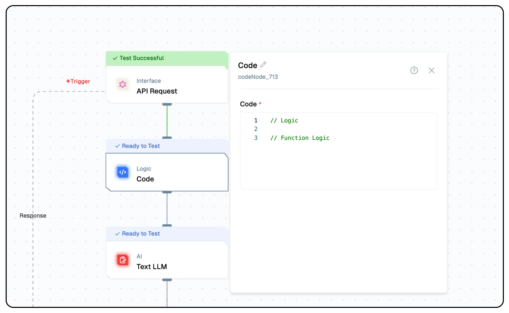

# Code Node Documentation

The Lamatic.ai JavaScript Code Node allows users to enhance their workflow automation by integrating custom logic into their Lamatic flow. It provides a flexible and powerful way to manipulate data and create complex operations within the Lamatic platform using JavaScript. This node is designed to be user-friendly, enabling developers to easily add, test, and deploy their code within the platform. By using this node, users can tailor their workflows to meet specific needs.


<Callout type="info">
 We will expand support to include additional programming languages.
</Callout>

## Features

<details>
  <summary>**Key Functionalities**</summary>

  1. **Custom Logic Integration:** Seamlessly incorporate JavaScript code to create tailored workflows.  

  1. **Data Manipulation:** Process and transform large datasets dynamically within your flows.  

  1. **Third-Party API Support:** Extend your workflows by connecting to external APIs and services.  

  1. **Dynamic Report Generation:** Automate the creation of insightful reports based on real-time data.  

  1. **Testing and Deployment Tools:** Easily test and deploy JavaScript logic directly in the Lamatic platform.  

</details>

<details>
  <summary>**Benefits**</summary>

  1. **Enhanced Flow Customization:** Tailor flows to meet specific business or operational needs.  

  1. **Streamlined Automation:** Minimize manual intervention with robust, automated processes.  

  1. **Improved Efficiency:** Optimize workflows by integrating complex operations directly into your flows. 

  1. **Reduced Development Overhead:** Empower developers to build and deploy custom logic without external systems.  
  
  1. **Scalable Design:** Create reusable logic components that adapt to various use cases and scale with your needs.  

</details>

## What Can You Build?

1. **Automated Data Processing Workflows:** Handle large datasets within the Lamatic platform effortlessly by automating repetitive tasks and calculations.
1. **Custom Notification Systems:** Send alerts based on specific criteria or data changes, ensuring timely communication.
1. **Third-Party API Integration:** Extend the functionality of existing Lamatic flows by incorporating external APIs.
1. **Dynamic Report Generation:** Compile and present data insights automatically for real-time analysis and decision-making.

## Configuration

1. **Open the Code Node Configuration Panel:**:
   - Click on the Code Node in your flow to access its configuration options.
1. **Add JavaScript Code**:
   - Write or paste your JavaScript code in the provided editor.
   - Test your code using the built-in tools to ensure correctness and functionality.
1. **Define Inputs and Outputs**:
   - Map input variables and set up the expected outputs to ensure seamless integration with other nodes in your flow.
1. **Test and Debug**:
   - Run test cases within the platform to validate your logic.
1. **Save and Deploy**:
   - Save the configuration and deploy the flow.

## Low-Code Example

```yaml
nodes:
  - nodeId: codeNode_590
    nodeType: codeNode
    nodeName: Code
    values:
      code: var a = 5
    needs:
      - triggerNode_1
  - nodeId: plus-node-addNode_392806
    nodeType: addNode
    nodeName: ""
    values: {}
    needs:
      - codeNode_590
```
## Output
- The  result produced by the JavaScript script after execution.

## Troubleshooting

### Common Issues

| **Problem**            | **Solution**                                                                       |
| ---------------------- | ---------------------------------------------------------------------------------- |
| **Syntax Errors**      | Review the JavaScript code for typos or errors and use the testing tools to debug. |
| **Unexpected Outputs** | Validate input parameters and ensure proper mapping to outputs.                    |
| **Execution Failures** | Check node logs for error details and verify all dependencies.                     |

### Debugging Tips

- Use the built-in code editor to test and validate JavaScript logic.
- Verify the flow structure to ensure nodes are correctly connected.
- Check Lamatic Flow logs for error messages and execution details.
- Monitor input and output data to confirm the correct flow of information.

By leveraging the Lamatic.ai Code Node, you can create highly customized, efficient, and scalable flow tailored to your specific needs.
