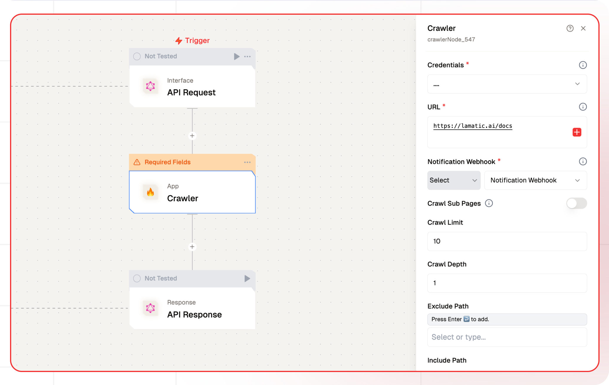

# Crawler Node Documentation

You can use Firecrawl with the Crawl node to systematically browse and index websites. Whether you're mapping website structures or extracting specific data, Crawl offers a seamless and customizable solution for discovering and organizing site information. It simplifies the extraction of web data, making it accessible and ready for AI applications.



## Features

<details>
  <summary>**Key Functionalities**</summary>

  
  1. **Comprehensive Crawling**: It recursively traverses websites, identifying and accessing all subpages to ensure thorough data collection. It begins with a specified URL, analyzes the sitemap (if available), and follows links to uncover all accessible subpages.
  
  1. **Dynamic Content Handling**: It effectively manages dynamic content rendered with JavaScript, ensuring comprehensive data extraction from all accessible subpages. 
  
  1. **Modular Design**: Create reusable workflow components
</details>

<details>
  <summary>**Benefits**</summary>

  
  1. **Reliability:** It handles common web scraping challenges, including proxies, rate limits, and anti-scraping measures, ensuring consistent and dependable data extraction. Ease of Use -
  
  1. **Efficiency:** It intelligently manages requests to minimize bandwidth usage and avoid detection, optimizing the data extraction process.
</details>

## Prerequisites

Before using Crawler Node, ensure the following:

- A valid [Firecrawl API Key](https://www.firecrawl.dev/).
- Access to the Firecrawl service host URL.
- Properly configured credentials for Firecrawl.
- A webhook endpoint for receiving notifications (required for the crawler).

## Installation

### Step 1: Obtain API Credentials

1. Register on [Firecrawl](https://www.firecrawl.dev/).
2. Generate an API key from your account dashboard.
3. Note the **Host URL** and **Webhook Endpoint**.

### Step 2: Configure Firecrawl Credentials

Use the following format to set up your credentials:

| **Key Name**          | **Description**                                     | **Example Value**           |
| --------------------- | --------------------------------------------------- | --------------------------- |
| **Credential Name**   | Name to identify this set of credentials            | `my-firecrawl-creds`        |
| **Firecrawl API Key** | Authentication key for accessing Firecrawl services | `fc_api_xxxxxxxxxxxxx`      |
| **Host**              | Base URL where Firecrawl service is hosted          | `https://api.firecrawl.dev` |

### Setup 3: Connect with Notification Webhook

1. Create a Webhook flow to receive crawl updates and results

## Configuration Reference

| **Parameter**            | **Description**                                    | **Example Value**                   |
| ------------------------ | -------------------------------------------------- | ----------------------------------- |
| **Credential Name**      | Select previously saved credentials                | `my-firecrawl-creds`                |
| **URL**                  | Starting point URL for the crawler                 | `https://example.com`               |
| **Notification Webhook** | Endpoint to receive crawl updates and results      | `https://your-webhook.com/callback` |
| **Exclude Path**         | URL patterns to exclude from the crawl             | `"admin/*", "private/*"`            |
| **Include Path**         | URL patterns to include in the crawl               | `"blog/*", "products/*"`            |
| **Crawl Depth**          | Maximum depth to crawl relative to the entered URL | `3`                                 |
| **Crawl Limit**          | Maximum number of pages to crawl                   | `1000`                              |
| **Crawl Sub Pages**      | Toggle to enable or disable crawling sub pages     | `true`                              |

## Low-Code Example

```yaml
nodes:
  - nodeId: crawlerNode_547
    nodeType: crawlerNode
    nodeName: Crawler
    values:
      credentials: ....
      url: https://lamatic.ai/docs
      webhook: ""
      crawlSubPages: false
      crawlLimit: 10
      crawlDepth: 1
      excludePath: []
      includePath: []
    needs:
      - triggerNode_1
```

## Troubleshooting

### Common Issues

| **Problem**                    | **Solution**                                                      |
| ------------------------------ | ----------------------------------------------------------------- |
| **Invalid API Key**            | Ensure the API key is correct and has not expired.                |
| **Connection Issues**          | Verify that the host URL is correct and reachable.                |
| **Webhook Errors**             | Check if the webhook endpoint is active and correctly configured. |
| **Crawling Errors**            | Review the inclusion/exclusion paths for accuracy.                |
| **Dynamic Content Not Loaded** | Increase the `Wait for Page Load` time in the configuration.      |

### Debugging

- Check Firecrawl logs for detailed error information.
- Test the webhook endpoint to confirm it is receiving updates.
