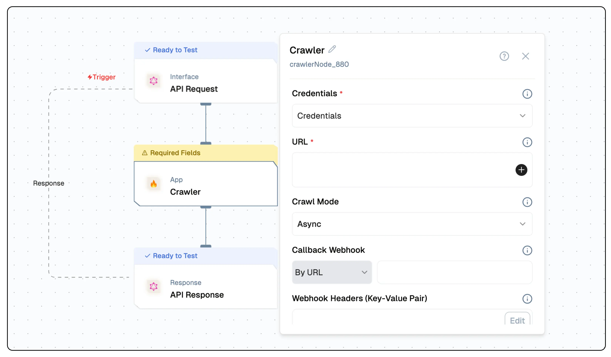

# Crawler Node Documentation

You can use Firecrawl with the Crawl node to systematically browse and index websites. Whether you're mapping website structures or extracting specific data, Crawl offers a seamless and customizable solution for discovering and organizing site information. It simplifies the extraction of web data, making it accessible and ready for AI applications.



## Features

<details>
  <summary>**Key Functionalities**</summary>

1. **Comprehensive Crawling**: It recursively traverses websites, identifying and accessing all subpages to ensure thorough data collection. It begins with a specified URL, analyzes the sitemap (if available), and follows links to uncover all accessible subpages.
2. **Dynamic Content Handling**: It effectively manages dynamic content rendered with JavaScript, ensuring comprehensive data extraction from all accessible subpages.
3. **Modular Design**: Create reusable workflow components.

</details>

<details>
  <summary>**Benefits**</summary>

1. **Reliability:** It handles common web scraping challenges, including proxies, rate limits, and anti-scraping measures, ensuring consistent and dependable data extraction.
2. **Efficiency:** It intelligently manages requests to minimize bandwidth usage and avoid detection, optimizing the data extraction process.

</details>

## Prerequisites

Before using Crawler Node, ensure the following:

- A valid [Firecrawl API Key](https://www.firecrawl.dev/).
- Access to the Firecrawl service host URL.
- Properly configured credentials for Firecrawl.
- A webhook endpoint for receiving notifications (required for the crawler).

## Installation

### Step 1: Obtain API Credentials

1. Register on [Firecrawl](https://www.firecrawl.dev/).
2. Generate an API key from your account dashboard.
3. Note the **Host URL** and **Webhook Endpoint**.

### Step 2: Configure Firecrawl Credentials

Use the following format to set up your credentials:

| **Key Name**          | **Description**                                     | **Example Value**           |
| --------------------- | --------------------------------------------------- | --------------------------- |
| **Credential Name**   | Name to identify this set of credentials            | `my-firecrawl-creds`        |
| **Firecrawl API Key** | Authentication key for accessing Firecrawl services | `fc_api_xxxxxxxxxxxxx`      |
| **Host**              | Base URL where Firecrawl service is hosted          | `https://api.firecrawl.dev` |

### Setup 3: Setup the Mode 
You can choose between sync and async mode. If you choose async mode, you need to set up a webhook endpoint to receive the crawl results. For that, you would create a Webhook flow/url to receive crawl updates and results.

In case of async mode, the user will have the option to choose the following configurations : 

| **Parameter**          | **Description**                                                                 | **Example Value**                     |
|-------------------------|---------------------------------------------------------------------------------|---------------------------------------|
| **Credential Name**     | Select previously saved credentials                                            | `my-firecrawl-creds`                  |
| **Callback Webhook**    | URL to receive notifications about crawl completion                            | `https://example.com/webhook`         |
| **Webhook Headers**     | Headers to be sent to the webhook                                              | `{'Content-Type:application/json'}` |
| **Webhook Metadata** | Metadata to be sent to the webhook | `{'status':'{{codeNode_540.status}}'}` |
| **Webhook Events** | A multiselect list of events to be sent to the webhook | `["completed", "failed", "page", "started"]` |


## Low-Code Example

```yaml
nodes:
  - nodeId: crawlerNode_880
    nodeType: crawlerNode
    nodeName: Crawler
    values:
      credentials: ''
      url: ''
      crawlMode: async
      webhook: ''
      webhookHeaders: ''
      webhookMetadata: ''
      webhookEvents:
        - completed
        - failed
        - page
        - started
      crawlSubPages: false
      crawlLimit: 10
      crawlDepth: 1
      excludePath: []
      includePath: []
      maxDiscoveryDepth: 1
      ignoreSitemap: false
      allowBackwardLinks: false
      allowExternalLinks: false
      ignoreQueryParameters: false
      delay: 0
    modes:
      webhook: url
    needs:
      - triggerNode_1
```

## Event Trigger Output 
Now, there are four events that can be triggered from the crawler node. The events are as follows:

1. **Started** : This event is triggered when the crawl process begins. It provides information about the crawl job, including the job ID and the URL being crawled.
2. **Page** : This event is triggered for each page that is crawled. It provides details about the crawled page, including the URL and any extracted data.
3. **Completed** : This event is triggered when the crawl process is completed. It provides a summary of the crawl job, including the total number of pages crawled and any errors encountered.
4. **Failed** : This event is triggered when the crawl process fails. It provides information about the error that occurred, including the error message and the job ID.

### Example Event Output - Started

```json
{
  "success": true,
  "type": "crawl.started",
  "id": "82***********************4",
  "data": [],
  "metadata": {}
}
```

### Example Event Output - Page

```json
{
  "success":true,
  "type":"crawl.page",
  "id":"82***********************4",
  "data":[
    `{
        "markdown":"Docs\n\nFlows\n\n# Lamatic Flows",
        "metadata":`{"ogUrl":"https://lamatic.ai/docs/flows",
        "og:title":["Lamatic Flows - Lamatic.ai Docs","just-footer"],
        "ogDescription":"Flow builder in Lamatic.ai Studio",
        "twitter:url":"https://lamatic.ai",
        "twitter:image":"https://lamatic.ai/api/og?title=Lamatic%20Flows&description=Flow%20builder%20in%20Lamatic.ai%20Studio&section=Docs",
        "twitter:site:domain":"lamatic.ai",
        "ogTitle":"Lamatic Flows - Lamatic.ai Docs",
        "robots":"index,follow",
        "viewport":["width=device-width, initial-scale=1.0, viewport-fit=cover",
        "width=device-width, initial-scale=1"],
        "og:description":["Flow builder in Lamatic.ai Studio","Flow builder in Lamatic.ai Studio"],
        "title":"Lamatic Flows - Lamatic.ai Docs",
        "ogImage":"https://lamatic.ai/api/og?title=Lamatic%20Flows&description=Flow%20builder%20in%20Lamatic.ai%20Studio&section=Docs",
        "next-head-count":"22",
        "og:url":"https://lamatic.ai/docs/flows",
        "og:image":"https://lamatic.ai/api/og?title=Lamatic%20Flows&description=Flow%20builder%20in%20Lamatic.ai%20Studio&section=Docs",
        "twitter:title":"just-footer",
        "description":["Flow builder in Lamatic.ai Studio","Flow builder in Lamatic.ai Studio"],
        "theme-color":"#000",
        "twitter:card":"summary_large_image",
        "favicon":"https://lamatic.ai/public/favicon-32x32.png",
        "scrapeId":"3dbb0e15-d286-4857-ae3e-004940418975",
        "sourceURL":"https://lamatic.ai/docs/flows",
        "url":"https://lamatic.ai/docs/flows",
        "statusCode":200
      }`
    }
  ],
  "metadata":{}`
}
```

### Event Output - Completed

```json
{
  "success": true,
  "type": "crawl.completed",
  "id": "82***********************4",
  "data": [],
  "metadata": {}
}
```

### Event Output - Failed

```json
{
  "success": false,
  "type": "crawl.failed",
  "id": "82***********************4",
   "error": 'Error Occured'
  "data": [],
  "metadata": {}
}
```

## Output Schema

- `success`: A boolean indicating whether the crawl operation was successfully initiated.                              
- `id`: A unique identifier assigned to the crawl job.
- `url`: The API endpoint URL associated with the crawl job, used for tracking or retrieving results.

### Example Output

```json
{
    "success": true,
    "id": "8***************************7",
    "url": "https://api.firecrawl.dev/v1/crawl/8***************************7"
}
```

## Configuration Reference
This is the base configutaion for the crawler node, regardless of the mode you choose.

| **Parameter**          | **Description**                                                                 | **Example Value**                     |
|-------------------------|---------------------------------------------------------------------------------|---------------------------------------|
| **Credential Name**     | Select previously saved credentials                                            | `my-firecrawl-creds`                  |
| **URL**                 | Starting point URL for the crawler                                             | `https://example.com`                 |
| **Exclude Path**        | URL patterns to exclude from the crawl                                          | `"admin/*", "private/*"`              |
| **Include Path**        | URL patterns to include in the crawl                                            | `"blog/*", "products/*"`              |
| **Crawl Depth**         | Maximum depth to crawl relative to the entered URL                              | `3`                                   |
| **Crawl Limit**         | Maximum number of pages to crawl                                                | `1000`                                |
| **Crawl Sub Pages**     | Toggle to enable or disable crawling sub pages                                  | `true`                                |
| **Max Discovery Depth** | Maximum depth for discovering new URLs during the crawl                         | `5`                                   |
| **Ignore Sitemap**      | Ignore the sitemap.xml file for crawling                                        | `false`                               |
| **Allow Backward Links**| Allow crawling backward links (e.g., from a blog post to the homepage)          | `true`                                |
| **Allow External Links** | Allow crawling external links (e.g., links to other domains)                   | `false`                               |
| **Ignore Query Parameters** | Ignore specific query parameters in URLs                                    | `false`           |
| **Delay**               | Delay between requests to avoid overloading the server                       | `2` (seconds)                 |

## Troubleshooting

### Common Issues

| **Problem**                    | **Solution**                                                      |
| ------------------------------ | ----------------------------------------------------------------- |
| **Invalid API Key**            | Ensure the API key is correct and has not expired.                |
| **Connection Issues**          | Verify that the host URL is correct and reachable.                |
| **Webhook Errors**             | Check if the webhook endpoint is active and correctly configured. |
| **Crawling Errors**            | Review the inclusion/exclusion paths for accuracy.                |
| **Dynamic Content Not Loaded** | Increase the `Wait for Page Load` time in the configuration.      |

### Debugging

- Check Firecrawl logs for detailed error information.
- Test the webhook endpoint to confirm it is receiving updates.
