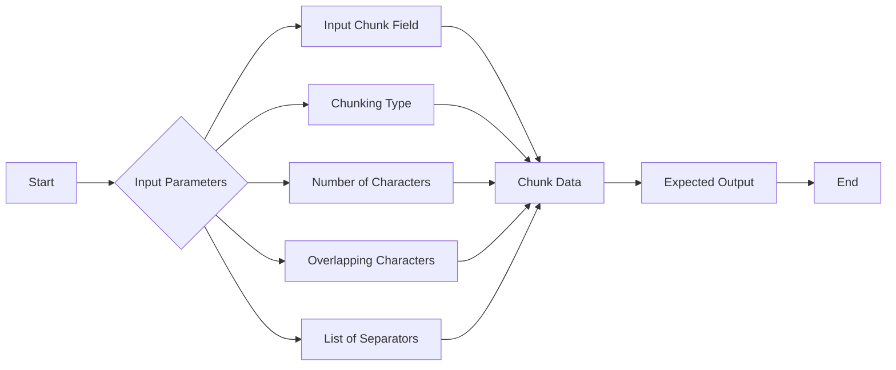

# Chunking

Divide and organize large data files 
into optimally sized portions or chunks for 
efficient retrievals and contextualization.

<Callout emoji="💡">
    **Learn More about Chunking on [Weaviate](https://weaviate.io/developers/academy/py/standalone/chunking/introduction#-chunk-size-selection)**
</Callout>

### Input Parameters

- Input Chunk Field: Specifies the text data to be divided into smaller parts
- Chunking Type: Defines the method used to segment the text, such as fixed-size or semantic-based chunking
- Number of Characters: Determines the maximum length of each chunk created during the process
- Overlapping Characters:  Indicates the number of characters that overlap between consecutive chunks to maintain context
- List of Separators: Identifies the characters or strings used to delineate the boundaries between chunks

### Expected Output

Accurately chunked data ready to be embedded into a vector database.

**Example Use Case**

In this example workflow of vectorizing text data, text is fed into the chunking node 
which perfoms fixed-size chunking at 500 characters with the amount of character overlap between 
chunks at 5 and the requisites for separating chunks being common sentence-ending punctuation.

