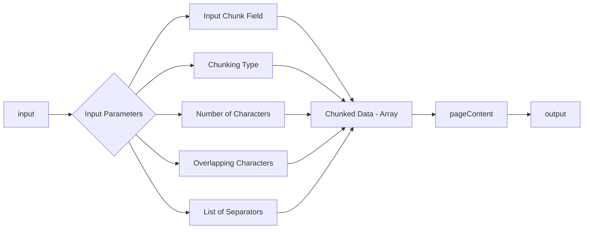

# Chunking

Divide and organize large data files into optimally sized portions or chunks for efficient retrievals and contextualization.


### Input Parameters

- **Input Chunk Field**: Specifies the text data to be divided into smaller parts
- **Chunking Type**: Defines the method used to segment the text, such as fixed-size or semantic-based chunking. The two main chunking types are:
  - **Recursive Character Text Splitter**: This method splits the text into fixed-size chunks, with the option to specify the maximum number of characters per chunk and the overlap between consecutive chunks.
  - **Text Splitter**: This method splits the text using user-defined separators, such as punctuation marks or newline characters.
- **Number of Characters**: Determines the maximum length of each chunk created during the process (used in Recursive Character Text Splitter)
- **Overlapping Characters**: Indicates the number of characters that overlap between consecutive chunks to maintain context (used in Recursive Character Text Splitter)
- **List of Separators**: Identifies the characters or strings used to delineate the boundaries between chunks (used in Text Splitter)

### Expected Output

Accurately chunked data ready to be embedded into a vector database. To get the data of each Chunk, you will need to extract the `pageContent` object from the list. To do that, you can use the following code:

```javascript
let docs = {{chunk_node_id.output.chunks}}

let outputDocs = docs.map(doc => doc.pageContent);

output = outputDocs;
```

<details>
<summary>**Example Use Case**</summary>

In this example workflow of vectorizing text data, text is fed into the chunking node 
which perfoms fixed-size chunking at 500 characters with the amount of character overlap between 
chunks at 5 and the requisites for separating chunks being common sentence-ending punctuation.


</details>

<Callout emoji="💡">
    **Learn More about Chunking on [Weaviate](https://weaviate.io/developers/academy/py/standalone/chunking/introduction#-chunk-size-selection)**
</Callout>