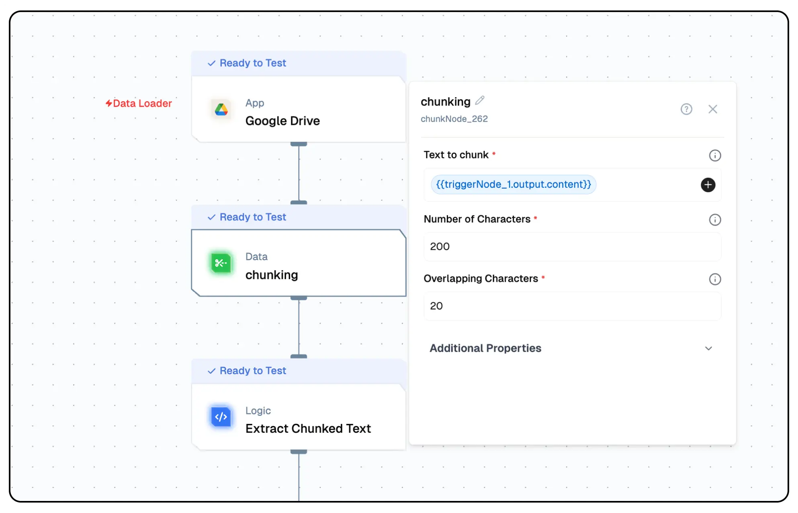

import { NodeOverview } from "@/components/NodeOverview"
import { NodeTypeInfo } from "@/components/NodeTypeInfo"

# Chunking Node
<NodeOverview slug="chunking-node" type="data" />

## Overview

The Chunking Node is a data processing component that breaks down large text documents into smaller, manageable chunks. This is essential for processing large documents with AI models that have token limits, enabling efficient text analysis and processing.



<NodeTypeInfo 
  batchTrigger={false}
  eventTrigger={false}
  action={true}
  description="This node is an Action node that processes large text documents and breaks them into smaller chunks for further processing."
/>

## Features

<details>
  <summary>**Key Functionalities**</summary>

1. **Custom Chunking Logic:** Configure specific methodologies and separators to divide text into meaningful units while preserving context.

1. **Semantic Preparation:** Break data into manageable chunks optimized for vectorization and semantic retrieval processes.

1. **Flexible Integration:** Incorporate Lamatic.ai's Chunking node into various flow for tailored data processing solutions.

1. **Contextual Integrity:** Ensure the resulting chunks maintain relevance and logical flow for downstream analysis.

1. **Configurable Parameters:** Customize chunk size, overlap, and separators to match the needs of your dataset.

</details>

<details>
  <summary>**Benefits**</summary>

1. **Optimized Data Processing:** Enhance the performance of vectorization and semantic retrieval with pre-processed chunks.

1. **Scalable Flow:** Manage large datasets effectively, enabling flow to scale seamlessly with increasing data.

1. **Improved Accuracy:** Maintain context and relevance in chunked data for better insights during analysis.

1. **Streamlined Automation:** Automate text parsing tasks to save time and reduce manual effort.

1. **Enhanced Insights:** Facilitate meaningful information extraction from structured and unstructured datasets.

</details>

## What Can You Build?

1. Develop a system for efficient text vectorization and semantic retrieval.
1. Create flow that handle large datasets by breaking them into manageable chunks.
1. Implement automation processes to parse and prepare data for machine learning models.
1. Build data processing pipelines that maintain context and relevance through custom chunking methodologies.

## Setup

### Select the Chunking Node

1. Fill in the required parameters.
1. Build the desired flow
1. Deploy the Project
1. Click Setup on the workflow editor to get the automatically generated instruction and add it in your application.

## Configuration Reference

| **Parameter**              | **Description**                                                                                                                                                                                                                                                                                                                                                                                                                                                                                                                                                                                                                                                                                                                                                                                                                                       | **Required** | **Example Value**                   |
| -------------------------- | ----------------------------------------------------------------------------------------------------------------------------------------------------------------------------------------------------------------------------------------------------------------------------------------------------------------------------------------------------------------------------------------------------------------------------------------------------------------------------------------------------------------------------------------------------------------------------------------------------------------------------------------------------------------------------------------------------------------------------------------------------------------------------------------------------------------------------------------------------- | ------------ | ----------------------------------- |
| **Text to chunk**          | The text data to be split into smaller chunks.                                                                                                                                                                                                                                                                                                                                                                                                                                                                                                                                                                                                                                                                                                                                                                                                        | Yes          | `${{data}}`                         |
| **Number of Characters**   | Max length (in characters) for each chunk.                                                                                                                                                                                                                                                                                                                                                                                                                                                                                                                                                                                                                                                                                                                                                                                                            | Yes          | 200                                 |
| **Overlapping Characters** | Number of characters overlapping between chunks.                                                                                                                                                                                                                                                                                                                                                                                                                                                                                                                                                                                                                                                                                                                                                                                                      | Yes          | 20                                  |
| **Chunking Type**          | Choose the method to split the text into chunks. <br/><br/> `Recursive Character Text Splitter` method splits text into smaller chunks while preserving as much context as possible. It works by recursively breaking down the text, starting with larger logical units like paragraphs, then sentences, and so on, until the desired chunk size is achieved. This approach is ideal for use cases where maintaining coherence within chunks is important, such as natural language processing or document indexing. <br/><br/> `Character Text Splitter` is a simpler method that divides text into chunks based on a fixed number of characters. It does not consider the structure of the text, such as paragraphs or sentences, and while it is faster and easier to implement, it may cut off sentences or disrupt the logical flow of the text. | Yes          | `Recursive Character Text Splitter` |
| **List of separators**     | Characters or strings used to define chunk boundaries.                                                                                                                                                                                                                                                                                                                                                                                                                                                                                                                                                                                                                                                                                                                                                                                                | No           | `\n\n` `\n` ` `                     |

## Low-Code Example

```yaml
nodes:
  - nodeId: chunkNode_262
    nodeType: chunkNode
    nodeName: chunking
    values:
      chunkField: "{{triggerNode_1.output.content}}"
      numOfChars: 200
      separators:
        - \n\n
        - \n
        - " "
      chunkingType: recursiveCharacterTextSplitter
      overlapChars: "20"
    needs:
      - triggerNode_1
```

## Output

#### `chunks`
- An array of objects, each representing a segmented portion of the input text and its associated metadata.

#### `pageContent`
- The textual content of the chunk, extracted from the input data.

#### `metadata`
- A nested object providing additional details about the chunk's origin or properties.

#### `loc`