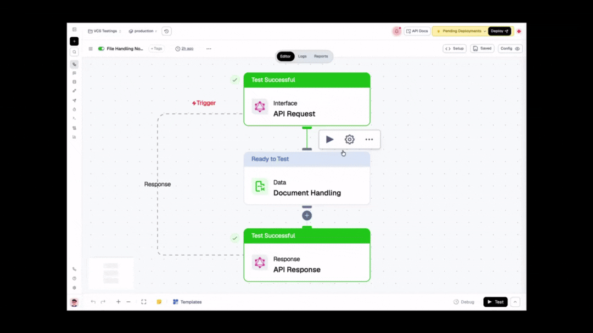

import { NodeOverview } from "@/components/NodeOverview";
import { NodeTypeInfo } from "@/components/NodeTypeInfo";

# Document Handling Node

<NodeOverview slug="document-handling-node" type="data" />

## Overview

Working with PDFs in a flow used to mean piecing together multiple nodes just to merge a couple of files or pull out a few pages. The Document Handling node does it in one step: pick what you want done, point it at your documents, and get a ready-to-use file back.

It covers 14 operations across five types: Merge, Split, Pages, Bookmarks, and Metadata. You pick a **Type** first, then the specific **Operation** for that type, so you only ever see the fields relevant to what you're doing instead of one long list of every option at once.

<NodeTypeInfo
  batchTrigger={false}
  eventTrigger={false}
  action={true}
  description="This node is an **Action** node that merges, splits, and edits pages, bookmarks, and metadata in PDF documents."
/>

## Features

  
Key Functionalities

1. **Merge**: Combine multiple PDFs into one, with optional per-document page ranges and bookmark preservation.
2. **Split**: Break a PDF apart every N pages, at specific page numbers, or into one file per page.
3. **Pages**: Extract, delete, insert blank pages, insert pages from another document, or reorder/duplicate pages.
4. **Bookmarks**: List, set, or remove a PDF's bookmarks.
5. **Metadata**: Get or set document metadata, title, author, subject, creator, and keywords.

  
Benefits

1. **One Node, Not a Chain**: Handle common PDF editing tasks without wiring together multiple nodes.
2. **Only Relevant Fields**: The two-step Type → Operation picker keeps the panel focused on what you're actually configuring.
3. **Safe by Default**: Each run executes in its own isolated container, and documents flow in and out as URLs rather than inline data.
4. **Predictable I/O**: Every operation that produces a file returns the same shape, a presigned URL plus a durable storage key, so downstream nodes always know what to expect.

## What Can You Build?

- Merge a cover page, generated report, and appendix into a single client-facing PDF.
- Split a large scanned document into per-page or per-chapter files for downstream processing.
- Strip a fixed cover page or insert a signed addendum into an existing contract.
- Read or stamp document metadata (title, author, keywords) as part of a publishing pipeline.
- Preserve or rebuild a PDF's bookmark outline when reassembling documents.

---

## How It Works

Drop the node into a flow, provide your document URL(s), and run it. Each run spins up in its own isolated container.

- **Inputs are URLs only.** Base64 input is rejected with a message pointing you at a URL instead, this keeps whole PDF files out of your workflow state and run logs.
- **Outputs that produce a file** return a presigned URL and a durable storage key, ready to pass to the next step or store for later.
- **List Bookmarks and Get Metadata** return their data directly instead of a file.

<Callout type="warning">
**Two things worth knowing before you rely on this node:**

Password-protected PDFs are rejected. The node can't process an encrypted file it can't open. **Get Metadata** is the one exception, it can still inspect an encrypted document without the password.

Some operations (**Extract**, **Insert**, and ranged **Merge**) can drop annotations, outlines, or form fields from the source PDF. This is a limitation of the underlying processing, not a bug, the node UI calls it out directly so it isn't a surprise.
</Callout>

## Setup

### 1. Merge

Combines multiple PDFs into a single document.

#### Configuration Reference

| Parameter | Description | Required | Example |
| --- | --- | --- | --- |
| Documents | The PDF files to merge, in order. Accepts URLs. | Yes | `["{{node1.output.url}}", "{{node2.output.url}}"]` |
| Page Ranges | Optional per-document page ranges. Leave empty to include a document in full. | No | `1-3` |
| Preserve Bookmarks | If enabled, carries each source document's bookmarks into the merged output. | No | true |

#### Output

- `files`: an array with one entry: `{ url, key, pageCount }` for the merged document.

### 2. Split

Breaks a single PDF into multiple files.

#### Configuration Reference

| Parameter | Applies to | Description | Required | Example |
| --- | --- | --- | --- | --- |
| Document | All | The PDF to split. Accepts a URL. | Yes | `{{node1.output.url}}` |
| Operation | All | Which split mode to use. | Yes | `At Specific Page Numbers` |
| Pages per File | Every N Pages | Number of pages per output file. | Yes, for this operation | `5` |
| Pages | At Specific Page Numbers | Page numbers to split at. | Yes, for this operation | `3, 7, 12` |

Every Page needs no additional field, each page becomes its own file.

#### Output

- `files`: an array with one entry per resulting file: `{ url, key, pageCount }`.

### 3. Pages

Adds, removes, or reorders pages within a document.

#### Configuration Reference

| Parameter | Applies to | Description | Required | Example |
| --- | --- | --- | --- | --- |
| Document | All | The PDF to modify. Accepts a URL. | Yes | `{{node1.output.url}}` |
| Operation | All | Extract, Delete, Insert Blank Pages, Insert From Document, or Reorder/Duplicate. | Yes | `Extract` |
| Pages | Extract, Delete | Page numbers or ranges to extract or delete. | Yes, for these operations | `1-2, 5` |
| Position | Insert Blank Pages, Insert From Document | Where to insert the new pages. | Yes, for these operations | `after page 3` |
| Count | Insert Blank Pages | Number of blank pages to insert. | Yes, for this operation | `1` |
| Source Document | Insert From Document | URL of the PDF to pull pages from. | Yes, for this operation | `{{node1.output.url}}` |
| Source Pages | Insert From Document | Page numbers or ranges to pull from the source document. | Yes, for this operation | `1-2` |
| Page Order | Reorder/Duplicate | The new page order. Repeat a page number to duplicate it. | Yes, for this operation | `1, 1, 2, 4, 3` |

<Callout type="warning">
Extract and Insert can drop annotations, outlines, and form fields from the affected pages.
</Callout>

#### Output

- `files`: an array with one entry: `{ url, key, pageCount }` for the resulting document.

### 4. Bookmarks

Reads or modifies a PDF's bookmark outline.

#### Configuration Reference

| Parameter | Applies to | Description | Required | Example |
| --- | --- | --- | --- | --- |
| Document | All | The PDF to read or modify. Accepts a URL. | Yes | `{{node1.output.url}}` |
| Operation | All | List, Set, or Remove. | Yes | `Set` |
| Bookmarks (JSON) | Set | The bookmark outline to write, as JSON. | Yes, for this operation | `[{"title": "Chapter 1", "page": 1}]` |
| Replace Existing Bookmarks | Set | If enabled, replaces the document's entire bookmark outline. If disabled, adds to the existing outline. | No | true |

#### Output

- **List**: `bookmarks`, the document's current bookmark outline.
- **Set / Remove**: `files`, an array with one entry: `{ url, key, pageCount }` for the updated document.

### 5. Metadata

Reads or writes a PDF's document metadata.

#### Configuration Reference

| Parameter | Applies to | Description | Required | Example |
| --- | --- | --- | --- | --- |
| Document | All | The PDF to read or modify. Accepts a URL. | Yes | `{{node1.output.url}}` |
| Operation | All | Get or Set. | Yes | `Set` |
| Title | Set | Document title. | No | `Q3 Board Report` |
| Author | Set | Document author. | No | `Finance Team` |
| Subject | Set | Document subject. | No | `Quarterly Results` |
| Creator | Set | Creating application or person. | No | `Lamatic` |
| Keywords | Set | Search keywords for the document. | No | `finance, quarterly, board` |

#### Output

- **Get**: `metadata`, an object with the document's current title, author, subject, creator, and keywords. Works even on password-protected PDFs, since reading metadata doesn't require decrypting content.
- **Set**: `files`, an array with one entry: `{ url, key, pageCount }` for the updated document.

## Troubleshooting

### Common Issues

| Problem | Solution |
| --- | --- |
| Request rejected with a password/encryption error | The source PDF is password-protected. Remove the password before running the node, or use Get Metadata if you only need to read its metadata. |
| Base64 input rejected | This node only accepts document URLs. Upload the file first (for example, via a storage node) and pass its URL instead. |
| Annotations, form fields, or outlines missing after Extract, Insert, or a ranged Merge | Expected for these operations. If you need to preserve them, avoid page-range operations on the affected pages. |
| Split or Pages operation returns an error about page numbers | Confirm the page numbers or ranges you supplied exist in the source document, out-of-range pages are rejected rather than silently ignored. |

