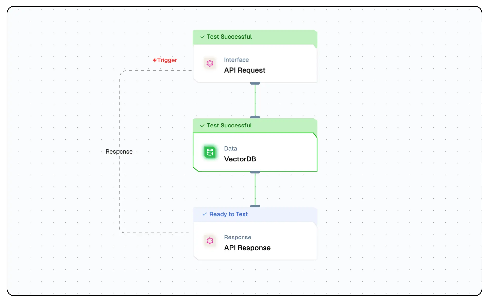

import { NodeOverview } from "@/components/NodeOverview"

# Vector Action Node

<NodeOverview slug="vector-actions-node" type="data" />

## Overview

The Vector Action Node enables users to **index**, **filter**, and **delete** data from vector databases. These actions form the core of vector-based data workflows in Lamatic.



## Features

<details>
  <summary>Key Functionalities</summary>

1. **Multi-Action Capability**: Choose between indexing, filtering, or deleting records in a vector DB.
2. **Conditional Filtering**: Apply advanced JSON filters with logical operators (`And`, `Or`, etc.).
3. **Primary Key Matching**: Use custom primary keys to uniquely identify or filter/delete entries.
4. **Duplicate Handling**: Choose to `overwrite` or `skip` on indexing conflicts.

</details>

<details>
  <summary>Benefits</summary>

1. **Flexibility**: Handle multiple vector operations within one node.
2. **Control**: Fine-tune data updates with filters and duplication settings.
3. **Efficiency**: Manage large vector datasets with scalable indexing and deletion.
4. **Search Precision**: Use rich metadata and filters to retrieve exactly what’s needed.

</details>

## What Can You Build?

- Automate document indexing pipelines.
- Build search interfaces with filterable vector data.
- Clean up or update vector DBs programmatically.

---

## 1. Index Action

Indexes vectors and metadata into the selected vector database.

## Configuration Reference

| **Parameter**           | **Description**                                                        | **Required** | **Example Value**                 |
| ----------------------- | ---------------------------------------------------------------------- | ------------ | --------------------------------- |
| **Vector DB**           | Select the vector database where the vectors will be indexed.          | Yes          | `database`                        |
| **Vectors**             | Enter the vector data to be indexed in the database.                   | Yes          | `{{codeNode_540.output.vectors}}` |
| **Metadata**            | Include additional information to enhance vector search and retrieval. | Yes          | `{{codeNode_540.output.vectors}}` |
| **Primary Keys (JSON)** | Provide unique identifiers for each vector in JSON format.             | Yes          | []                                |
| **Duplication Records** | Manage duplicates by choosing to `overwrite` or `skip` them.           | No           | `overwrite`                       |

## Low-Code Example

```yaml
- nodeId: IndexNode_543
    nodeType: IndexNode
    nodeName: Index to DB
    values:
      vectorDB: IndexCrawler
      webhookURL: https://webhook.site/685a66e7-b4d3-40a4-9801-99e3460414f9
      primaryKeys: ''
      vectorsField: '{{codeNode_540.output.vectors}}'
      metadataField: '{{codeNode_540.output.metadata}}'
      duplicateOperation: overwrite
      embeddingModelName: {}
      generativeModelName:
        type: embedder/text
        nodeId: IndexNode
        model_name: text-embedding-ada-002
        provider_name: openai
    needs:
      - codeNode_540
```


## Output
- `recordsIndexed`: An integer indicating the number of records successfully indexed.
- `duplicateRecordsDeleted`: An integer representing the number of duplicate records removed during the indexing process.
- `message`: A string providing a status or summary of the indexing operation.

### Example Output

```json
 {
    "recordsIndexed": 1,
    "duplicateRecordsDeleted": 0,
    "message": "Data indexed successfully"
  }
```

## 2. Filter Action

Filters indexed records using metadata and/or vector queries.

### Configuration Reference

| **Parameter**   | **Description**                                               | **Required** | **Example**      |
|-----------------|---------------------------------------------------------------|--------------|------------------|
| **vectorDB**    | Target vector database                                        | Yes          | `CallData`       |
| **action**      | Must be set to `filter`                                       | Yes          | `filter`         |
| **filters**     | JSON filter using logical operators and conditions            | Yes          | See below        |
| **limit**       | Number of results to return                                   | No           | `20`             |

### Example

```yaml
- nodeId: vectorNode_2
  nodeType: vectorNode
  nodeName: VectorDB
  values:
    vectorDB: CallData
    action: filter
    vectorsField: '[]'
    metadataField: '[]'
    primaryKeys: ['topic']
    duplicateOperation: overwrite
    filters: |-
      {
        "operator": "And",
        "operands": [
          {
            "path": ["topic"],
            "operator": "Equal",
            "valueText": "Topic1"
          }
        ]
      }
    limit: 20
```

## Output
-  `success`: A boolean indicating if the filter operation was successful.
-  `data`: An array of records matching the filter criteria.
-  `count`: The number of records returned by the filter operation.

### Example Output

```json
{
    "success": true,
    "data": [
      {
        "title": "Lamatic Docs",
        "content": "Welcome to the Lamatic documentation!",
      }
    ],
    "count": 1
  }
```

## 3. Delete Action

Deletes records matching filter criteria.

### Configuration Reference

| **Parameter**   | **Description**                                         | **Required** | **Example**      |
|-----------------|---------------------------------------------------------|--------------|------------------|
| **vectorDB**    | Target vector database                                  | Yes          | `CallData`       |
| **action**      | Must be set to `delete`                                 | Yes          | `delete`         |
| **filters**     | JSON filter for selecting items to delete               | Yes          | See below        |
| **primaryKeys** | Optional fields used to match entries for deletion      | No           | `["topic"]`      |

### Example

```yaml
- nodeId: vectorNode_3
  nodeType: vectorNode
  nodeName: VectorDB
  values:
    vectorDB: CallData
    action: delete
    vectorsField: '[]'
    metadataField: '[]'
    primaryKeys: ['topic']
    duplicateOperation: overwrite
    filters: |-
      {
        "operator": "And",
        "operands": [
          {
            "path": ["topic"],
            "operator": "Equal",
            "valueText": "Topic1"
          }
        ]
      }
    limit: 20
  needs:
    - triggerNode_1
```

## Output
- `deletedCount`: Number of records successfully deleted.
- `matches`: Number of records that matched the filter criteria.
- `failed`: Number of records that failed to delete.

### Example Output

```json
{
    "deletedCount": 2,
    "matches": 2,
    "failed": 0
}
```

## Troubleshooting

### Common Issues

| **Problem**               | **Solution**                                                                 |
|---------------------------|------------------------------------------------------------------------------|
| **Invalid Vector DB**     | Ensure the database name exists and is spelled correctly.                   |
| **Missing Embeddings**    | Make sure vectors are provided or an embedding model is configured.         |
| **Misconfigured Filters** | Ensure filters use valid JSON and correct field paths and operators.        |
| **Primary Key Conflicts** | Resolve using `overwrite` or `skip` options for handling duplicates.         |