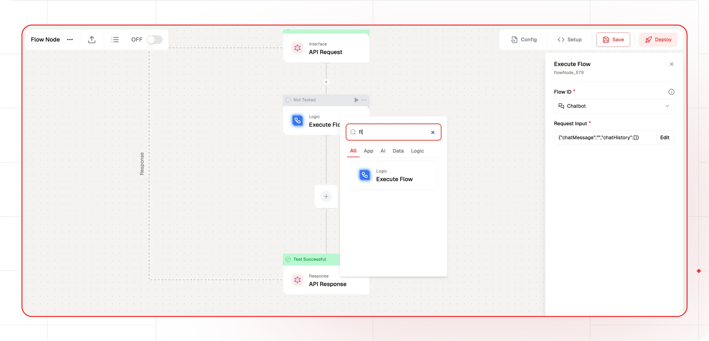

# Execute Flow Documentation

The Execute Flow in Lamatic enables execution of other flows within your current workflow, facilitating modular and reusable flow designs. This node serves as a powerful tool for creating complex, interconnected workflows by allowing flows to be used as building blocks.


## Features

<details>
  <summary>**Key Functionalities**</summary>
  1. **Sub-flow Execution**: Call and execute other flows 1. **Data Passing**: Transfer
  current flow data as input 1. **Modular Design**: Create reusable workflow components
</details>

<details>
  <summary>**Benefits**</summary>
  1. Enables workflow modularity 1. Promotes code reuse 1. Simplifies complex processes
</details>

## Prerequisites

Before using the Execute Flow, ensure you have:

- Active flows with compatible triggers (API Request, Chat, or Search)
- Necessary permissions to execute target flows
- Understanding of data flow and parameter passing

---

## Configuration Reference

### Execute Flow Parameters

| **Parameter**     | **Description**                         | **Required** | **Example**                               |
| ----------------- | --------------------------------------- | ------------ | ----------------------------------------- |
| **Flow ID**       | Target flow selection from active flows | ✅           | `4be6dea6-d13c-44d8-87cf-5ad46361c890`    |
| **Request Input** | Input parameters for target flow        | ✅           | `{ "prompt": "{{triggerNode_1.output}}"}` |

---

## Usage Guidelines

### Setting Up Execute Node

1. **Add Execute Node**:

   - Drag Flow Node to your workflow
   - Select target flow from dropdown

2. **Configure Parameters**:

   - Set Flow ID for target flow
   - Configure input parameters
   - Map data from current flow

3. **Validate Configuration**:
   - Ensure all required parameters are set
   - Verify data mapping is correct

### Best Practices

1. **Modular Design**

   - Break complex workflows into smaller flows
   - Create reusable components
   - Maintain clear flow boundaries

2. **Data Management**

   - Plan data flow between workflows
   - Document parameter requirements
   - Handle data transformations appropriately

3. **Error Handling**
   - Implement proper error checking
   - Provide fallback options
   - Monitor flow execution

---

## Low-Code Example

```yaml
- nodeId: flowNode_919
  nodeType: flowNode
  nodeName: Execute Flow
  values:
    flowId: flow_id
    requestInput: |-
      {
        "test": "{{triggerNode_1.output.user_name}}"
      }
  needs:
    - node_id
```

## Sample Output

```json
{
    "flowOutput": {}
}
```
## Output Schema

- flowOutput: An object containing the results or data generated by the executed flow.
## Troubleshooting

### Common Issues

| **Problem**            | **Solution**                                  |
| ---------------------- | --------------------------------------------- |
| **Flow Not Found**     | Verify Flow ID and deployment status          |
| **Parameter Mismatch** | Check input parameter format and requirements |
| **Permission Denied**  | Confirm execution permissions                 |
| **Execution Timeout**  | Review flow complexity and timeout settings   |

### Debugging Tips

- Check Lamatic Flow logs for error details
- Verify flow deployment status
- Test input parameters independently
- Monitor flow execution time
- Review permission settings

---

## Example Use Cases

### Multi-step Processing

1. **Data Preparation Flow**:

   - Clean and validate input data
   - Transform data format
   - Apply business rules

2. **Analysis Flow**:

   - Process prepared data
   - Generate insights
   - Create reports

3. **Notification Flow**:
   - Send results to stakeholders
   - Update systems
   - Log completion status

### Chain Processing

- Execute series of specialized flows
- Pass results between flows
- Maintain process isolation
