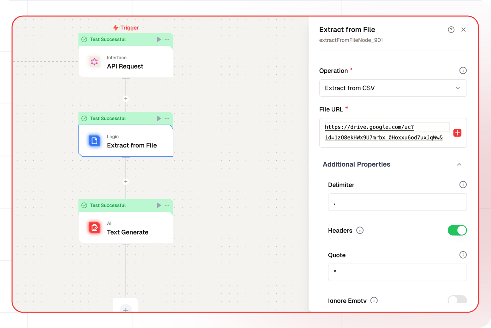

# Extract from File Node Documentation

The Extract from File node is designed to parse and extract data from multiple file formats. It provides a flexible interface for handling different file types with customizable configuration options, ensuring accurate data extraction and formatting for downstream processing.



## Features

<details>
  <summary>**Key Functionalities**</summary>

1. **Multiple Format Support**: Handles CSV, JSON, Text, HTML, PDF, DOCX, and XLSX files with format-specific parsing options.

2. **Configurable Parsing**: Offers detailed configuration options for each file type to control how data is extracted and processed.

3. **Encoding Options**: Supports multiple file encodings including UTF-8, ASCII, and UTF-16LE for text-based formats.

4. **Data Transformation**: Provides options to clean and transform data during extraction (trimming, filtering, etc.).

</details>

<details>
  <summary>**Benefits**</summary>

1. **Versatility**: Single node solution for handling various file formats commonly used in data processing.

2. **Precision Control**: Fine-grained control over data extraction through format-specific configuration options.

3. **Data Quality**: Built-in options for data cleaning and validation during extraction.

4. **Seamless Integration**: Easy integration with other nodes in the workflow for comprehensive data processing.

</details>

## What can I build?

1. Data processing pipelines that handle multiple file formats
2. Automated document parsing systems
3. Data extraction workflows for business intelligence
4. Content aggregation systems from various file sources

## Setup

### Select the Extract from File Node

1. Choose the appropriate operation for your file type
2. Configure format-specific parameters
3. Provide the file URL
4. Deploy and test the extraction

## Configuration Reference

### Common Parameters

| Parameter | Description                  | Required | Default             |
| --------- | ---------------------------- | -------- | ------------------- |
| nodeName  | Name of the node instance    | Yes      | "Extract from File" |
| operation | Type of file to extract from | Yes      | "extractFromCSV"    |
| fileUrl   | URL or path to the file      | Yes      | ""                  |

### Format-Specific Parameters

<details>
  <summary>**CSV Configuration**</summary>

| Parameter              | Description                                                                                                                                                         | Required | Default |
| ---------------------- | ------------------------------------------------------------------------------------------------------------------------------------------------------------------- | -------- | ------- |
| delimiter              | The delimiter that will separate columns, usually a comma                                                                                                           | No       | ","     |
| headers                | If selected than will return data as list of objects with keys as column names                                                                                      | No       | true    |
| quote                  | The character to use to quote fields that contain a \',\' delimiter. (e.g. "first,name",last name => ["first,name", "last name"])                                   | No       | "\""    |
| ignoreEmpty            | If true this will discard columns that are all white space or delimiters.                                                                                           | No       | false   |
| comment                | If your CSV contains comments you can use this option to ignore lines that begin with the specified character (e.g. #)                                              | No       | null    |
| discardUnmappedColumns | If you want to discard columns that do not map to a header. This is only valid in the case when the number of parsed columns is greater than the number of headers. | No       | true    |
| trim                   | Trim all white space from columns if true                                                                                                                           | No       | false   |
| rtrim                  | Right trim all columns if true                                                                                                                                      | No       | false   |
| ltrim                  | Left trim all columns if true                                                                                                                                       | No       | false   |
| maxRows                | Maximum number of rows to parse. 0 means no limit                                                                                                                   | No       | 0       |
| skipRows               | Number of rows to skip at the beginning                                                                                                                             | No       | 0       |
| encoding               | Select the encoding of the file                                                                                                                                     | No       | "utf8"  |

</details>

<details>
  <summary>**JSON Configuration**</summary>

| Parameter | Description                     | Required | Default |
| --------- | ------------------------------- | -------- | ------- |
| encoding  | Select the encoding of the file | No       | "utf8"  |

</details>

<details>
  <summary>**Text Configuration**</summary>

| Parameter | Description                     | Required | Default |
| --------- | ------------------------------- | -------- | ------- |
| encoding  | Select the encoding of the file | No       | "utf8"  |

</details>

<details>
  <summary>**HTML Configuration**</summary>

| Parameter     | Description                                           | Required | Default |
| ------------- | ----------------------------------------------------- | -------- | ------- |
| returnRawText | Set to true to return the raw data instead of parsing | No       | false   |

</details>

<details>
  <summary>**PDF Configuration**</summary>

| Parameter | Description                                        | Required | Default |
| --------- | -------------------------------------------------- | -------- | ------- |
| joinPages | Combine all pages into a single string             | No       | false   |
| password  | Password for the PDF file, if the PDF is encrypted | No       | ""      |

</details>

<details>
  <summary>**DOCX Configuration**</summary>

No additional config required

</details>

<details>
  <summary>**XLSX Configuration**</summary>

| Parameter   | Description                | Required | Default |
| ----------- | -------------------------- | -------- | ------- |
| ignoreEmpty | Discard empty columns/rows | No       | false   |

</details>

## Sample Outputs

### CSV Sample Output

```json
{
  "extractedData": [
    {
      "Index": "1",
      "Customer Id": "DD37Cf93aecA6Dc",
      "First Name": "Sheryl",
      "Last Name": "Baxter",
      "Company": "Rasmussen Group",
      "City": "East Leonard",
      "Country": "Chile",
      "Phone 1": "229.077.5154",
      "Phone 2": "397.884.0519x718",
      "Email": "zunigavanessa@smith.info",
      "Subscription Date": "2020-08-24",
      "Website": "http://www.stephenson.com/"
    },
    {
      "Index": "2",
      "Customer Id": "1Ef7b82A4CAAD10",
      "First Name": "Preston",
      "Last Name": "Lozano",
      "Company": "Vega-Gentry",
      "City": "East Jimmychester",
      "Country": "Djibouti",
      "Phone 1": "5153435776",
      "Phone 2": "686-620-1820x944",
      "Email": "vmata@colon.com",
      "Subscription Date": "2021-04-23",
      "Website": "http://www.hobbs.com/"
    },
    {
      "Index": "3",
      "Customer Id": "6F94879bDAfE5a6",
      "First Name": "Roy",
      "Last Name": "Berry",
      "Company": "Murillo-Perry",
      "City": "Isabelborough",
      "Country": "Antigua and Barbuda",
      "Phone 1": "+1-539-402-0259",
      "Phone 2": "(496)978-3969x58947",
      "Email": "beckycarr@hogan.com",
      "Subscription Date": "2020-03-25",
      "Website": "http://www.lawrence.com/"
    }
  ]
}
```

### JSON Sample Output

```json
{
  "extractedData": [
    {
      "name": "Adeel Solangi",
      "language": "Sindhi",
      "id": "V59OF92YF627HFY0",
      "bio": "Donec lobortis eleifend condimentum. Cras dictum dolor lacinia lectus vehicula rutrum. Maecenas quis nisi nunc. Nam tristique feugiat est vitae mollis. Maecenas quis nisi nunc.",
      "version": 6.1
    },
    {
      "name": "Afzal Ghaffar",
      "language": "Sindhi",
      "id": "ENTOCR13RSCLZ6KU",
      "bio": "Aliquam sollicitudin ante ligula, eget malesuada nibh efficitur et. Pellentesque massa sem, scelerisque sit amet odio id, cursus tempor urna. Etiam congue dignissim volutpat. Vestibulum pharetra libero et velit gravida euismod.",
      "version": 1.88
    },
    {
      "name": "Aamir Solangi",
      "language": "Sindhi",
      "id": "IAKPO3R4761JDRVG",
      "bio": "Vestibulum pharetra libero et velit gravida euismod. Quisque mauris ligula, efficitur porttitor sodales ac, lacinia non ex. Fusce eu ultrices elit, vel posuere neque.",
      "version": 7.27
    },
    {
      "name": "Abla Dilmurat",
      "language": "Uyghur",
      "id": "5ZVOEPMJUI4MB4EN",
      "bio": "Donec lobortis eleifend condimentum. Morbi ac tellus erat.",
      "version": 2.53
    }
  ]
}
```

### Text Sample Output

```json
{
  "extractedData": "TXT test file\nPurpose: Provide example of this file type\nDocument file type: TXT\nVersion: 1.0\nRemark:\n\nExample content:\nThe names \"John Doe\" for males, \"Jane Doe\" or \"Jane Roe\" for females, or \"Jonnie Doe\" and \"Janie Doe\" for children, or just \"Doe\" non-gender-specifically are used as placeholder names for a party whose true identity is unknown or must be withheld in a legal action, case, or discussion. The names are also used to refer to acorpse or hospital patient whose identity is unknown. This practice is widely used in the United States and Canada, but is rarely used in other English-speaking countries including the United Kingdom itself, from where the use of \"John Doe\" in a legal context originates. The names Joe Bloggs or John Smith are used in the UK instead, as well as in Australia and New Zealand.\n\nJohn Doe is sometimes used to refer to a typical male in other contexts as well, in a similar manner to John Q. Public, known in Great Britain as Joe Public, John Smith or Joe Bloggs. For example, the first name listed on a form is often John Doe, along with a fictional address or other fictional information to provide an example of how to fill in the form. The name is also used frequently in popular culture, for example in the Frank Capra film Meet John Doe. John Doe was also the name of a 2002 American television series.\n\nSimilarly, a child or baby whose identity is unknown may be referred to as Baby Doe. A notorious murder case in Kansas City, Missouri, referred to the baby victim as Precious Doe. Other unidentified female murder victims are Cali Doe and Princess Doe. Additional persons may be called James Doe, Judy Doe, etc. However, to avoid possible confusion, if two anonymous or unknown parties are cited in a specific case or action, the surnames Doe and Roe may be used simultaneously; for example, \"John Doe v. Jane Roe\". If several anonymous parties are referenced, they may simply be labelled John Doe #1, John Doe #2, etc. (the U.S. Operation Delego cited 21 (numbered) \"John Doe\"s) or labelled with other variants of Doe / Roe / Poe / etc. Other early alternatives such as John Stiles and Richard Miles are now rarely used, and Mary Major has been used in some American federal cases.\n\n\n\nFile created by https://www.online-convert.com\nMore example files: https://www.online-convert.com/file-type\nText of Example content: Wikipedia (https://en.wikipedia.org/wiki/John_Doe)\nLicense: Attribution-ShareAlike 4.0 (https://creativecommons.org/licenses/by-sa/4.0/)\n\nFeel free to use and share the file according to the license above."
}
```

### HTML Sample Output

```json
{
  "extractedData": "This is an example paragraph. Anything in the body tag will appear on the page,\njust like this p tag and its contents."
}
```

### PDF Sample Output

```json
{
  "extractedData": {
    "metadata": {
      "format": "PDF 1.4",
      "title": "Sample Data for Data Tables",
      "author": "",
      "subject": "",
      "keywords": "",
      "creator": "Adobe InDesign 2.0.2",
      "producer": "Adobe PDF Library 5.0",
      "creationDate": "D:20051108152002Z",
      "modDate": "D:20060706163857-04'00'",
      "trapped": "",
      "encryption": null,
      "file_path": "/tmp/tmp3fab86jg.pdf",
      "page_count": 2
    },
    "texts": [
      "**NATIONAL PARTNERSHIP FOR QUALITY AFTERSCHOOL LEARNING**\nwww.sedl.org/afterschool/toolkits\n\n## ��������������������������\n\n# Tutoring to Enhance Science Skills\n## Tutoring Two: Learning to Make Data Tables\n### . . . . . . . . . . . . . . . . . . . . . . . . . . . . . . . . . . . . . . . . . . . . . . . . . . . . . . . . . . . . . . . . . . . . . . . . . . . . . . . . . . . . . . . . . . . . . .\n\n**Sample Data for Data Tables**\n\nUse these data to create data tables following the Guidelines for Making a Data Table and\nChecklist for a Data Table.\n\n**Example 1: Pet Survey (GR 2–3)**\nMs. Hubert’s afterschool students took a survey of the 600 students at Morales Elementary\nSchool. Students were asked to select their favorite pet from a list of eight animals. Here\nare the results.\n\nLizard 25, Dog 250, Cat 115, Bird 50, Guinea pig 30, Hamster 45, Fish 75,\nFerret 10\n\n**Example 2: Electromagnets—Increasing Coils (GR 3–5)**\nThe following data were collected using an electromagnet with a 1.5 volt battery, a switch,\na piece of #20 insulated wire, and a nail. Three trials were run. Safety precautions in\n_repeating this experiment include using safety goggles or safety spectacles and avoiding_\n_short circuits._\n\n\n**Number of Coils** **Number of Paperclips**\n\n5 3, 5, 4\n\n|Number of Coils|Number of Paperclips|\n|---|---|\n|5|3, 5, 4|\n|10|7, 8, 6|\n|15|11, 10, 12|\n|20|15, 13, 14|\n\n\n**Example 3: pH of Substances (GR 5–10)**\nThe following are pH values of common household substances taken by three different\nteams using pH probes. Safety precautions in repeating this experiment include hooded\n_ventilation, chemical-splash safety goggles, gloves, and apron. Do not use bleach,_\n_ammonia, or strong acids with children._\n\nLemon juice 2.4, 2.0, 2.2; Baking soda (1 Tbsp) in Water (1 cup) 8.4, 8.3, 8.7;\nOrange juice 3.5, 4.0, 3.4; Battery acid 1.0, 0.7, 0.5; Apples 3.0, 3.2, 3.5;\nTomatoes 4.5, 4.2, 4.0; Bottled water 6.7, 7.0, 7.2; Milk of magnesia 10.5, 10.3,\n10.6; Liquid hand soap 9.0, 10.0, 9.5; Vinegar 2.2, 2.9, 3.0; Household bleach\n12.5, 12.5, 12.7; Milk 6.6, 6.5, 6.4; Household ammonia 11.5, 11.0, 11.5;\nLye 13.0, 13.5, 13.4; and Sodium hydroxide 14.0, 14.0, 13.9; Anti-freeze 10.1,\n10.9, 9.7; Windex 9.9. 10.2, 9.5; Liquid detergent 10.5, 10.0, 10.3; and\nCola 3.0, 2.5, 3.2\n\n**_Teaching tip: The pH scale is from 0 to 14. Have students make two data tables, one_**\n_with the data as given and one with the pH scale 0 to 14 with the substances’ average_\n_pH in rank order on the scale (Battery acid at the lower end and Sodium hydroxide at_\n_the upper end) or create a pH graphic organizer._\n\n\n-----\n\n",
      "**Example 4: Automobile Land Speed Records (GR 5-10)**\nIn the first recorded automobile race in 1898, Count Gaston de Chasseloup-Laubat of\nParis, France, drove 1 kilometer in 57 seconds for an average speed of 39.2 miles per hour\n(mph) or 63.1 kilometers per hour (kph). In 1904, Henry Ford drove his Ford Arrow across\nfrozen Lake St. Clair, MI, at an average speed of 91.4 mph. Now, the North American\nEagle is trying to break a land speed record of 800 mph. The Federation International de\nL’Automobile (FIA), the world’s governing body for motor sport and land speed records,\nrecorded the following land speed records. (Retrieved on February 5, 2006, from\nhttp://www.landspeed.com/lsrinfo.asp.)\n\n**Speed (mph)** **Driver** **Car** **Engine** **Date**\n\n407.447 Craig Breedlove Spirit of America GE J47 8/5/63\n\n413.199 Tom Green Wingfoot Express WE J46 10/2/64\n\n434.22 Art Arfons Green Monster GE J79 10/5/64\n\n468.719 Craig Breedlove Spirit of America GE J79 10/13/64\n\n526.277 Craig Breedlove Spirit of America GE J79 10/15/65\n\n536.712 Art Arfons Green Monster GE J79 10/27/65\n\n555.127 Craig Breedlove Spirit of America, Sonic 1 GE J79 11/2/65\n\n576.553 Art Arfons Green Monster GE J79 11/7/65\n\n600.601 Craig Breedlove Spirit of America, Sonic 1 GE J79 11/15/65\n\n622.407 Gary Gabelich Blue Flame Rocket 10/23/70\n\n633.468 Richard Noble Thrust 2 RR RG 146 10/4/83\n\n763.035 Andy Green Thrust SSC RR Spey 10/15/97\n\n**Example 5: Distance and Time (GR 8-10)**\nThe following data were collected using a car with a water clock set to release a drop in\na unit of time and a meter stick. The car rolled down an inclined plane. Three trials were\nrun. Create a data table with an average distance column and an average velocity column,\ncreate an average distance-time graph, and draw the best-fit line or curve. Estimate the\ncar’s distance traveled and velocity at six drops of water. Describe the motion of the car. Is\nit going at a constant speed, accelerating, or decelerating? How do you know?\n\n|Speed (mph)|Driver|Car|Engine Date|Col5|\n|---|---|---|---|---|\n|407.447|Craig Breedlove|Spirit of America|GE J47|8/5/63|\n|413.199|Tom Green|Wingfoot Express|WE J46|10/2/64|\n|434.22|Art Arfons|Green Monster|GE J79|10/5/64|\n|468.719|Craig Breedlove|Spirit of America|GE J79|10/13/64|\n|526.277|Craig Breedlove|Spirit of America|GE J79|10/15/65|\n|536.712|Art Arfons|Green Monster|GE J79|10/27/65|\n|555.127|Craig Breedlove|Spirit of America, Sonic 1|GE J79|11/2/65|\n|576.553|Art Arfons|Green Monster|GE J79|11/7/65|\n|600.601|Craig Breedlove|Spirit of America, Sonic 1|GE J79|11/15/65|\n|622.407|Gary Gabelich|Blue Flame|Rocket|10/23/70|\n|633.468|Richard Noble|Thrust 2|RR RG 146|10/4/83|\n|763.035|Andy Green|Thrust SSC|RR Spey|10/15/97|\n||||||\n\n\n**Time (drops of water)      Distance (cm)**\n\n1 10,11,9\n\n2 29, 31, 30\n\n3 59, 58, 61\n\n4 102, 100, 98\n\n5 122, 125, 127\n\n|Time (drops of water)|Distance (cm)|\n|---|---|\n|1|10,11,9|\n|2|29, 31, 30|\n|3|59, 58, 61|\n|4|102, 100, 98|\n|5|122, 125, 127|\n\n\n© 2006 WGBH Educational Foundation. All rights reserved.\n\n\n-----\n\n"
    ],
    "raw": [
      {
        "metadata": {
          "format": "PDF 1.4",
          "title": "Sample Data for Data Tables",
          "author": "",
          "subject": "",
          "keywords": "",
          "creator": "Adobe InDesign 2.0.2",
          "producer": "Adobe PDF Library 5.0",
          "creationDate": "D:20051108152002Z",
          "modDate": "D:20060706163857-04'00'",
          "trapped": "",
          "encryption": null,
          "file_path": "/tmp/tmp3fab86jg.pdf",
          "page_count": 2,
          "page": 1
        },
        "toc_items": [],
        "tables": [
          {
            "bbox": [105.5, 379.5, 379.59375, 469.75],
            "rows": 5,
            "columns": 2
          }
        ],
        "images": [],
        "graphics": [],
        "text": "**NATIONAL PARTNERSHIP FOR QUALITY AFTERSCHOOL LEARNING**\nwww.sedl.org/afterschool/toolkits\n\n## ��������������������������\n\n# Tutoring to Enhance Science Skills\n## Tutoring Two: Learning to Make Data Tables\n### . . . . . . . . . . . . . . . . . . . . . . . . . . . . . . . . . . . . . . . . . . . . . . . . . . . . . . . . . . . . . . . . . . . . . . . . . . . . . . . . . . . . . . . . . . . . . .\n\n**Sample Data for Data Tables**\n\nUse these data to create data tables following the Guidelines for Making a Data Table and\nChecklist for a Data Table.\n\n**Example 1: Pet Survey (GR 2–3)**\nMs. Hubert’s afterschool students took a survey of the 600 students at Morales Elementary\nSchool. Students were asked to select their favorite pet from a list of eight animals. Here\nare the results.\n\nLizard 25, Dog 250, Cat 115, Bird 50, Guinea pig 30, Hamster 45, Fish 75,\nFerret 10\n\n**Example 2: Electromagnets—Increasing Coils (GR 3–5)**\nThe following data were collected using an electromagnet with a 1.5 volt battery, a switch,\na piece of #20 insulated wire, and a nail. Three trials were run. Safety precautions in\n_repeating this experiment include using safety goggles or safety spectacles and avoiding_\n_short circuits._\n\n\n**Number of Coils** **Number of Paperclips**\n\n5 3, 5, 4\n\n|Number of Coils|Number of Paperclips|\n|---|---|\n|5|3, 5, 4|\n|10|7, 8, 6|\n|15|11, 10, 12|\n|20|15, 13, 14|\n\n\n**Example 3: pH of Substances (GR 5–10)**\nThe following are pH values of common household substances taken by three different\nteams using pH probes. Safety precautions in repeating this experiment include hooded\n_ventilation, chemical-splash safety goggles, gloves, and apron. Do not use bleach,_\n_ammonia, or strong acids with children._\n\nLemon juice 2.4, 2.0, 2.2; Baking soda (1 Tbsp) in Water (1 cup) 8.4, 8.3, 8.7;\nOrange juice 3.5, 4.0, 3.4; Battery acid 1.0, 0.7, 0.5; Apples 3.0, 3.2, 3.5;\nTomatoes 4.5, 4.2, 4.0; Bottled water 6.7, 7.0, 7.2; Milk of magnesia 10.5, 10.3,\n10.6; Liquid hand soap 9.0, 10.0, 9.5; Vinegar 2.2, 2.9, 3.0; Household bleach\n12.5, 12.5, 12.7; Milk 6.6, 6.5, 6.4; Household ammonia 11.5, 11.0, 11.5;\nLye 13.0, 13.5, 13.4; and Sodium hydroxide 14.0, 14.0, 13.9; Anti-freeze 10.1,\n10.9, 9.7; Windex 9.9. 10.2, 9.5; Liquid detergent 10.5, 10.0, 10.3; and\nCola 3.0, 2.5, 3.2\n\n**_Teaching tip: The pH scale is from 0 to 14. Have students make two data tables, one_**\n_with the data as given and one with the pH scale 0 to 14 with the substances’ average_\n_pH in rank order on the scale (Battery acid at the lower end and Sodium hydroxide at_\n_the upper end) or create a pH graphic organizer._\n\n\n-----\n\n",
        "words": []
      },
      {
        "metadata": {
          "format": "PDF 1.4",
          "title": "Sample Data for Data Tables",
          "author": "",
          "subject": "",
          "keywords": "",
          "creator": "Adobe InDesign 2.0.2",
          "producer": "Adobe PDF Library 5.0",
          "creationDate": "D:20051108152002Z",
          "modDate": "D:20060706163857-04'00'",
          "trapped": "",
          "encryption": null,
          "file_path": "/tmp/tmp3fab86jg.pdf",
          "page_count": 2,
          "page": 2
        },
        "toc_items": [],
        "tables": [
          {
            "bbox": [54.25, 193.4583282470703, 558.5, 481.75],
            "rows": 14,
            "columns": 5
          },
          {
            "bbox": [123.5, 588.5, 397.59375, 696.691162109375],
            "rows": 6,
            "columns": 2
          }
        ],
        "images": [],
        "graphics": [],
        "text": "**Example 4: Automobile Land Speed Records (GR 5-10)**\nIn the first recorded automobile race in 1898, Count Gaston de Chasseloup-Laubat of\nParis, France, drove 1 kilometer in 57 seconds for an average speed of 39.2 miles per hour\n(mph) or 63.1 kilometers per hour (kph). In 1904, Henry Ford drove his Ford Arrow across\nfrozen Lake St. Clair, MI, at an average speed of 91.4 mph. Now, the North American\nEagle is trying to break a land speed record of 800 mph. The Federation International de\nL’Automobile (FIA), the world’s governing body for motor sport and land speed records,\nrecorded the following land speed records. (Retrieved on February 5, 2006, from\nhttp://www.landspeed.com/lsrinfo.asp.)\n\n**Speed (mph)** **Driver** **Car** **Engine** **Date**\n\n407.447 Craig Breedlove Spirit of America GE J47 8/5/63\n\n413.199 Tom Green Wingfoot Express WE J46 10/2/64\n\n434.22 Art Arfons Green Monster GE J79 10/5/64\n\n468.719 Craig Breedlove Spirit of America GE J79 10/13/64\n\n526.277 Craig Breedlove Spirit of America GE J79 10/15/65\n\n536.712 Art Arfons Green Monster GE J79 10/27/65\n\n555.127 Craig Breedlove Spirit of America, Sonic 1 GE J79 11/2/65\n\n576.553 Art Arfons Green Monster GE J79 11/7/65\n\n600.601 Craig Breedlove Spirit of America, Sonic 1 GE J79 11/15/65\n\n622.407 Gary Gabelich Blue Flame Rocket 10/23/70\n\n633.468 Richard Noble Thrust 2 RR RG 146 10/4/83\n\n763.035 Andy Green Thrust SSC RR Spey 10/15/97\n\n**Example 5: Distance and Time (GR 8-10)**\nThe following data were collected using a car with a water clock set to release a drop in\na unit of time and a meter stick. The car rolled down an inclined plane. Three trials were\nrun. Create a data table with an average distance column and an average velocity column,\ncreate an average distance-time graph, and draw the best-fit line or curve. Estimate the\ncar’s distance traveled and velocity at six drops of water. Describe the motion of the car. Is\nit going at a constant speed, accelerating, or decelerating? How do you know?\n\n|Speed (mph)|Driver|Car|Engine Date|Col5|\n|---|---|---|---|---|\n|407.447|Craig Breedlove|Spirit of America|GE J47|8/5/63|\n|413.199|Tom Green|Wingfoot Express|WE J46|10/2/64|\n|434.22|Art Arfons|Green Monster|GE J79|10/5/64|\n|468.719|Craig Breedlove|Spirit of America|GE J79|10/13/64|\n|526.277|Craig Breedlove|Spirit of America|GE J79|10/15/65|\n|536.712|Art Arfons|Green Monster|GE J79|10/27/65|\n|555.127|Craig Breedlove|Spirit of America, Sonic 1|GE J79|11/2/65|\n|576.553|Art Arfons|Green Monster|GE J79|11/7/65|\n|600.601|Craig Breedlove|Spirit of America, Sonic 1|GE J79|11/15/65|\n|622.407|Gary Gabelich|Blue Flame|Rocket|10/23/70|\n|633.468|Richard Noble|Thrust 2|RR RG 146|10/4/83|\n|763.035|Andy Green|Thrust SSC|RR Spey|10/15/97|\n||||||\n\n\n**Time (drops of water)      Distance (cm)**\n\n1 10,11,9\n\n2 29, 31, 30\n\n3 59, 58, 61\n\n4 102, 100, 98\n\n5 122, 125, 127\n\n|Time (drops of water)|Distance (cm)|\n|---|---|\n|1|10,11,9|\n|2|29, 31, 30|\n|3|59, 58, 61|\n|4|102, 100, 98|\n|5|122, 125, 127|\n\n\n© 2006 WGBH Educational Foundation. All rights reserved.\n\n\n-----\n\n",
        "words": []
      }
    ]
  }
}
```

### DOCX Sample Output

```json
{
  "extractedData": "\n\nDemonstration of DOCX support in calibre\n\nThis document demonstrates the ability of the calibre DOCX Input plugin to convert the various typographic features in a Microsoft Word (2007 and newer) document. Convert this document to a modern ebook format, such as AZW3 for Kindles or EPUB for other ebook readers, to see it in action.\n\nThere is support for images, tables, lists, footnotes, endnotes, links, dropcaps and various types of text and paragraph level formatting.\n\nTo see the DOCX conversion in action, simply add this file to calibre using the **“Add Books”** button and then click “**Convert”.**  Set the output format in the top right corner of the conversion dialog to EPUB or AZW3 and click **“OK”**.\n\n# Text Formatting\n\n## Inline formatting\n\nHere, we demonstrate various types of inline text formatting and the use of embedded fonts.\n\nHere is some **bold,** *italic,* ***bold-italic,*** underlined and ~~struck out~~  text. Then, we have a superscript and a subscript. Now we see some red, green and blue text. Some text with a yellow highlight. Some text in a box. Some text in inverse video.\n\nA paragraph with styled text: subtle emphasis followed by **strong text** and intense emphasis. This paragraph uses document wide styles for styling rather than inline text properties as demonstrated in the previous paragraph — calibre can handle both with equal ease.\n\n## Fun with fonts\n\nThis document has embedded the Ubuntu font family. The body text is in the Ubuntu typeface, here is some text in the Ubuntu Mono typeface, notice how every letter has the same width, even i and m. Every embedded font will automatically be embedded in the output ebook during conversion.\n\n## **Paragraph level formatting**\n\nYou can do crazy things with paragraphs, if the urge strikes you. For instance this paragraph is right aligned and has a right border. It has also been given a light gray background.\n\nFor the lovers of poetry amongst you, paragraphs with hanging indents, like this often come in handy. You can use hanging indents to ensure that a line of poetry retains its individual identity as a line even when the screen is too narrow to display it as a single line. Not only does this paragraph have a hanging indent, it is also has an extra top margin, setting it apart from the preceding paragraph.\n\n# Tables\n\n| ITEM | NEEDED |\n| --- | --- |\n| Books | 1 |\n| Pens | 3 |\n| Pencils | 2 |\n| Highlighter | 2 colors |\n| Scissors | 1 pair |\n\nTables in Word can vary from the extremely simple to the extremely complex. calibre tries to do its best when converting tables. While you may run into trouble with the occasional table, the vast majority of common cases should be converted very well, as demonstrated in this section. Note that for optimum results, when creating tables in Word, you should set their widths using percentages, rather than absolute units. To the left of this paragraph is a floating two column table with a nice green border and header row.\n\nNow let’s look at a fancier table—one with alternating row colors and partial borders. This table is stretched out to take 100% of the available width.\n\n| City or Town | Point A | Point B | Point C | Point D | Point E |\n| --- | --- | --- | --- | --- | --- |\n| Point A | — |  |  |  |  |\n| Point B | 87 | — |  |  |  |\n| Point C | 64 | 56 | — |  |  |\n| Point D | 37 | 32 | 91 | — |  |\n| Point E | 93 | 35 | 54 | 43 | — |\n\nNext, we see a table with special formatting in various locations. Notice how the formatting for the header row and sub header rows is preserved.\n\n| College | New students | Graduating students | Change |\n| --- | --- | --- | --- |\n|  | Undergraduate |  |  |\n| Cedar University | 110 | 103 | +7 |\n| Oak Institute | 202 | 210 | -8 |\n|  | Graduate |  |  |\n| Cedar University | 24 | 20 | +4 |\n| Elm College | 43 | 53 | -10 |\n| Total | 998 | 908 | 90 |\n\nSource: Fictitious data, for illustration purposes only\n\nNext, we have something a little more complex, a nested table, i.e. a table inside another table. Additionally, the inner table has some of its cells merged. The table is displayed horizontally centered.\n\n| | One  Three | Two | | --- | --- | | Four | | To the left is a table inside a table, with some cells merged. |\n| --- | --- | --- | --- | --- |\n\nWe end with a fancy calendar, note how much of the original formatting is preserved. Note that this table will only display correctly on relatively wide screens. In general, very wide tables or tables whose cells have fixed width requirements don’t fare well in ebooks.\n\n| December 2007 | | | | | | | | | | | | |\n| --- | --- | --- | --- | --- | --- | --- | --- | --- | --- | --- | --- | --- |\n| Sun |  | Mon |  | Tue |  | Wed |  | Thu |  | Fri |  | Sat | |\n|  |  |  |  |  |  |  |  |  |  |  |  | 1 | |\n|  |  |  |  |  |  |  |  |  |  |  |  |  | |\n| 2 |  | 3 |  | 4 |  | 5 |  | 6 |  | 7 |  | 8 | |\n|  |  |  |  |  |  |  |  |  |  |  |  |  | |\n| 9 |  | 10 |  | 11 |  | 12 |  | 13 |  | 14 |  | 15 | |\n|  |  |  |  |  |  |  |  |  |  |  |  |  | |\n| 16 |  | 17 |  | 18 |  | 19 |  | 20 |  | 21 |  | 22 | |\n|  |  |  |  |  |  |  |  |  |  |  |  |  | |\n| 23 |  | 24 |  | 25 |  | 26 |  | 27 |  | 28 |  | 29 | |\n|  |  |  |  |  |  |  |  |  |  |  |  |  | |\n| 30 |  | 31 |  |  |  |  |  |  |  |  |  |  | |\n\n# Structural Elements\n\nMiscellaneous structural elements you can add to your document, like footnotes, endnotes, dropcaps and the like.\n\n## Footnotes & Endnotes\n\nFootnotes[[1]](#footnote-2) and endnotes[[2]](#endnote-2) are automatically recognized and both are converted to endnotes, with backlinks for maximum ease of use in ebook devices.\n\n## Dropcaps\n\nD\n\nrop caps are used to emphasize the leading paragraph at the start of a section. In Word it is possible to specify how many lines of text a drop-cap should use. Because of limitations in ebook technology, this is not possible when converting. Instead, the converted drop cap will use font size and line height to simulate the effect as well as possible. While not as good as the original, the result is usually tolerable. This paragraph has a “D” dropcap set to occupy three lines of text with a font size of 58.5 pts. Depending on the screen width and capabilities of the device you view the book on, this dropcap can look anything from perfect to ugly.\n\n## Links\n\nTwo kinds of links are possible, those that refer to an external website and those that refer to locations inside the document itself. Both are supported by calibre. For example, here is a link pointing to the [calibre download page](http://calibre-ebook.com/download). Then we have a link that points back to the section on [paragraph level formatting](#_Paragraph_level_formatting) in this document.\n\n## Table of Contents\n\nThere are two approaches that calibre takes when generating a Table of Contents. The first is if the Word document has a Table of Contents itself. Provided that the Table of Contents uses hyperlinks, calibre will automatically use it. The levels of the Table of Contents are identified by their left indent, so if you want the ebook to have a multi-level Table of Contents, make sure you create a properly indented Table of Contents in Word.\n\nIf no Table of Contents is found in the document, then a table of contents is automatically generated from the headings in the document. A heading is identified as something that has the Heading 1 or Heading 2, etc. style applied to it. These headings are turned into a Table of Contents with Heading 1 being the topmost level, Heading 2 the second level and so on.\n\nYou can see the Table of Contents created by calibre by clicking the Table of Contents button in whatever viewer you are using to view the converted ebook.\n\n[Demonstration of DOCX support in calibre 1](#_Toc359077851)\n\n[Text Formatting 2](#_Toc359077852)\n\n[Inline formatting 2](#_Toc359077853)\n\n[Fun with fonts 2](#_Toc359077854)\n\n[Paragraph level formatting 2](#_Toc359077855)\n\n[Tables 3](#_Toc359077856)\n\n[Structural Elements 5](#_Toc359077857)\n\n[Footnotes & Endnotes 5](#_Toc359077858)\n\n[Dropcaps 5](#_Toc359077859)\n\n[Links 5](#_Toc359077860)\n\n[Table of Contents 5](#_Toc359077861)\n\n[Images 7](#_Toc359077862)\n\n[Lists 8](#_Toc359077863)\n\n[Bulleted List 8](#_Toc359077864)\n\n[Numbered List 8](#_Toc359077865)\n\n[Multi-level Lists 8](#_Toc359077866)\n\n[Continued Lists 8](#_Toc359077867)\n\n# Images\n\nImages can be of three main types. Inline images are images that are part of the normal text flow, like this image of a green dot . Inline images do not cause breaks in the text and are usually small in size. The next category of image is a floating image, one that “floats “ on the page and is surrounded by text. Word supports more types of floating images than are possible with current ebook technology, so the conversion maps floating images to simple left and right floats, as you can see with the left and right arrow images on the sides of this paragraph.\n\nThe final type of image is a “block” image, one that becomes a paragraph on its own and has no text on either side. Below is a centered green dot.\n\nCentered images like this are useful for large pictures that should be a focus of attention.\n\nGenerally, it is not possible to translate the exact positioning of images from a Word document to an ebook. That is because in Word, image positioning is specified in absolute units from the page boundaries. There is no analogous technology in ebooks, so the conversion will usually end up placing the image either centered or floating close to the point in the text where it was inserted, not necessarily where it appears on the page in Word.\n\n# Lists\n\nAll types of lists are supported by the conversion, with the exception of lists that use fancy bullets, these get converted to regular bullets.\n\n## Bulleted List\n\n* One\n* Two\n\n## Numbered List\n\n1. One, with a very long line to demonstrate that the hanging indent for the list is working correctly\n2. Two\n\n## Multi-level Lists\n\n1. One\n   1. Two\n      1. Three\n      2. Four with a very long line to demonstrate that the hanging indent for the list is working correctly.\n      3. Five\n2. Six\n\nA Multi-level list with bullets:\n\n* One\n  + Two\n    - This bullet uses an image as the bullet item\n      * Four\n* Five\n\n## Continued Lists\n\n1. One\n2. Two\n\nAn interruption in our regularly scheduled listing, for this essential and very relevant public service announcement.\n\n1. We now resume our normal programming\n2. Four\n\n1. In paged media, footnotes are usually displayed at the bottom of the text. However, in ebooks, a better paradigm is to make them clickable endnotes that the user can browse at her pleasure. This conversion is handled automatically by calibre. [↑](#footnote-ref-2)\n2. Endnotes are typically used for longer notes, they remain endnotes when converted into ebook form, except that they have an additional backlink to make it easy to return to the current position after reading the note. [↑](#endnote-ref-2)\n"
}
```

### XLSX Sample Output

```json
{
  "extractedData": [
    {
      "sheetName": "Example Test",
      "data": [
        ["MC", "What is 2+2?", 4, "correct", 3, "incorrect"],
        [
          "MA",
          "What C datatypes are 8 bits? (assume i386)",
          "int",
          null,
          "float",
          null,
          "double",
          null,
          "char"
        ],
        ["TF", "Bagpipes are awesome.", "true"],
        [
          "ESS",
          "How have the original Henry Hornbostel buildings influenced campus architecture and design in the last 30 years?"
        ],
        [
          "ORD",
          "Rank the following in their order of operation.",
          "Parentheses",
          "Exponents",
          "Division",
          "Addition"
        ],
        [
          "FIB",
          "The student activities fee is",
          95,
          "dollars for students enrolled in",
          19,
          "units or more,"
        ],
        [
          "MAT",
          "Match the lower-case greek letter with its capital form.",
          "λ",
          "Λ",
          "α",
          "γ",
          "Γ",
          "φ",
          "Φ"
        ]
      ]
    },
    {
      "sheetName": "Format Abbr.",
      "data": [
        [],
        [],
        [],
        ["http://www.cmu.edu/blackboard"],
        [],
        ["Question Format Abbreviations"],
        [],
        ["Abbreviation", "Question Type"],
        ["MC", "Multiple Choice"],
        ["MA", "Multiple Answer"],
        ["TF", "True/False"],
        ["ESS", "Essay"],
        ["ORD", "Ordering"],
        ["MAT", "Matching"],
        ["FIB", "Fill in the Blank"],
        ["FIL", "File response"],
        ["NUM", "Numeric Response"],
        ["SR", "Short response"],
        ["OP", "Opinion"],
        ["FIB_PLUS", "Multiple Fill in the Blank"],
        ["JUMBLED_SENTENCE", "Jumbled Sentence"],
        ["QUIZ_BOWL", "Quiz Bowl"]
      ]
    },
    {
      "sheetName": "Readme",
      "data": [
        [],
        [],
        [],
        ["http://www.cmu.edu/blackboard"],
        [],
        ["File Information"],
        [],
        [],
        ["Source"],
        ["http://www.cmu.edu/blackboard/files/evaluate/tests-example.xls"],
        [],
        [],
        ["Version"],
        ["1.0 (January 2012)"],
        [],
        [],
        ["Contact"],
        ["bb-help@andrew.cmu.edu"],
        [],
        [],
        ["About"],
        [
          "This is an example and template for preparing Blackboard tests offline. See the full directions at: http://www.cmu.edu/blackboard/evaluate#manage_tests/import_questions"
        ]
      ]
    }
  ]
}
```

## Low-Code Example

```yaml
nodes:
  - nodeId: extractFromFileNode_983
    nodeType: extractFromFileNode
    nodeName: Extract from File
    values:
      trim: false
      ltrim: false
      quote: '"'
      rtrim: false
      comment: "null"
      fileUrl: https://dummyurl/downloads/demos/demo.docx
      headers: true
      maxRows: "0"
      encoding: utf8
      maxPages: "0"
      password: ""
      skipRows: "0"
      delimiter: ","
      joinPages: true
      operation: extractFromXLSX
      skipLines: "0"
      ignoreEmpty: false
      returnRawText: false
      discardUnmappedColumns: false
    needs:
      - triggerNode_1
```

## Troubleshooting

### Common Issues

| Problem         | Solution                                            |
| --------------- | --------------------------------------------------- |
| File Not Found  | Verify the file URL is accessible and correct       |
| Parsing Errors  | Check file format matches selected operation        |
| Encoding Issues | Try different encoding options for text-based files |

### Debugging

1. Check file accessibility
2. Verify file format matches operation
3. Review format-specific configuration
4. Check node logs for detailed error messages
