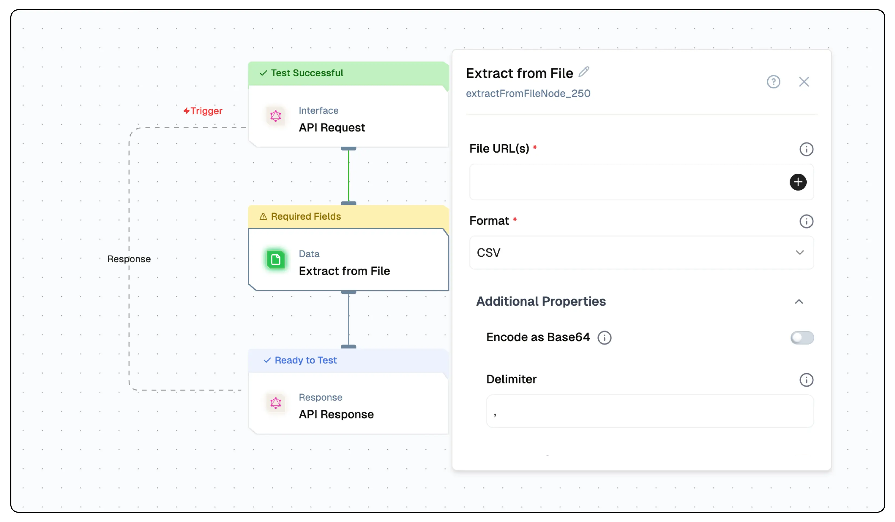

# Extract from File Node Documentation

The Extract from File node is designed to parse and extract data from multiple file formats. It provides a flexible interface for handling different file types with customizable configuration options, ensuring accurate data extraction and formatting for downstream processing.



## Features

<details>
  <summary>**Key Functionalities**</summary>

1. **Multiple Format Support**: Handles CSV, JSON, Text, HTML, PDF, DOCX, and XLSX files with format-specific parsing options.

2. **Configurable Parsing**: Offers detailed configuration options for each file type to control how data is extracted and processed.

3. **Encoding Options**: Supports multiple file encodings including UTF-8, ASCII, and UTF-16LE for text-based formats.

4. **Data Transformation**: Provides options to clean and transform data during extraction (trimming, filtering, etc.).
5. **Base64 Encoding**: Supports encoding the extracted data as base64.

</details>

<details>
  <summary>**Benefits**</summary>

1. **Versatility**: Single node solution for handling various file formats commonly used in data processing.

2. **Precision Control**: Fine-grained control over data extraction through format-specific configuration options.

3. **Data Quality**: Built-in options for data cleaning and validation during extraction.

4. **Seamless Integration**: Easy integration with other nodes in the workflow for comprehensive data processing.

</details>

## What can I build?

1. Data processing pipelines that handle multiple file formats
2. Automated document parsing systems
3. Data extraction workflows for business intelligence
4. Content aggregation systems from various file sources
5. Extract data from files as base64 and use it in AI nodes

## Setup

### Select the Extract from File Node

1. Choose the appropriate operation for your file type
2. Configure format-specific parameters
3. Provide the file URL
4. Deploy and test the extraction

## Configuration Reference

### Common Parameters

| Parameter      | Description                                                                                                                                       | Required | Default             |
| -------------- | ------------------------------------------------------------------------------------------------------------------------------------------------- | -------- | ------------------- |
| nodeName       | Name of the node instance                                                                                                                         | Yes      | "Extract from File" |
| operation      | Type of file to extract from                                                                                                                      | Yes      | "extractFromCSV"    |
| fileUrl(s)     | URL or path to the file/Array of URLs                                                                                                             | Yes      | ""                  |
| format         | file format                                                                                                                                       | Yes      | "auto"              |
| encodeAsBase64 | encode the extracted data as base64 of structure: data:content-type;base64,encodedString. Eg: data:text/plain;base64,SW52YWxpZCBwYXJhbWV0ZXJzCg== | No       | false               |

### Format-Specific Parameters

<details>
  <summary>**CSV Configuration**</summary>

| Parameter              | Description                                                                                                                                                         | Required | Default |
| ---------------------- | ------------------------------------------------------------------------------------------------------------------------------------------------------------------- | -------- | ------- |
| delimiter              | The delimiter that will separate columns, usually a comma                                                                                                           | No       | ","     |
| headers                | If selected than will return data as list of objects with keys as column names                                                                                      | No       | true    |
| quote                  | The character to use to quote fields that contain a \',\' delimiter. (e.g. "first,name",last name => ["first,name", "last name"])                                   | No       | "\""    |
| ignoreEmpty            | If true this will discard columns that are all white space or delimiters.                                                                                           | No       | false   |
| comment                | If your CSV contains comments you can use this option to ignore lines that begin with the specified character (e.g. #)                                              | No       | null    |
| discardUnmappedColumns | If you want to discard columns that do not map to a header. This is only valid in the case when the number of parsed columns is greater than the number of headers. | No       | true    |
| trim                   | Trim all white space from columns if true                                                                                                                           | No       | false   |
| rtrim                  | Right trim all columns if true                                                                                                                                      | No       | false   |
| ltrim                  | Left trim all columns if true                                                                                                                                       | No       | false   |
| maxRows                | Maximum number of rows to parse. 0 means no limit                                                                                                                   | No       | 0       |
| skipRows               | Number of rows to skip at the beginning                                                                                                                             | No       | 0       |
| encoding               | Select the encoding of the file                                                                                                                                     | No       | "utf8"  |

</details>

<details>
  <summary>**JSON Configuration**</summary>

| Parameter | Description                     | Required | Default |
| --------- | ------------------------------- | -------- | ------- |
| encoding  | Select the encoding of the file | No       | "utf8"  |

</details>

<details>
  <summary>**Text Configuration**</summary>

| Parameter | Description                     | Required | Default |
| --------- | ------------------------------- | -------- | ------- |
| encoding  | Select the encoding of the file | No       | "utf8"  |

</details>

<details>
  <summary>**HTML Configuration**</summary>

| Parameter     | Description                                           | Required | Default |
| ------------- | ----------------------------------------------------- | -------- | ------- |
| returnRawText | Set to true to return the raw data instead of parsing | No       | false   |

</details>

<details>
  <summary>**PDF Configuration**</summary>

| Parameter   | Description                                                                        | Required | Default |
| ----------- | ---------------------------------------------------------------------------------- | -------- | ------- |
| joinPages   | Combine all pages into a single string                                             | No       | false   |
| password(s) | Password/ Array of Passwords for the PDF file to try from, if the PDF is encrypted | No       | ""      |

</details>

<details>
  <summary>**DOCX Configuration**</summary>

No additional config required

</details>

<details>
  <summary>**Image Configuration**</summary>

No additional config required

</details>

<details>
  <summary>**XLSX Configuration**</summary>

| Parameter   | Description                                                                    | Required | Default |
| ----------- | ------------------------------------------------------------------------------ | -------- | ------- |
| ignoreEmpty | Discard empty columns/rows                                                     | No       | false   |
| headers     | If selected than will return data as list of objects with keys as column names | No       | true    |

</details>

## Sample Input


```
   File URL(s): ["https://calibre-ebook.com/downloads/demos/demo.docx","https://example-files.online-convert.com/document/txt/example.txt","https://sedl.org/afterschool/toolkits/science/pdf/ast_sci_data_tables_sample.pdf"]
   Format: Auto Detect
   Everything Else Default
```

## Low-Code Example

```yaml
nodes:
  - nodeId: extractFromFileNode_983
    nodeType: extractFromFileNode
    nodeName: Extract from File
    values:
      trim: false
      ltrim: false
      quote: '"'
      rtrim: false
      comment: "null"
      fileUrl: >-
        ["https://calibre-ebook.com/downloads/demos/demo.docx","https://example-files.online-convert.com/document/txt/example.txt","https://sedl.org/afterschool/toolkits/science/pdf/ast_sci_data_tables_sample.pdf"]
      headers: true
      maxRows: "0"
      encoding: utf8
      maxPages: "0"
      password: ""
      skipRows: "0"
      delimiter: ","
      joinPages: true
      format: auto
      skipLines: "0"
      ignoreEmpty: false
      returnRawText: false
      discardUnmappedColumns: false
    needs:
      - triggerNode_1
```

## Output

#### `files`
- An array of objects, each representing a file and its extracted content along with associated metadata.

#### `metadata`
- A nested object containing descriptive attributes of the file.

  - **`mime_type`**: Specifies the file’s MIME type, indicating its format and encoding.
  - **`type`**: Categorizes the file’s general type.
  - **`filename`**: The name of the file.
  - **`extension`**: The file’s extension.
  - **`url`**: The source URL of the file.
  - **`size`**: The file size in bytes, or `null` if not available.
  - **`file_id`**: A unique identifier for the file within the processing context.

#### `data`
- An array of strings containing the extracted content from the file.

#### `additional_fields`
- A nested object containing supplementary data or metadata about file processing.

#### `raw`
- An array of objects providing unprocessed or detailed extraction data.

  - **`metadata`**: A nested object within `raw` detailing file format and creation metadata.
    - **`format`**: The file’s format version.
    - **`title`**: The file’s title.
    - **`author`**: The file’s author.
    - **`subject`**: A description of the file’s subject.
    - **`keywords`**: Keywords associated with the file.
    - **`creator`**: The software or tool used to create the file.
    - **`producer`**: The software or library that produced the file.
    - **`creationDate`**: The file’s creation date.
    - **`modDate`**: The file’s last modification date.
    - **`trapped`**: Related to PDF trapping status.
    - **`encryption`**: Indicates the file’s encryption status, or `null` if not encrypted.

#### `file_path`
- A string specifying the temporary or local file path used during processing.

#### `page_count`
- An integer indicating the total number of pages in the file.

#### `page`
- An integer specifying the page number of the extracted content.

#### `toc_items`
- An array containing the table of contents items.

#### `tables`
- An array of objects describing tables extracted from the file.

  - **`bbox`**: An array of coordinates defining the bounding box of a table.
  - **`rows`**: The number of rows in a table.
  - **`columns`**: The number of columns in a table.

#### `images`
- An array of image data extracted from the file.

#### `graphics`
- An array of graphic elements extracted from the file.

#### `text`
- A string containing the raw text content extracted from a specific page or section.

#### `words`
- An array of individual words extracted from the text.


### Example Output
```json
"files": [
      {
        "metadata": {
          "mime_type": "application/vnd.openxmlformats-officedocument.wordprocessingml.document",
          "type": "document",
          "filename": "demo.docx",
          "extension": "docx",
          "url": "https://calibre-ebook.com/downloads/demos/demo.docx",
          "size": 1311881,
          "file_id": 0
        },
        "data": [
          "data"
        ]
      },
      {
        "metadata": {
          "file_id": 1,
          "type": "document",
          "url": "https://example-files.online-convert.com/document/txt/example.txt",
          "filename": "example.txt",
          "extension": "txt",
          "mime_type": "text/plain; charset=UTF-8",
          "size": null
        },
        "data": [
          "data"
        ]
      }
    ]
```


## Troubleshooting

### Common Issues

| Problem         | Solution                                            |
| --------------- | --------------------------------------------------- |
| File Not Found  | Verify the file URL is accessible and correct       |
| Parsing Errors  | Check file format matches selected operation        |
| Encoding Issues | Try different encoding options for text-based files |

### Debugging

1. Check file accessibility
2. Verify file format matches operation
3. Review format-specific configuration
4. Check node logs for detailed error messages