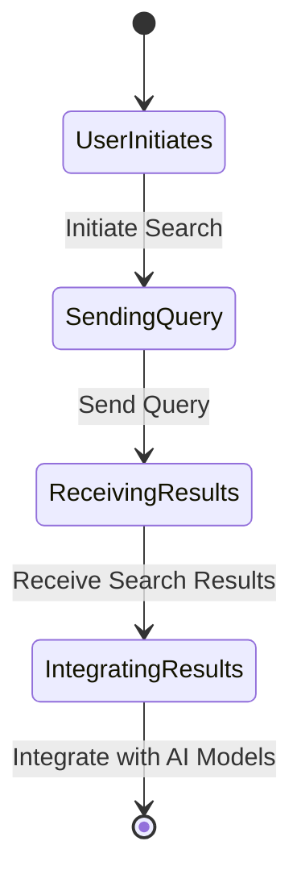

# Search Web

Leverage the open knowledge of the web, injecting web search 
results as supplemental context for your AI models.

## Search Web Flow

To search the web and inject search results into your AI models, you can follow these steps:

1. **Initiate Search**: The user initiates the search process by sending a query to the web search engine.

2. **Send Query**: The system sends the query to the web search engine to retrieve the search results.

3. **Receive Search Results**: The system receives the search results from the web search engine, which contain relevant information based on the query.

4. **Integrate with AI Models**: The system integrates the search results with your AI models to provide supplemental context and enhance the analysis or predictions.

By leveraging the open knowledge of the web, you can enrich your AI models with external data sources and improve the accuracy and relevance of your AI-powered applications.

