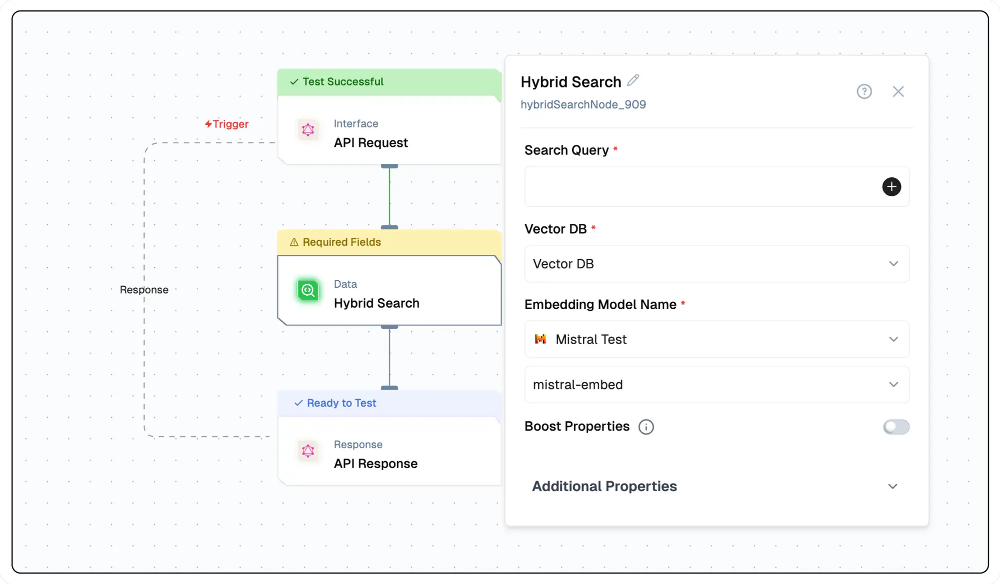

import { NodeOverview } from "@/components/NodeOverview"

# Hybrid Search Node
<NodeOverview slug="hybrid-search-node"/>

## Overview

The Hybrid Search node provides the ability to embed a vector search of a connected vector database within a Lamatic flow.



## Features

<details>

<summary>**Key Functionalities**</summary>

1. **Hybrid Search Capability**: Combines text-based queries and vector database searches for precise and contextually relevant results.

1. **Dynamic Query Integration**: Supports dynamic input parameters (e.g., `{{triggerNode_1.output.topic}}`) to tailor search queries.

1. **Vector Database Support**: Integrates seamlessly with vector databases for advanced search and retrieval.

1. **Embedding Model Integration**: Leverages embedding models, such as Mistral API (`mistral-embed`), for enhanced semantic understanding.

1. **Customizable Boost Properties**: Includes options to adjust parameters like `Alpha` for fine-tuning search results.

</details>

<details>

<summary>**Benefits**</summary>

1. **Enhanced Precision**: Delivers accurate results by combining traditional search with semantic vector-based techniques.

1. **Flexibility**: Supports dynamic query generation and multiple embedding models, catering to diverse use cases.

1. **Scalability**: Works effectively with large-scale vector databases for high-performance search applications.

1. **Ease of Use**: Provides an intuitive interface for configuring search parameters, boosting usability for non-technical users.

1. **Optimized Results**: Allows fine-tuning with boost properties like `Alpha` to balance relevance and diversity in outputs.

</details>

## What can I build?

1. Create a dynamic search interface within your application to query a vector database.
1. Develop a personalized recommendation system using text and vector based search results.
1. Integrate real-time search capabilities to enhance user experience in your app.

## Setup

### Select the Hybrid Search Node

1. Fill in the required parameters.
1. Build the desired flow
1. Deploy the Project
1. Click Setup on the workflow editor to get the automatically generated instruction and add it in your application.

## Configuration Reference

| **Parameter**                           | **Description**                                                                                                                                                                                                                                                                                                                                                              | **Example Value**            |
| --------------------------------------- | ---------------------------------------------------------------------------------------------------------------------------------------------------------------------------------------------------------------------------------------------------------------------------------------------------------------------------------------------------------------------------- | ---------------------------- |
| **Search Query**                        | Input the query to search the vector database.                                                                                                                                                                                                                                                                                                                               | Tell me something about Bali |
| **Vector DB**                           | Select the vector database to be queried.                                                                                                                                                                                                                                                                                                                                    | Database                     |
| **Embedding Model Name**                | This field allows the user to select the embedding model used to embed the query into vector space. It loads available embedding models through the listModels method.                                                                                                                                                                                                       | Embedding Model Name         |
| **Boost Properties**                    | Specific properties can be boosted by a factor specified as a number                                                                                                                                                                                                                                                                                                         | True/False                   |
| **Alpha**                               | Hybrid search results can favor the keyword component or the vector component. To change the relative weights of the keyword and vector components, set the alpha value in your query.Hybrid search results can favor the keyword component or the vector component. To change the relative weights of the keyword and vector components, set the alpha value in your query. | 0.25                         |
| **Certainty**                           | Its the distance score into a value between `0 <= certainty <= 1`, where 1 would represent identical vectors and 0 would represent opposite vectors.Its the distance score into a value between `0 <= certainty <= 1`, where 1 would represent identical vectors and 0 would represent opposite vectors.                                                                     | 0.7                          |
| **Limit**                               | Number of results to return                                                                                                                                                                                                                                                                                                                                                  | 3                            |
| **Group Similar Distance upto N Jumps** | Automatically groups and limits search results by detecting significant gaps in similarity scores. When N > 0, the function will include results until it finds N large differences in scores between consecutive results. This helps filter out less relevant results that are notably different from the top matches.                                                      | 0                            |
| **Fusion Type**                         | This field allows the user to select the fusion type used to combine the keyword and vector search results.                                                                                                                                                                                                                                                                  | Relative/Ranked              |
| **Filters**                             | Apply JSON-based filters to refine search results.                                                                                                                                                                                                                                                                                                                           | []                           |

## Low-Code Example

```yaml
nodes:
  nodes:
    - nodeId: hybridSearchNode_217
      nodeType: hybridSearchNode
      nodeName: Hybrid Search
      values:
        searchQuery: Tell me something about ${{triggerNode_1.output.topic}}
        vectorDB: ""
        alpha: "0.25"
        certainty: "0.85"
        limit: "3"
        autocut: "0"
        fusionType: relativeScoreFusion
        boostProperties: false
        filters: "[]"
        embeddingModelName:
          provider_name: mistral
          type: embedder/text
          credential_name: Mistral API
          credentialId: 32bf5e3b-a8fc-4697-b95a-b1af3dcf7498
          model_name: mistral/mistral-embed
      needs:
        - triggerNode_1
    - nodeId: plus-node-addNode_378459
      nodeType: addNode
      nodeName: ""
      values: {}
      needs:
        - hybridSearchNode_217
```

## Output

#### `searchResults`
- An array of objects, each representing a search result with its associated data and scoring information.

  - **`_additional`**: Contains extra metadata about the search result.
  - **`score`**: A string indicating the relevance or confidence score of the result, as provided in the additional metadata.
  - **`data`**: A string containing the content or information retrieved for the search result.
  - **`score`** (duplicate at the top level): Same as the one inside `_additional`.


### Example Output

```json
{
    "searchResults": [
      {
        "_additional": {
          "score": "0.25"
        },
        "data": "info",
        "score": "0.25"
      }
    ]
}
```

## Troubleshooting

### Common Issues

| **Problem**                    | **Solution**                                                 |
| ------------------------------ | ------------------------------------------------------------ |
| **Invalid API Key**            | Ensure the API key is correct and has not expired.           |
| **Dynamic Content Not Loaded** | Increase the `Wait for Page Load` time in the configuration. |

### Debugging

1. Check Lamatic Flow logs for error details.
1. Verify API Key.
