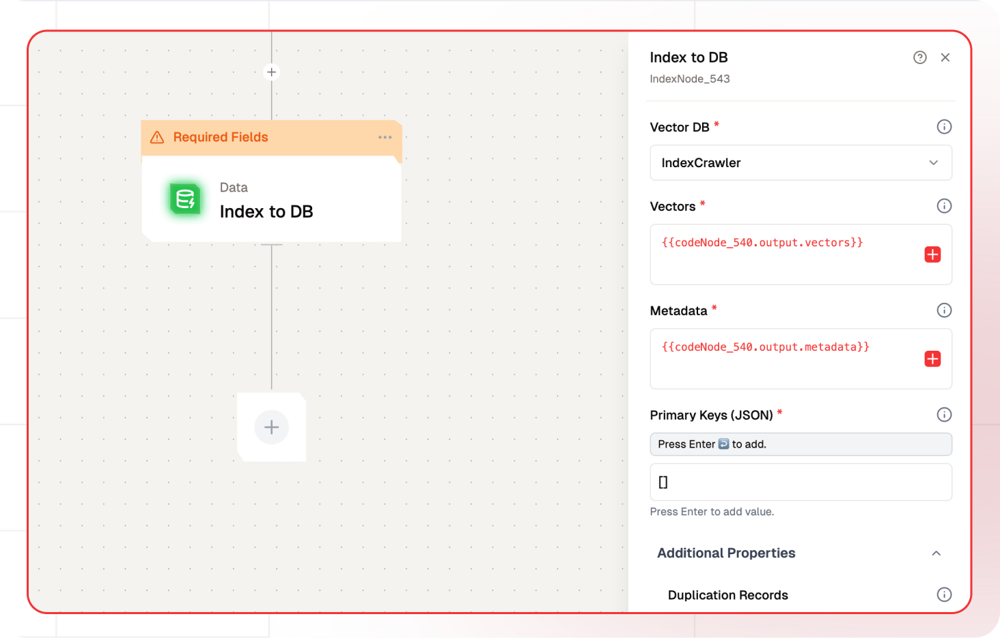

# Index Node Documentation

The Index node inserts records into a vector database, enabling fast semantic retrieval. This node is part of a larger workflow that allows users to manage and configure the indexing of data, including vectors and metadata, into a specified vector database. By configuring various parameters such as the vector database, metadata fields, and embedding models, users can tailor the indexing process to their specific needs.



## Features

<details>
  <summary>**Key Functionalities**</summary>

1. **Custom Logic Integration:** Seamlessly incorporate JavaScript code to create tailored workflows.

2. **Data Manipulation:** Process and transform large datasets dynamically within your flows.

3. **Third-Party API Support:** Extend your workflows by connecting to external APIs and services.

4. **Dynamic Report Generation:** Automate the creation of insightful reports based on real-time data.

5. **Testing and Deployment Tools:** Easily test and deploy JavaScript logic directly in the Lamatic platform.

</details>

<details>
  <summary>**Benefits**</summary>

1. **Enhanced Flow Customization:** Tailor flows to meet specific business or operational needs.

2. **Streamlined Automation:** Minimize manual intervention with robust, automated processes.

3. **Improved Efficiency:** Optimize workflows by integrating complex operations directly into your flows.

4. **Reduced Development Overhead:** Empower developers to build and deploy custom logic without external systems.

5. **Scalable Design:** Create reusable logic components that adapt to various use cases and scale with your needs.

</details>

## What Can You Build?

1. Develop a system for efficient document retrieval based on semantic content.
1. Build a recommendation engine that suggests content based on vector similarity.
1. Create a search interface that allows users to find related articles or documents quickly.
1. Implement a data analysis tool that organizes and retrieves large datasets using vector embedding.

## Setup

### Select the Index Node

1. Fill in the required parameters.
1. Build the desired flow
1. Deploy the Project
1. Click Setup on the workflow editor to get the automatically generated instruction and add it in your application.

## Configuration Reference

| **Parameter**           | **Description**                                                        | **Required** | **Example Value**                 |
| ----------------------- | ---------------------------------------------------------------------- | ------------ | --------------------------------- |
| **Vector DB**           | Select the vector database where the vectors will be indexed.          | Yes          | `database`                        |
| **Vectors**             | Enter the vector data to be indexed in the database.                   | Yes          | `{{codeNode_540.output.vectors}}` |
| **Metadata**            | Include additional information to enhance vector search and retrieval. | Yes          | `{{codeNode_540.output.vectors}}` |
| **Primary Keys (JSON)** | Provide unique identifiers for each vector in JSON format.             | Yes          | []                                |
| **Duplication Records** | Manage duplicates by choosing to `overwrite` or `skip` them.           | No           | `overwrite`                       |

## Low-Code Example

```yaml
- nodeId: IndexNode_543
    nodeType: IndexNode
    nodeName: Index to DB
    values:
      vectorDB: IndexCrawler
      webhookURL: https://webhook.site/685a66e7-b4d3-40a4-9801-99e3460414f9
      primaryKeys: ''
      vectorsField: '{{codeNode_540.output.vectors}}'
      metadataField: '{{codeNode_540.output.metadata}}'
      duplicateOperation: overwrite
      embeddingModelName: {}
      generativeModelName:
        type: embedder/text
        nodeId: IndexNode
        model_name: text-embedding-ada-002
        provider_name: openai
    needs:
      - codeNode_540
```

## Sample Output

```json
 {
    "recordsIndexed": 1,
    "duplicateRecordsDeleted": 0,
    "message": "Data indexed successfully"
  }
```

## Troubleshooting

### Common Issues

| **Problem**                    | **Solution**                                                                                                                                                                                  |
| ------------------------------ | --------------------------------------------------------------------------------------------------------------------------------------------------------------------------------------------- |
| **Invalid Database**           | Ensure the database is correct.                                                                                                                                                               |
| **Dynamic Content Not Loaded** | Increase the `Wait for Page Load` time in the configuration.                                                                                                                                  |
| **ID Column Usage**            | Avoid using a column named "id" as IDs are reserved in the vector store. Using it will cause issues when building a vector.                                                                   |
| **Data Type Changes**          | Do not change the data type of indexed data. For example, if the "index size" metadata is indexed as a Number, changing it to a String in subsequent indexing attempts will result in errors. |

### Debugging

1. Check Lamatic Flow logs for error details.
