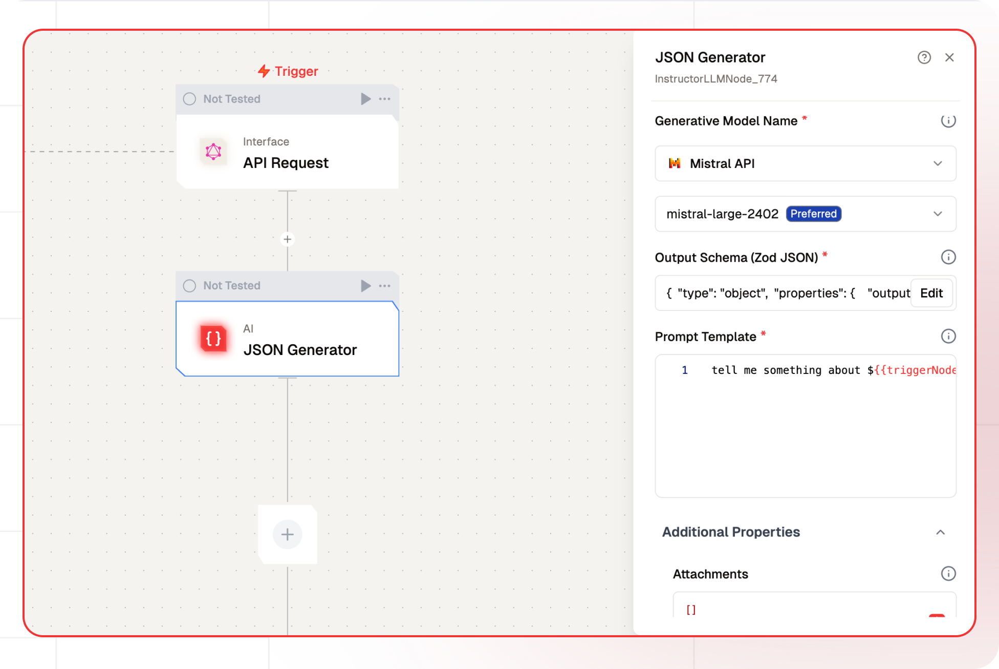

# JSON Generate Node Documentation

The JSON Generate node is used to produce structured JSON outputs from language model (LLM) prompts. It allows users to define a specific output schema, ensuring consistency and precision in data formatting for various applications. 


The node is part of a larger workflow system, enabling seamless integration with other processes and providing a streamlined setup experience for developers. This functionality is particularly useful in contexts where structured data is needed from natural language inputs, such as generating recipes or other content where specific data fields are required.



## Features

<details>
  <summary>**Key Functionalities**</summary>

  1. **Generative Model Selection**: Allows users to select credentials for their preferred generative model, ensuring flexibility and compatibility with various LLMs.

  1. **Customizable Prompts**: Features a field for creating prompt templates, enabling tailored input for specific use cases.

  1. **System Prompt Definition**: Includes an option to define a system-level prompt to guide the AI’s behavior, ensuring context-aware and role-specific responses.

  1. **Additional Properties Management**: Offers expandable sections for configuring advanced properties to fine-tune AI-generated outputs.
</details> 
   
<details>
  <summary>**Benefits**</summary>

1. **Flexibility**: Supports integration with multiple LLMs, allowing users to utilize different models based on their specific needs and use cases.

1. **User-Centric Design**: Provides intuitive interfaces for prompt customization and system prompt definition, making it accessible to both beginners and advanced users. 

1. **Enhanced Control**: Enables precise control over the AI’s behavior and output quality through customizable prompts and system configurations.

1. **Scalability**: Facilitates the creation of reusable prompt templates for diverse workflows, ensuring consistency across projects.
</details>

## What can I build?

1. Create AI-driven applications that require structured data output from natural language inputs.
1. Develop automated systems for generating specific data formats for use in analytics and reporting.
1. Build interactive tools that convert conversational inputs into structured JSON for use in various applications.
1. Design workflows for content generation that require consistency in data formatting across different platforms.

## Setup

### Select the JSON Generate Node

1. Fill in the required parameters.
1. Build the desired flow
1. Deploy the Project
1. Click Setup on the workflow editor to get the automatically generated instruction and add it in your application.

## Configuration Reference

| **Parameter**             | **Description**                                                                                                | **Example Value**            |
| ------------------------- | -------------------------------------------------------------------------------------------------------------- | ---------------------------- |
| **Generative Model Name** | Select the model to generate text based on the prompt.                                                         | Gemini Model                 |
| **Prompt Template**       | Define the instructions for generating the text output.Define the instructions for generating the text output. | Tell me something about Bali |
| **System Prompt**         | System prompt to guide the LLM                                                                                 | You are Travel Planner       |

## Low-Code Example

```yaml
nodes:
  - nodeId: InstructorLLMNode_774
    nodeType: InstructorLLMNode
    nodeName: JSON Generator
    values:
      schema: |-
        {
          "type": "object",
          "properties": {
            "output": {
              "type": "string"
            }
          }
        }
      promptTemplate: tell me something about ${{triggerNode_1.output.topic}}
      attachments: '[]'
      messages: '[]'
      generativeModelName:
        provider_name: mistral
        type: generator/text
        credential_name: Mistral API
        credentialId: 32bf5e3b-a8fc-4697-b95a-b1af3dcf7498
        model_name: mistral/mistral-large-2402
    needs:
      - triggerNode_1
```

## Troubleshooting

### Common Issues

| **Problem**                    | **Solution**                                                 |
| ------------------------------ | ------------------------------------------------------------ |
| **Invalid API Key**            | Ensure the API key is correct and has not expired.           |
| **Dynamic Content Not Loaded** | Increase the `Wait for Page Load` time in the configuration. |

### Debugging

1. Check Lamatic Flow logs for error details.
1. Verify API Key.
