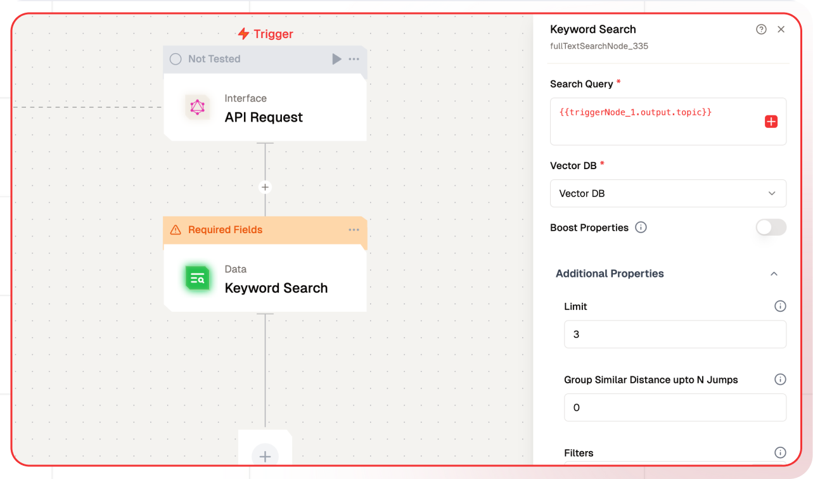

# Keyword Search Node Documentation

The Keyword Search Node is designed to search for specific keywords within a Vector Database.



## Features

<details>

<summary>**Key Functionalities**</summary>

1. **Dynamic Search Query Input**: Allows for customizable search queries using dynamic placeholders like `{{triggerNode_1.output.topic}}`.

2. **Vector Database Selection**: Provides an option to select a specific vector database for efficient retrieval of information.

3. **Boost Properties**: Enables users to prioritize specific attributes for search results by activating the boost properties option.

4. **Result Limitation**: Allows limiting the number of search results returned with a configurable limit.

5. **Grouping of Similar Results**: Supports grouping similar search results based on configurable distance thresholds.

6. **Filters Integration**: Lets users apply filters for more refined search results.

</details>

<details>

<summary>**Benefits**</summary>

1. **Customizability**: Dynamic query capabilities ensure search inputs can adapt to varying workflows and datasets.

2. **Relevance**: Boost properties and grouping enhance the quality of search results, ensuring higher relevance.

3. **Scalability**: Seamless integration with vector databases supports large-scale and complex applications.

4. **Efficiency**: Configurable limits and filters save resources by optimizing the retrieval process.

</details>

## What can I build?

1. Create a dynamic search interface within your application to query a vector database.

2. Develop a personalized recommendation system by combining keyword search and vector-based similarity.

3. Build real-time search capabilities with grouped and filtered results for enhanced user experience.

## Setup

### Select the Keyword Search Node

1. Fill in the required parameters.
1. Build the desired flow
1. Deploy the Project
1. Click Setup on the workflow editor to get the automatically generated instruction and add it in your application.

## Configuration Reference

| **Parameter**                           | **Description**                                                                                                                                                                                                                                                                                                         | **Example Value**            |
| --------------------------------------- | ----------------------------------------------------------------------------------------------------------------------------------------------------------------------------------------------------------------------------------------------------------------------------------------------------------------------- | ---------------------------- |
| **Search Query**                        | Input the query to search the vector database.                                                                                                                                                                                                                                                                          | Tell me something about Bali |
| **Vector DB**                           | Select the vector database to be queried.                                                                                                                                                                                                                                                                               | Database                     |
| **Boost Properties**                    | Specific properties can be boosted by a factor specified as a number                                                                                                                                                                                                                                                    | True/False                   |
| **Limit**                               | Number of results to return                                                                                                                                                                                                                                                                                             | 3                            |
| **Group Similar Distance upto N Jumps** | Automatically groups and limits search results by detecting significant gaps in similarity scores. When N > 0, the function will include results until it finds N large differences in scores between consecutive results. This helps filter out less relevant results that are notably different from the top matches. | 0                            |
| **Filters**                             | Apply JSON-based filters to refine search results.                                                                                                                                                                                                                                                                      | []                           |

## Low-Code Example

```yaml
nodes:
nodes:
  - nodeId: fullTextSearchNode_335
    nodeType: fullTextSearchNode
    nodeName: Keyword Search
    values:
      searchQuery: '{{triggerNode_1.output.topic}}'
      vectorDB: ''
      limit: '3'
      boostProperties: false
      autocut: '0'
      filters: ''
    needs:
      - triggerNode_1
```

## Troubleshooting

### Common Issues

| **Problem**                    | **Solution**                                                 |
| ------------------------------ | ------------------------------------------------------------ |
| **Dynamic Content Not Loaded** | Increase the `Wait for Page Load` time in the configuration. |

### Debugging

1. Check Lamatic Flow logs for error details.
1. Verify API Key.
