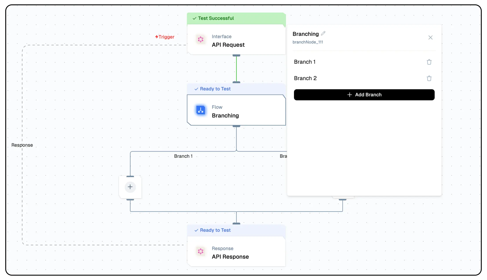

import { NodeOverview } from "@/components/NodeOverview"

# Branch Node
<NodeOverview slug="branch-node" type="logic" />

## Overview

The branch node enables the execution of multiple nodes in parallel, allowing actions to run simultaneously instead of one after the other.



## Features

<details>  
  <summary>**Key Functionalities**</summary>

1. **Parallel Execution:** Execute multiple tasks simultaneously, improving efficiency and reducing processing time.

2. **Flexible Workflow Design:** Easily create complex flow by adding, editing, or removing branches as needed.

3. **Conditional Logic Support:** Implement advanced logic to determine which branches to activate based on specific criteria.

4. **Error Handling:** Ensure robust flow with dedicated error-handling branches for different scenarios.

5. **Real-time Monitoring:** Track the execution of each branch in real time, providing visibility into the workflow's progress.

</details>

<details>  
  <summary>**Benefits**</summary>

1. **Increased Productivity:** Automate and parallelize tasks to reduce completion times and maximize output.

2. **Enhanced Flexibility:** Adapt flow to meet dynamic requirements with easy-to-configure branching structures.

3. **Simplified Complexity:** Manage intricate processes in a streamlined and visual manner.

4. **Error Mitigation:** Minimize risks by isolating and handling errors within specific branches.

5. **Scalability:** Build flow that grow with your needs, supporting additional branches or tasks as required.

</details>

## What Can You Build?

1. **Multi-step Automation:** Run several tasks in parallel, such as processing data, sending emails, and updating records, all within a single workflow.
1. **Simultaneous Integrations:** Connect multiple tools or systems at the same time, ensuring efficient data synchronization and faster task execution.

## Configuration

1. **Open the Branch Node Configuration Panel:**:
   - Here you can manage branches.
2. Define a respected node within each branch.

Note: Minimum two branches are required.

## Low-Code Example

```yaml
nodes:
  - nodeId: branchNode_663
    nodeType: branchNode
    nodeName: Branching
    values:
      branches:
        - label: Branch 1
          value: branchNode_663-addNode_484
        - label: Branch 2
          value: branchNode_663-addNode_801
    needs:
      - triggerNode_1
    branches:
      - label: Branch 1
        value: plus-node-addNode_484899
      - label: Branch 2
        value: plus-node-addNode_801189
  - nodeId: plus-node-addNode_484899
    nodeType: addNode
    nodeName: ""
    values: {}
    needs:
      - branchNode_663
  - nodeId: plus-node-addNode_801189
    nodeType: addNode
    nodeName: ""
    values: {}
    needs:
      - branchNode_663
  - nodeId: plus-node-addNode_227323
    nodeType: addNode
    nodeName: ""
    values: {}
    needs:
      - plus-node-addNode_484899
      - plus-node-addNode_801189
```

## Output

#### `input`

- An object containing the data or parameters provided to the node for processing.

#### `output`

- An object representing the result or decision made by the branching logic.

#### `skip`

- A boolean indicating whether the branch condition resulted in skipping further processing or execution.

#### `status`

- A string denoting the operational status of the node, indicating success or failure of the branching process.

### Example Output

```json
{
  "input": {},
  "output": {
    "skip": true
  },
  "status": "success"
}
```

## Troubleshooting

### Common Issues

| **Problem**                   | **Solution**                                                                               |
| ----------------------------- | ------------------------------------------------------------------------------------------ |
| **Parallel Execution Errors** | Verify that all branches are correctly configured and ensure no conflicts in dependencies. |
| **Branch Activation Issues**  | Check conditional logic to ensure criteria are correctly defined.                          |
| **Data Sync Delays**          | Ensure proper data mapping and synchronization across branches.                            |
| **Error Handling Failures**   | Review error-handling logic and confirm fallback branches are set up correctly.            |

### Debugging Tips

- Verify branch and ensure all connections are correctly established.
- Inspect logs for branch-specific error details to identify the root cause of failures.
- Test individual branches independently before running the entire workflow.
- Confirm input data consistency across all branches to avoid unexpected outcomes.
