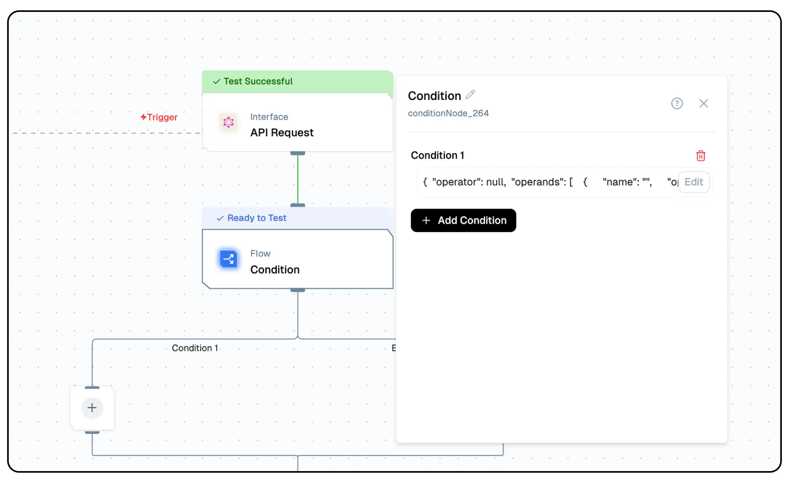
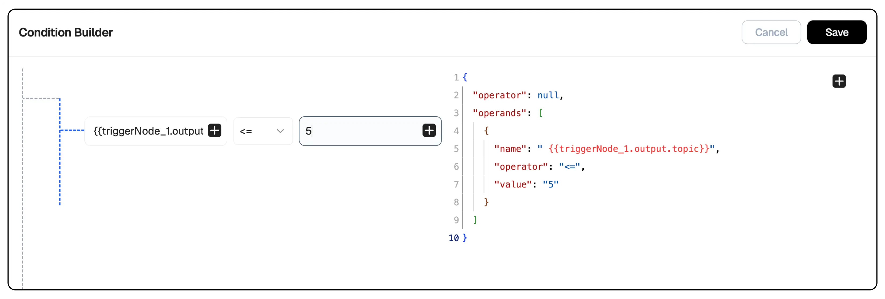

import { NodeOverview } from "@/components/NodeOverview"

# Condition Node 
<NodeOverview slug="condition-node" type="logic" />

## Overview

The Lamatic.ai Condition Node is a versatile component designed to introduce condition logic into your flow. Think of it as the decision-maker for your applications. By evaluating variables and triggers, it determines the next steps in your workflow, enabling a more dynamic and responsive system. Whether you’re automating processes, managing data flows, or creating complex logic, this node is the foundation for smarter decision-making.



## Features

<details>
  <summary>**Key Functionalities**</summary>
  1. **User-Friendly Interface:** Intuitive drag-and-drop design for building flows without coding expertise. 
  2. **Event Triggering:** Define conditions that react to real-time events, ensuring dynamic responses. 
  3. **Dynamic Input Handling:** Incorporate variables and real-time data to create adaptive flows. 
  4. **Multi-Step Optimization:** Streamline lengthy flows by dynamically adjusting based on the outcomes of each step.
</details>

<details>
  <summary>**Benefits**</summary>
  1. **Enhanced Decision-Making:** Automate complex logic with ease, reducing manual intervention. 
  2. **Increased Efficiency:** Adapt flows to real-time changes, ensuring processes remain optimized. 
  3. **Reduced Errors:** Automate repetitive decision-making tasks to minimize human error. 
  4. **Improved Scalability:** Build reusable and adaptable flow components for diverse applications.
</details>

## What Can You Build?

1. **Automated Decision-Making Processes:** Create flow that analyze data inputs and execute the appropriate actions automatically.
1. **Dynamic Flow:** Adjust processes based on real-time inputs, such as user actions or external data feeds.
1. **Custom Logic Flows:** Enhance your projects by embedding unique business logic directly into your applications.
1. **Optimized Multi-Step Processes:** Save time and reduce errors by automating repetitive decision-making tasks.

## Configuration

1. **Open the Condition Node Configuration Panel**:

   - Click on the **Condition Node** in your workflow. This will open the configuration panel on the right side, where you can define conditions.

2. **Define a Condition**:

   - Click the **Add Condition** button.
   - You will see a condition structure that includes:
     
     - **Operator**: The logic to be applied (e.g., `equals`, `greater than`, `contains`). Select the appropriate operator based on your condition.
     - **Operands**: Specify the input values for the condition. These could be variables, constants, or dynamic data.

3. **Edit the Condition**:

   - Click the **Edit** button next to the condition to customize it.
   - Define:

     - **First Operand**: The variable or value to evaluate.
     - **Operator**: Select from options such as `equals`, `not equals`, `greater than`, etc.
     - **Second Operand**: The value or variable to compare against.

     ```json
     {
       "operator": null,
       "operands": [
         {
           "name": "a",
           "operator": "<=",
           "value": "5"
         }
       ]
     }
     ```

4. **Add Multiple Conditions (Optional)**:

   - Use the **Add Condition** button to define additional conditions if needed.
   - Combine multiple conditions using logical operators like `AND` or `OR` to create more complex logic.

5. **Define Outcome Paths**:

   - Configure the paths for **Condition 1** and **Else**:
     - **Condition 1**: The path the workflow will follow if the condition evaluates to `true`.
     - **Else**: The fallback path if the condition evaluates to `false`.
   - Select the additional nodes into these paths to define subsequent actions.

6. **Test the Configuration**:

   - Use the **Test** option at the bottom right to simulate your workflow and verify that the Condition Node behaves as expected.

7. **Save and Deploy**:
   - Once configured, click **Save** to store the changes.
   - Click **Deploy** to activate the workflow with the configured Condition Node.

## Low-Code Example

```yaml
- nodeId: conditionNode_347
  nodeType: conditionNode
  condition:
    - label: Condition 1
      value: plus-node-addNode_263609
    - label: Else
      value: plus-node-addNode_784238
  nodeName: Condition
  values:
    conditions:
      - label: Condition 1
        value: conditionNode_347-addNode_263
        condition:
          operator: null
          operands:
            - name: ""
              operator: <=
              value: ""
      - label: Else
        value: conditionNode_347-addNode_784
        condition: {}
  needs:
    - triggerNode_1
```

## Output 
- `condition`: A string indicating the evaluated outcome or state determined by the condition node.

### Example Output

```json
{
    "condition": "Else"
}
```

## Troubleshooting

### Common Issues

| **Problem**             | **Solution**                                                                                      |
| ----------------------- | ------------------------------------------------------------------------------------------------- |
| **Parameter Mismatch**  | Check input parameter format and requirements                                                     |
| **Unexpected Behavior** | Validate all conditions and logic within the node to ensure they align with the desired outcomes. |
| **Execution Timeout**   | Review flow complexity and timeout settings                                                       |

### Debugging Tips

- Check Lamatic Flow logs for error details
- Verify flow deployment status
- Test input parameters independently
- Monitor flow execution time
