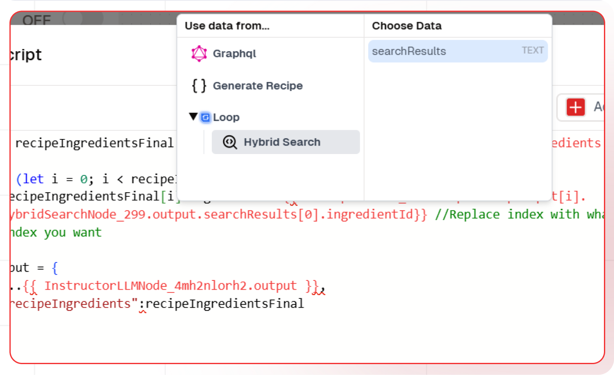

import { NodeOverview } from "@/components/NodeOverview"

# Loop Node

<NodeOverview slug="loop-node" type="logic" />

## Overview

The Loop Node allows users to execute loops in a workflow by iterating over a specified range or a list of objects. This node is particularly useful for automating repetitive tasks, handling iterative processing, and managing multiple data points within a single workflow execution.


## Features

<details>
  <summary>**Key Functionalities**</summary>
  1. **Range-based Iteration:** Define a start and end value to create a numerical loop. 
  2. **List-based Iteration:** Iterate over an array of objects for flexible iterative processing. 
  3. **Dynamic Variable Support:** Use dynamic variables for adaptable looping.
</details>

<details>
  <summary>**Benefits**</summary>
  1. **Automation:** Reduces manual effort by handling repetitive operations.

2. **Scalability:** Supports iterative processing for handling multiple inputs efficiently.

3. **Flexibility:** Works with both numerical ranges and structured data arrays.

</details>

## What can I build?

1. Automate repetitive tasks, such as sending emails to multiple recipients.

1. Process large datasets by iterating over records for transformation or analysis.

1. Generate reports by looping over a list of entities and aggregating results.

## Setup

### Select the Loop Node

1. Choose the Loop Node in your workflow.
1. Define the iteration type (Range or List).
1. Configure the required parameters.
1. Deploy the project.
1. Click Setup on the workflow editor to generate instructions for integration.

## Configuration Reference

| **Parameter**                  | **Description**                                                    | **Example Value**               |
| ------------------------------ | ------------------------------------------------------------------ | ------------------------------- |
| **Iterate Over**               | Defines whether the loop runs over a List or a Range.              | `List` or `Range`               |
| **Value**                      | (For List) Specifies the array or list to iterate over.            | `{{triggerNode_1.output.urls}}` |
| **Initial Value**              | (For Range) Starting value of the loop.                            | `0`                             |
| **End Value**                  | (For Range) Specifies the ending value (exclusive).                | `10`                            |
| **Increment**                  | (For Range) Defines the step size for each iteration.              | `10`                            |
| **Wait Before Next Iteration** | The number of seconds to wait before each iteration. Min:0, Max:30 | `10`                            |

> **Note:** The studio testing API has a timeout limit of 300 seconds. When using the Wait Before Next Iteration parameter with many iterations, be mindful that the total execution time (number of iterations × wait time) should not exceed 300 seconds to avoid API timeouts.

## Low-Code Example

```yaml
nodes:
  nodes:
    - nodeId: forLoopNode_250
      nodeType: forLoopNode
      nodeName: For Loop
      values:
        endValue: "10"
        increment: "1000"
        connectedTo: forLoopEndNode_984
        iterateOver: list
        initialValue: "0"
        iteratorValue: "{{triggerNode_1.output.urls}}"
      needs:
        - triggerNode_1
        - forLoopEndNode_984
      connections:
        - condition: Loop Start
          value: plus-node-addNode_226284
          type: conditionEdge
        - condition: Loop
          value: forLoopEndNode_984
          type: loopEdge
    - nodeId: forLoopEndNode_984
      nodeType: forLoopEndNode
      nodeName: For Loop End
      values:
        connectedTo: forLoopNode_250
      needs:
        - scraperNode_351
        - forLoopNode_250
      connections:
        - condition: Loop End
          value: plus-node-addNode_257360
          type: conditionEdge
        - condition: Loop
          value: forLoopNode_250
          type: loopEdge
          invisible: true
    - nodeId: plus-node-addNode_226284
      nodeType: addNode
      nodeName: ""
      values: {}
      needs:
        - forLoopNode_250
    - nodeId: plus-node-addNode_257360
      nodeType: addNode
      nodeName: ""
      values: {}
      needs:
        - forLoopEndNode_984
    - nodeId: scraperNode_351
      nodeType: scraperNode
      condition: Loop Start
      nodeName: Scraper
      values:
        url: "{{forLoopNode_250.output.currentValue}}"
        mobile: false
        waitFor: 123
        credentials: ....
        excludeTags: []
        includeTags: []
        onlyMainContent: false
        skipTLsVerification: false
      needs:
        - plus-node-addNode_226284
```

## Output

The output from the loop will be an array of objects.

#### Accessing Output of Looped Nodes



You can select the looped node's output from the variable selector as shown above. After which you can modify the index by modifying the index key to a specific index or a looping variable as per your requirement as show below.

#### Iterating Over Outcomes by Replacing Index

This feature allows for iterating over results dynamically by replacing the index placeholder with a specific value. It enables access to individual results from the loop output.

```js
//Replace index with whatever index you want
{{forLoopEndNode_271.output.loopOutput[index].hybridSearchNode_299.output.searchResults}}

//For Example to access output for iteration 0

{{forLoopEndNode_271.output.loopOutput[0].hybridSearchNode_299.output.searchResults}}


for (let i = 0; i < recipeIngredientsFinal.length; i++) {
  recipeIngredientsFinal[i].ingredientId={{forLoopEndNode_271.output.loopOutput[i].hybridSearchNode_299.output.searchResults[0].ingredientId}}
  //Replace index with whatever index you want
}
```

#### Use Case

- Extracting individual results from a looped query
- Processing results dynamically in a template
- Enhancing automation flow by iterating over multiple outcomes

## Testing

You can also check the individual outcome from each iteration using the dropdown in Testing.


## Flow Execution Logs

The flow execution logs provide detailed insights into the execution process of each iteration in the logs sections


## Troubleshooting

### Common Issues

| **Problem**            | **Solution**                                  |
| ---------------------- | --------------------------------------------- |
| **Loop Not Executing** | Ensure valid range or list input is provided. |
| **Performance Issues** | Enable concurrency or optimize list size.     |

### Debugging

1. Check Lamatic Flow logs for error details.
1. Verify input parameters to ensure correct configuration.
