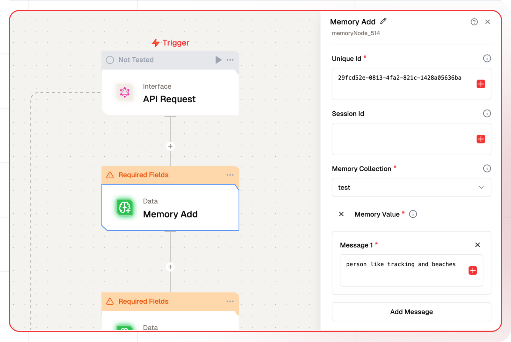

# Memory Add Node Documentation

The Memory Node Add allows users to store and manage contextual information by creating persistent memory collections tied to unique users and sessions. This node is particularly useful for maintaining conversation history, user preferences, and other stateful data across workflow executions.



## Features

<details>
  <summary>**Key Functionalities**</summary>

1. **Persistent Storage**: Store and manage contextual information that persists across workflow executions.

2. **User & Session Management**: Support for both user-level and session-specific memory storage with unique identifiers.

3. **Metadata Support**: Attach additional metadata to stored memories.

</details>

<details>
  <summary>**Benefits**</summary>
  1. **Persistence:** Maintain contextual information across multiple workflow executions.

2. **Scalability:** Efficiently store and retrieve large amounts of contextual data.

3. **Flexibility:** Support for both user-level and session-level memory storage.

</details>

## What can I build?

1. Chatbots that remember conversation history and user preferences.

2. Personalized recommendation systems based on user interactions.

3. Knowledge management systems with contextual information retrieval.

## Setup

### Configure the Memory Node

1. Select the Memory Add Node in your workflow.
2. Configure the unique user identifier.
3. Choose or create a memory collection.
4. Set up the embedding and generative models.
5. Define optional session ID and metadata.
6. Add the Memory Value
7. Deploy the project.

## Configuration Reference

| **Parameter**             | **Description**                                                        | **Example Value**                      |
| ------------------------- | ---------------------------------------------------------------------- | -------------------------------------- |
| **Unique Id**             | Identifier for the user whose memory is being stored                   | `29fcd52e-0813-4fa2-821c-1428a05636ba` |
| **Session Id**            | Optional identifier for specific user sessions                         | `2 (Defaults to Global)`               |
| **Memory Store**          | The collection where memories will be stored                           | `MemoryStore`                          |
| **Memory Value**          | The actual data from which facts to be retrieved and updated in memory | `I like cats`                          |
| **Embedding Model Name**  | Model used for converting text to vectors                              | `text-embedding-ada-002`               |
| **Generative Model Name** | Model used for processing stored information                           | `gpt-3.5-turbo`                        |
| **Metadata**              | Additional JSON data to store with the memory                          | `{"source": "chat"}`                   |

## Low-Code Example

```json
- nodeId: memoryNode_858
    nodeType: memoryNode
    nodeName: Memory Add
    values:
      uniqueId: '{{triggerNode_1.output.userId}}'
      sessionId: ''
      memoryValue:
        - role: user
          content: User likes to watch Pokemon
      memoryCollection: finalTest
      embeddingModelName:
        type: embedder/text
        model_name: default
        credentialId: some-id
        provider_name: openai
        credential_name: NEW PROVIDER
      generativeModelName:
        type: generator/text
        model_name: default
        credentialId: Some Credential Id
        provider_name: openai
        credential_name: Testing OpenAI
```

## Output 

-`memoryActions`: An array of objects representing actions or operations performed on the memory, which may be empty if no actions are recorded.
-`extractedFacts`: An array of strings containing facts or insights derived from the input data and added to the memory.

### Example Output

```json
{
    "memoryActions": [],
    "extractedFacts": [
      "User expressed a positive opinion about lamatic."
    ]
  }
```

## Common Issues and Debugging

1. **Memory Not Being Stored**

   - Verify the Unique Id is properly configured and not empty
   - Check that the Memory Collection name matches exactly across nodes
   - Ensure the Memory Value contains valid content.
   - Confirm the embedding model is accessible and running

### Troubleshooting Steps

1. **Check Node Configuration**

   - Verify all required fields are filled

2. **Monitor Workflow Logs**

   - Look for error messages in the execution logs
   - Check for timeout or rate limit errors

3. **Test Memory Operations**

   - Use the workflow testing feature to verify storage
   - Confirm immediate retrieval after storage
   - Test with simple data before complex implementations
